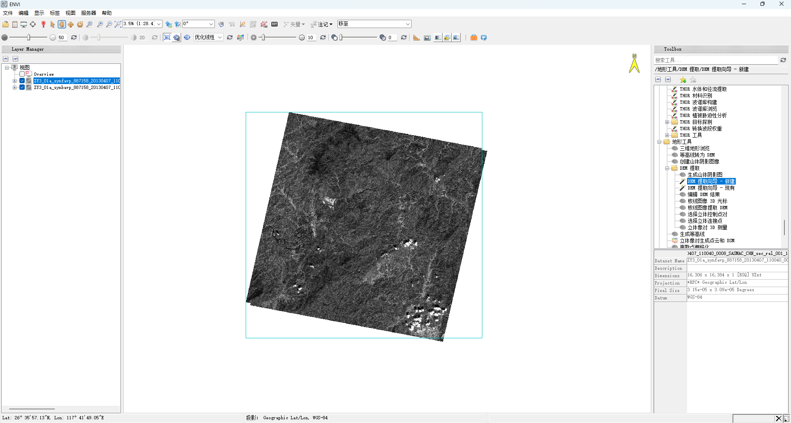
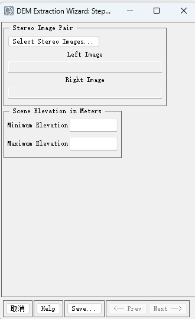
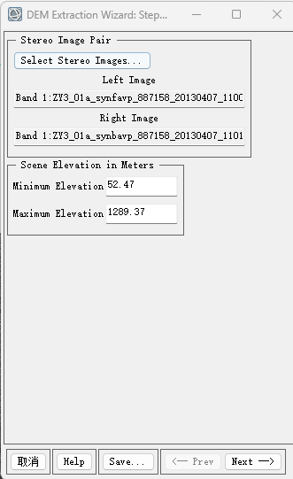
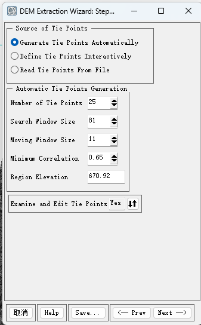
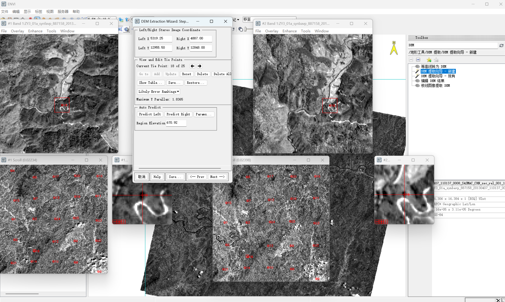
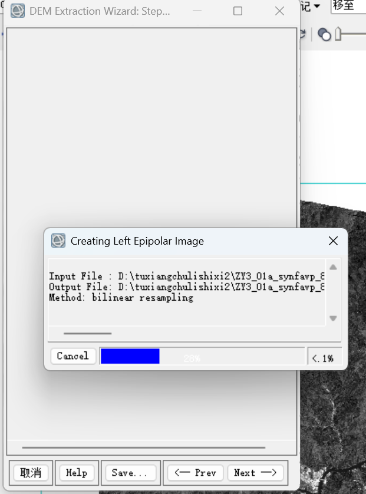
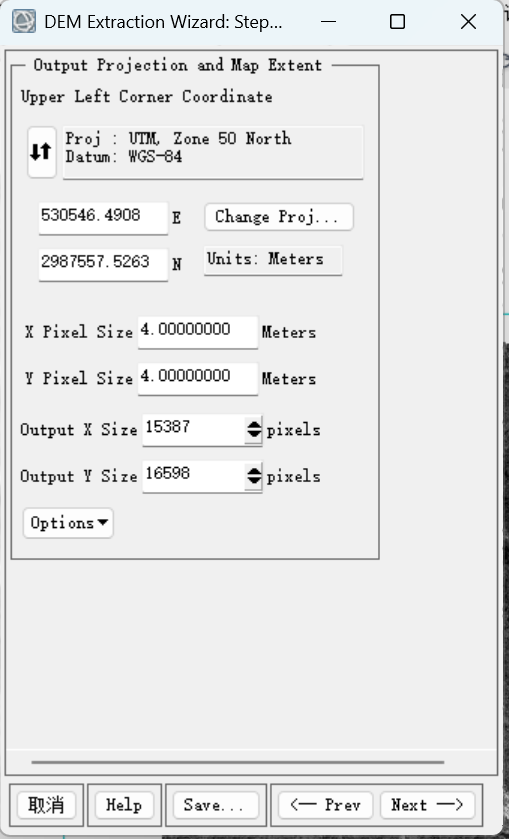
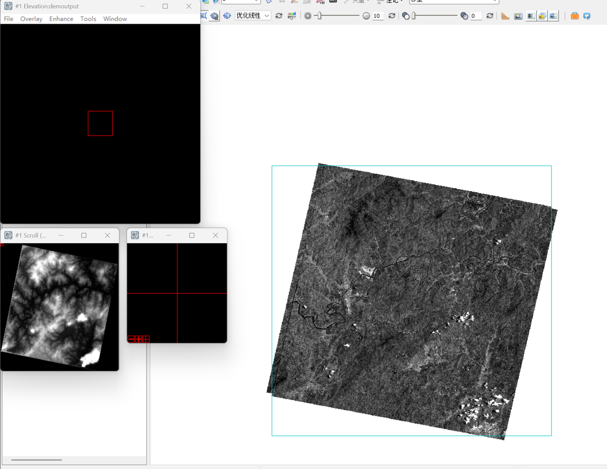
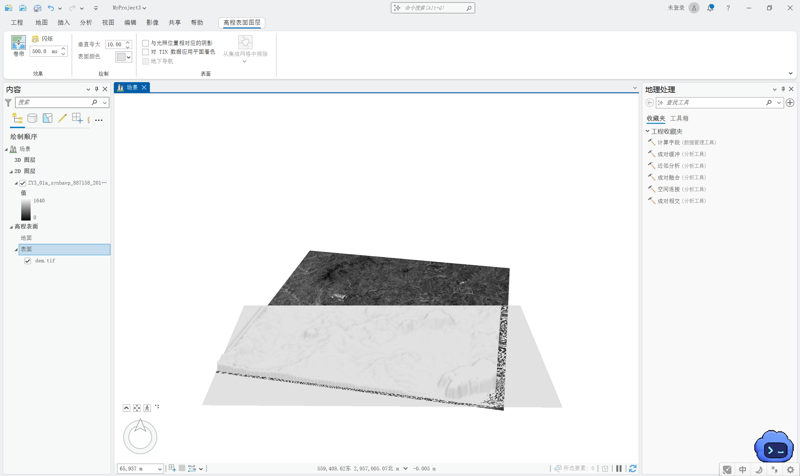
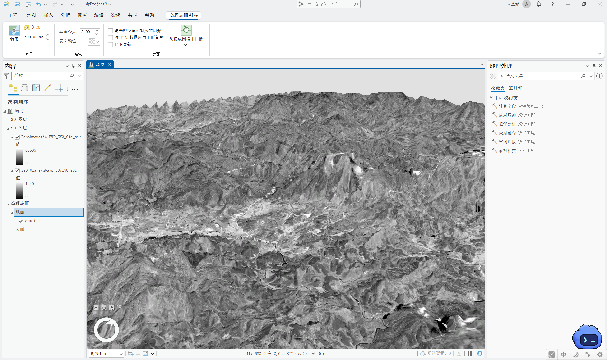

从两幅立体影像提取 DEM，本质上是在寻找同一地物在左右影像中的视差，再结合传感器模型恢复地面高程。ENVI 的 DEM Extraction Wizard 把这条流程拆成了立体像对选择、控制点、连接点、核线影像、立体匹配、投影和结果检查等步骤。

本文使用一组带 RPC 参数的资源三号（ZY-3）前后视全色影像演示。实验输出采用 **WGS 84 / UTM Zone 50N**，像元大小为 **4 m**，最后在 ArcGIS Pro 中将原始全色影像贴合到 DEM 表面进行三维检查。

> ENVI 不同版本的中文工具箱名称可能略有变化。英文路径通常为 `Terrain → DEM Extraction → DEM Extraction Wizard: New`。该功能需要相应的 DEM Extraction 模块许可。

## 1. 输入数据是否适合提取 DEM

开始之前，应先确认左右影像满足以下条件：

- 两幅影像构成立体像对，并覆盖同一片区域；
- 影像保留 RPC（Rational Polynomial Coefficients，有理多项式系数）或其他受支持的严格传感器信息；
- 数据没有在外部软件中随意裁剪或改写头文件；
- 影像之间有足够视差，同时仍有可稳定匹配的重叠区；
- 云、雪、深阴影、水面和大面积重复纹理没有占据主要区域；
- 临时目录和输出磁盘有充足空间。

RPC 描述影像行列坐标与地面三维坐标之间的近似关系。它能够帮助 ENVI 建立左右影像的初始几何关系，但不能自动替代地面控制和独立精度检验。

如果一幅影像接近正视、另一幅为明显侧视，官方建议把几何畸变较小的正视影像作为左影像，因为左影像会作为匹配基准。

## 2. 启动 DEM Extraction Wizard

在 ENVI 工具箱中依次展开：

`地形工具 → DEM 提取 → DEM 提取向导—新建`

英文界面为：

`Terrain → DEM Extraction → DEM Extraction Wizard: New`

向导允许在各步骤之间前后切换，也可以保存中间状态。长时间任务建议先保存向导文件，以便中断后继续。

## 3. 选择左右立体影像

在第一步单击 **Select Stereo Images**，依次指定左影像和右影像。

加载后核对：

- 左右影像是否确实属于同一组立体数据；
- 文件名和成像时间是否正确；
- RPC 是否成功识别；
- 最低和最高高程是否处于合理范围。

本次数据载入后，ENVI 根据 RPC 给出的场景高程范围约为 **52.47～1289.37 m**。

这个高程范围会影响初始几何搜索。如果已有可靠的区域高程资料，可以据此收紧范围；如果没有把握，宁可保留合理余量，也不要为了缩短计算时间而截掉真实山峰或谷地。

## 4. 是否使用地面控制点

向导下一步会询问地面控制点（GCP）来源。可以：

- 不使用 GCP；
- 交互采集 GCP；
- 从文件读取已有 GCP。

本实验影像自带 RPC，因此选择了不定义 GCP，直接进入连接点步骤。这样可以完成立体几何建立和 DEM 生成，但结果没有经过独立地面控制。按照 ENVI 官方定义，跳过 GCP 时应把成果视为相对 DEM 或至少是未经独立控制的结果，不能仅凭“影像有 RPC”就宣称达到绝对高程精度。

如果任务要求可靠的绝对定位和高程精度，应加入分布合理的 GCP，并另外保留检查点进行验证。

## 5. 自动生成连接点

连接点是左右影像中表示同一地物的位置，用于确定核线几何。选择 **Generate Tie Points Automatically**，本实验设置为：

| 参数 | 数值 | 含义 |
| --- | ---: | --- |
| Number of Tie Points | 25 | 计划生成的连接点数量 |
| Search Window Size | 81 | 在另一幅影像中搜索同名点的范围 |
| Moving Window Size | 11 | 用于相关匹配的局部模板大小 |
| Minimum Correlation | 0.65 | 接受匹配的最低相关系数 |
| Region Elevation | 670.92 m | 区域代表性高程 |

这些参数之间存在权衡：

- 增大连接点数量通常能改善空间分布，但也会增加计算量和误匹配检查工作；
- 搜索窗口必须大于移动窗口。初始几何较差、地形起伏较大时可能需要扩大搜索范围；
- 相关系数阈值过低会保留更多匹配，也更容易混入错误点；阈值过高则可能找不到足够连接点；
- 25 个点、81 像素搜索窗和 0.65 阈值是常用起点，不是所有数据的固定答案。

保持 **Examine and Edit Tie Points = Yes**，让向导在自动匹配后进入人工检查。

## 6. 检查和编辑连接点

ENVI 会同时打开左右影像和连接点列表。逐点检查是否落在同一地物上，优先保留：

- 道路交叉口；
- 裸地或岩石上的清晰角点；
- 稳定建筑角点；
- 灰度变化明显且在左右影像中都可辨认的位置。

避免把点放在云、阴影边界、水面、树冠摆动区和重复纹理中。

检查时不只看某一个点是否“差不多重合”，还要关注：

1. **空间分布**：连接点应覆盖整个重叠区，不能全部集中在中央。
2. **Likely Error Rankings**：优先检查最可能出错的点。
3. **Maximum Y Parallax**：ENVI 要求最大 y 视差不超过 10 像素；理想情况下应尽量接近 0，约 1～2 像素通常比勉强低于 10 更可靠。

发现错误点时，可以更新其左右位置、删除后补点，或退回上一步调整搜索参数。连接点错误会直接传递到核线影像和最终 DEM，不能靠后续平滑完全补救。

## 7. 生成核线影像

连接点通过检查后，ENVI 根据左右影像的几何关系生成核线影像。核线校正把二维同名点搜索约束到近似同一行，使后续匹配主要沿 x 方向寻找视差。

这一步和后续立体匹配可能产生体积较大的临时文件。处理速度慢时，先检查磁盘空间和临时目录，而不是反复点击 Next 启动多个任务。

## 8. 设置输出投影和分辨率

本实验输出采用：

- 投影：WGS 84 / UTM Zone 50N；
- 单位：m；
- X Pixel Size：4 m；
- Y Pixel Size：4 m；
- 输出范围：由当前立体像对计算；
- 输出栅格大小：约 15387 × 16598 像元。

**UTM 50N 只适用于本次数据所在区域。** 换一套数据时，应依据影像位置和项目坐标系统选择投影，不能照抄带号。

输出像元大小也不应盲目设小。它受原始影像分辨率、立体交会条件、匹配质量和目标比例尺共同限制。把 4 m 改成 1 m 只会增加像元数量，不会自动创造更真实的地形细节。

## 9. 运行 DEM 提取

在 DEM Extraction Parameters 中选择输出位置和数据类型，再开始计算。需要重点理解的设置包括：

- **Terrain Detail**：细节级别越高，匹配使用的金字塔层级越细，处理时间越长，也更容易保留小尺度起伏；
- **Output Data Type**：整型占用空间较小，浮点型可以保留小数高程；
- **Edge Trimming**：用于裁去立体匹配质量较差的边缘；
- **输出到文件**：正式任务应写入文件，不建议只保存在内存中。

处理过程中会依次出现左核线影像、右核线影像和高程结果。不要在进度条尚未结束时关闭 ENVI。

## 10. 在 ENVI 中检查 DEM

打开输出 DEM，先从整体上检查覆盖范围、地形起伏和无效值分布。

重点寻找：

- 大面积黑洞或无效值；
- 沿影像边缘出现的异常高墙；
- 山脊、沟谷被错误抹平；
- 水面和阴影区产生的噪声；
- 拼接状条带或周期性纹理；
- 高程范围明显超出场景最低、最高高程。

还应把 DEM 与左、右原始影像联动浏览，确认高程异常是否对应云、阴影、低纹理或匹配错误区域。

## 11. 在 ArcGIS Pro 中进行三维检查

### 11.1 将 DEM 作为高程表面

创建一个局部场景或全球场景，在“地图”选项卡中选择“添加数据 → 高程源图层”，把 `dem.tif` 添加到 **Ground** 高程表面。

如果直接把 DEM 当作普通二维栅格加入，它只会显示颜色，不会定义地形起伏。应在“内容”窗格的“高程表面”下确认 `dem.tif` 确实属于 Ground。

### 11.2 叠加原始影像

将原始全色影像作为二维图层加入场景，并设置为贴地显示。影像会沿 DEM 表面起伏，用于检查山脊、河谷和地物位置是否协调。

本实验截图把垂直夸大设置为 8.00，以突出山地起伏。垂直夸大只是显示效果：

- 精度检查应先使用 1.00；
- 地形较平缓、仅用于展示时再适度放大；
- 夸大后的三维外观不能作为 DEM 精度提高的证据。

## 12. 如何判断结果可信

一幅 DEM “看起来像山”并不等于精度合格。至少应做三层检查：

1. **内部几何检查**：连接点位置正确，y 视差足够小，核线影像没有明显错位。
2. **结果形态检查**：高程范围合理，沟谷和山脊连续，无效值和噪声能够解释。
3. **外部精度检查**：使用未参与建模的检查点或可靠参考 DEM 计算高程误差。

本实验没有输入 GCP 和独立检查点，因此可以说明“成功完成了 DEM 提取并获得合理的三维地形形态”，但不宜给出未经验证的绝对精度结论。

## 常见问题

| 现象 | 原因判断 | 处理方法 |
| --- | --- | --- |
| 无法选择影像或 Next 不可用 | 影像缺少 RPC，左右影像不是有效立体对，或高程范围为空 | 检查原始数据和头文件，重新按传感器类型打开 |
| 自动连接点数量很少 | 重叠不足、纹理弱、搜索窗口太小或阈值过高 | 扩大搜索窗、适当调整阈值，并人工补充稳定点 |
| 最大 y 视差超过 10 像素 | 存在错误连接点或左右影像关系不正确 | 按 Likely Error Rankings 逐点修正，必要时重新选像对 |
| DEM 出现大面积空洞 | 云、水面、阴影或低纹理区无法稳定匹配 | 调整匹配参数，后续只对可解释的小范围空洞进行编辑 |
| 运行非常慢或中途失败 | Terrain Detail 太高、窗口过大、内存或临时磁盘不足 | 降低细节级别，清理并更换临时目录，确认输出盘空间 |
| ArcGIS Pro 中地形仍是平面 | DEM 被作为普通图层添加，而不是高程源 | 把 DEM 加入 Ground 的 Elevation Source Layers |
| 影像与地形错位 | 投影、RPC、输出范围或图层定位不一致 | 核对坐标系和输出投影，不要用“手工平移”掩盖系统误差 |

## 参考资料

- [ENVI DEM Extraction Wizard](https://www.nv5geospatialsoftware.com/docs/DEMExtractionWizard.html)
- [ENVI：选择立体像对](https://www.nv5geospatialsoftware.com/docs/selectingstereoimagepair.html)
- [ENVI：自动采集和检查连接点](https://www.nv5geospatialsoftware.com/docs/CollectingTiePoints.html)
- [ArcGIS Pro：使用高程表面](https://pro.arcgis.com/en/pro-app/latest/help/mapping/layer-properties/elevation-surfaces.htm)
