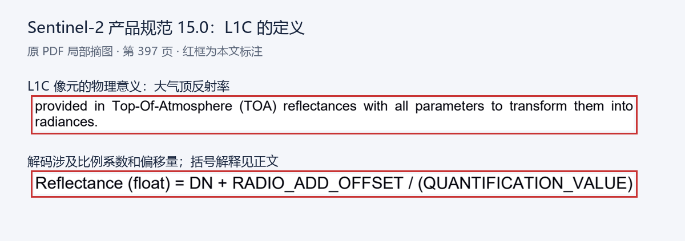
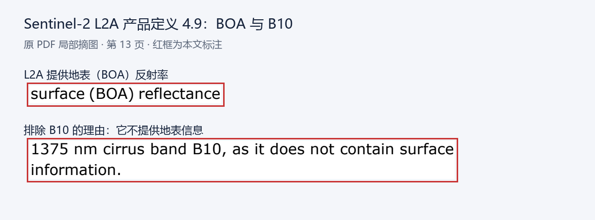
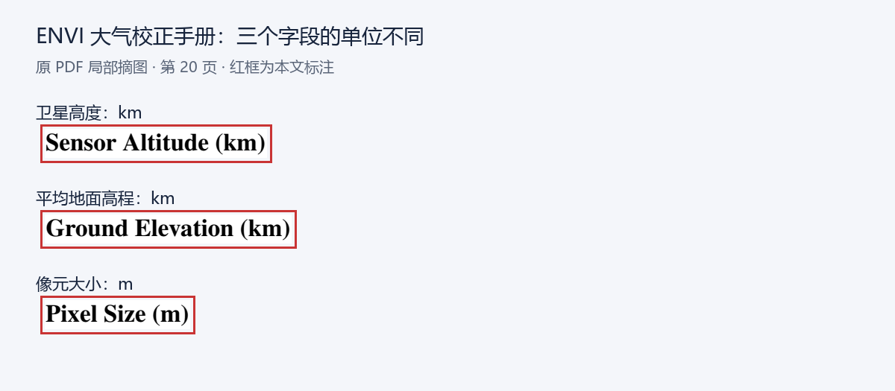
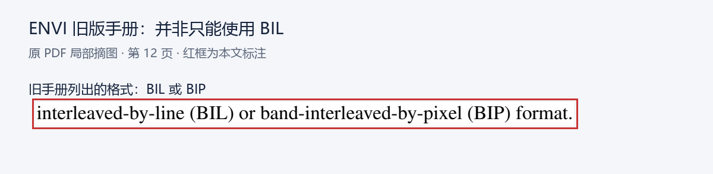
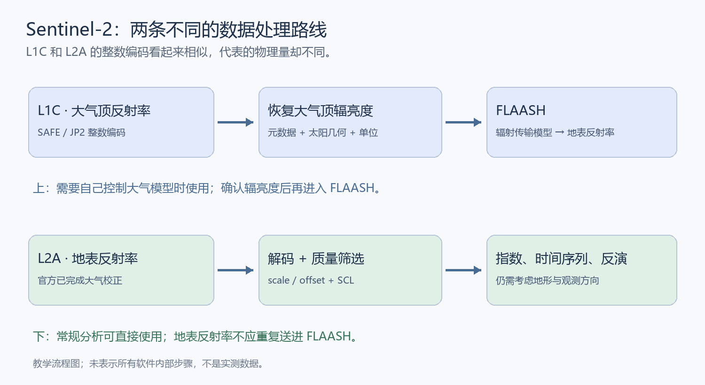
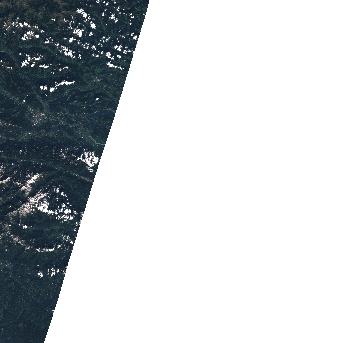

打开一幅卫星影像，点击树冠上的一个像元，软件显示一个数字：3200。这个数字表示什么？是树反射了 32% 的阳光，是传感器收到的辐射能量，还是一种尚未换算的文件编码？

答案不能从数字本身得出。必须知道传感器、产品级别、处理版本和元数据。<strong>大气校正最先要解决的，往往不是选哪个模型，而是弄清手上的像元值代表什么。</strong>

本文从这个问题讲起，以 Sentinel‑2 为主线，把遥感中的物理量、数据产品和 FLAASH 参数串起来。最后给出同一次真实观测的 L1C、L2A 官方产品记录，以及可以直接下载的波段、质量分类和元数据文件。

写作起点是[这篇 FLAASH 入门文章](https://mp.weixin.qq.com/s/S0A2gPy-05P64CwOTr-0uQ)。下面依据技术规范补充其中的简化之处，尤其是 L1C 的物理含义、像元大小的单位、水汽反演条件和软件版本差异。


*图 1：AI 生成的光学遥感概念图。黄色实线表示入射阳光，白色实线表示地表反射后进入传感器的信号；蓝色虚线提示大气散射贡献。箭头是解释用的叠加线，卫星、距离与大气厚度不按比例。这不是卫星观测，也不是大气校正的前后对比。*

## 1. 遥感影像里的一个像元是什么

### 1.1 遥感、传感器与电磁波

<strong>遥感</strong>是通过与目标不直接接触的仪器，测量目标反射或发射的电磁辐射，再推断目标性质。仪器叫作<strong>传感器</strong>。卫星是搭载仪器的平台，两者并不是同一个概念：Sentinel‑2 是卫星任务，MSI（MultiSpectral Instrument）是其多光谱成像仪。ENVI 则是读取、处理与分析这些影像的软件，FLAASH 是其中的大气校正工具。

本文讨论<strong>被动光学遥感</strong>：主要以太阳为光源，传感器接收地表反射的信号。主动遥感则由仪器自己发射能量，例如雷达发射微波；它的物理模型和预处理链不同，不能直接套用本文的光学 FLAASH 流程。

电磁波的<strong>波长</strong>决定它与物质怎样作用。可见光约为 400–700 nm；近红外（NIR）在可见红光以外，短波红外（SWIR）更长。这里 $1\ \mu\mathrm m=1000\ \mathrm{nm}$。红外并不都在测温：近红外、短波红外白天主要用于观测反射太阳光；热红外则关注物体自身的热辐射。Sentinel‑2 MSI 没有用于地表温度反演的热红外波段。

<strong>波段</strong>不是一个无限窄的波长，而是传感器接收的一段波长范围。<strong>光谱响应函数</strong>描述仪器在这段范围内对不同波长的相对敏感程度；中心波长只是一种概括。<strong>半高全宽（FWHM）</strong>是响应曲线达到峰值一半时的宽度，常用于描述带宽。做物理校正时，仅凭“这是第 4 波段”并不能确定这些信息。

这些响应曲线可以实际下载：[Copernicus 的 MSI 文档目录](https://sentiwiki.copernicus.eu/web/s2-documents)保存了各版文件，其中 [2024 年 4.0 版 XLSX](https://sentiwiki.copernicus.eu/__attachments/a_ece6183b6698587e7ecd9804974bece3d82e39e151aa5aeca9d8fd95e1f1558c/COPE-GSEG-EOPG-TN-15-0007%20-%20Sentinel-2%20Spectral%20Response%20Functions%202024%20-%204.0.xlsx)包含 Sentinel‑2A、2B、2C 的逐波长响应。目录还提供后续版本；应按平台和处理版本选择，不能把最新文件无条件套在历史产品上。

### 1.2 像元与四种分辨率

影像通常是由行、列和波段组成的<strong>栅格</strong>。<strong>像元</strong>是网格上的一个采样单元，其数值代表一个地面空间足迹内、某个波段接收到的信号。一个像元里可能同时有树、土壤和道路，这叫<strong>混合像元</strong>。它不会因为做了大气校正，就自动拆成三种纯地物。

| 名称 | 它说明什么 | 为什么不能混淆 |
| --- | --- | --- |
| 空间分辨率 | 能分辨多细的地面空间结构；产品常用地面采样距离 GSD 表示像元间距 | 10 m 像元不保证所有 10 m 目标都能清楚识别，光学模糊和目标对比度也重要 |
| 光谱分辨率 | 对相近波长的区分能力，与带宽和响应曲线有关 | 波段多不等于每个波段都窄 |
| 辐射分辨率 | 仪器把信号量化成多少数字等级的能力 | 16 位文件容器不等于 16 位有效测量精度，也不等于辐射准确度 |
| 时间分辨率 | 对同一区域重复观测的时间间隔 | 名义重访周期不保证有无云、适合分析的影像 |

<strong>多光谱</strong>是在若干波段采样，<strong>高光谱</strong>通常以密集、连续且更窄的波段观察光谱。后者更容易看清细小吸收特征，但也更依赖准确的定标、波段位置和足够的信噪比。信噪比表示有用信号相对于测量噪声的强弱。

### 1.3 Sentinel‑2 的 13 个波段

MSI 有 13 个波段，但不是 13 个 10 m 波段。下表采用任务设计的<strong>名义中心波长</strong>；不同卫星的实际中心和响应曲线略有差别，计算时应使用对应平台的元数据或官方响应文件。[ESA 任务资料](https://sentiwiki.copernicus.eu/web/s2-mission)提供波段与采样说明。

| 波段 | 名义中心波长 | 原生采样间距 | 主要信息 |
| --- | --- | --- | --- |
| B1 | 443 nm | 60 m | 沿海蓝光，对大气散射敏感 |
| B2 | 490 nm | 10 m | 蓝光 |
| B3 | 560 nm | 10 m | 绿光 |
| B4 | 665 nm | 10 m | 红光，植被叶绿素吸收明显 |
| B5 | 705 nm | 20 m | 红边 |
| B6 | 740 nm | 20 m | 红边 |
| B7 | 783 nm | 20 m | 红边／近红外过渡 |
| B8 | 842 nm | 10 m | 宽近红外，常与 B4 计算 NDVI |
| B8A | 865 nm | 20 m | 较窄近红外，不能默认与 B8 等价 |
| B9 | 945 nm | 60 m | 水汽吸收区域 |
| B10 | 1375 nm | 60 m | 卷云检测，标准 L2A 不提供其地表反射率 |
| B11 | 1610 nm | 20 m | 短波红外，对含水状况等敏感 |
| B12 | 2190 nm | 20 m | 短波红外，对含水、矿物、烧毁地表等敏感 |

<strong>红边</strong>是健康植被光谱从红光强吸收向近红外较高反射快速上升的区域。B5–B7 用来观察这段变化；它不是“红色边界”的空间位置。

如果把 60 m 的 B9 重采样到 10 m，只是让网格更密，水汽观测没有获得新的 10 m 细节。<strong>重采样</strong>是在新网格上计算数值：连续量可以按目的使用最近邻、双线性等方法；分类编码应使用最近邻等保留类别的方法，不能用双线性把“云类”和“植被类”插值成一个新类别。

## 2. DN、辐亮度、反射率：先认清数字的身份

### 2.1 DN 是编码，不是单位

DN 是 Digital Number，即文件中的数字量化值。它既可能表示经过仪器定标的辐射信号，也可能是某种物理量乘上比例系数、加上偏移后保存的整数。<strong>“文件是整数”不能推出“文件是原始数据”。</strong>

假设一个产品用

$$
\rho=s\,DN+o
$$

恢复反射率，$s$ 是比例系数（scale），$o$ 是偏移量（offset）。只有读过该产品的定义，才能解释 3200。若 $s=0.0001,o=0$，它对应 0.32；若 $o=-0.1$，则对应 0.22。

<strong>NoData</strong> 是“这个位置没有有效观测”的特殊编码，不是零反射率；<strong>饱和</strong>是信号超过仪器可记录范围，也不是一个可靠的高反射率测量。处理时应先识别这些特殊值，再计算物理量。

### 2.2 辐亮度与辐照度

<strong>辐亮度</strong>（radiance，$L_\lambda$）描述传感器从某个方向接收到的辐射强弱。常用单位为

$$
\mathrm{W\,m^{-2}\,sr^{-1}\,\mu m^{-1}}.
$$

W 是功率单位瓦特；$\mathrm{m^{-2}}$ 对应单位投影面积；sr 是<strong>球面度</strong>，即立体角单位，用来区分不同方向；$\mathrm{\mu m^{-1}}$ 表示单位波长间隔。它并不是“像元有多亮”的无单位评分。

更严格地说，令 $\Phi$ 为辐射功率、$A$ 为面积、$\Omega$ 为立体角、$\theta$ 为光线与表面法线的夹角，则<strong>光谱辐亮度</strong>定义为

$$
L_\lambda=\frac{\mathrm d^3\Phi}{\cos\theta\,\mathrm dA\,\mathrm d\Omega\,\mathrm d\lambda}.
$$

这里的 $\mathrm d$ 表示取很小的面积、方向范围和波长间隔；$\cos\theta\,\mathrm dA$ 是垂直于光线的投影面积。这一定义解释了为什么辐亮度的单位同时包含面积、方向和波长。[NIST《辐射传感器定标推荐规范》§1.2.1、§1.3](https://nvlpubs.nist.gov/nistpubs/Legacy/hb/nisthandbook152.pdf#page=13)给出辐亮度与光谱密度的定义。

<strong>辐照度</strong>（irradiance，$E$）描述落到表面单位面积上的辐射功率。它把入射方向的贡献积分起来，所以不像辐亮度那样保留 $\mathrm{sr^{-1}}$。两者名字相近，但一个强调方向上的信号，一个强调表面收到的能量。

在同一波长处，二者的关系为

$$
E_\lambda=\int_{\Omega^+}L_{\lambda,i}(\theta_i,\varphi_i)\cos\theta_i\,\mathrm d\Omega_i.
$$

$\Omega^+$ 是表面上方的入射半球；下标 $i$ 表示入射，$\varphi_i$ 是方位角，$\mathrm d\Omega_i=\sin\theta_i\,\mathrm d\theta_i\,\mathrm d\varphi_i$。积分的意思是把所有入射方向的贡献相加，斜着照到表面的光按余弦权重计入。于是 $E_\lambda$ 的单位是 $\mathrm{W\,m^{-2}\,\mu m^{-1}}$。[NIST 的辐射量定义与传输关系](https://nvlpubs.nist.gov/nistpubs/Legacy/hb/nisthandbook152.pdf#page=15)可用来核对这两类量。

实际波段接收的是一段光谱。若 $R_b(\lambda)$ 表示第 $b$ 个波段的相对响应，可以定义响应加权的平均光谱辐亮度：

$$
\overline L_b=\frac{\int L_\lambda(\lambda)R_b(\lambda)\,\mathrm d\lambda}{\int R_b(\lambda)\,\mathrm d\lambda}.
$$

它说明波段值并不等于中心波长处的单点值。这个式子是解释用的归一化定义，具体产品仍须遵循自己的定标约定；涉及辐亮度与太阳辐照度时，也必须使用相容的波段响应。[NIST 光谱辐亮度定标手册](https://nvlpubs.nist.gov/nistpubs/Legacy/SP/nbsspecialpublication250-1.pdf)说明了响应函数如何进入测量积分。

### 2.3 反射率与方向性

直观上，<strong>反射率</strong>描述表面反射了多少入射辐射，是无量纲的量。在理想的总量意义下，若照到表面的能量为 100、向所有方向反射的总量为 20，反射率就是 0.2。

卫星只从有限方向观察，不会收集表面向所有方向反射的能量。因此遥感产品中的“反射率”还带有观测方向和模型约定。常用的简化是假设表面为<strong>朗伯体</strong>：反射辐亮度不随观察方向改变，此时有 $L=E\rho/\pi$。真实树冠、水面、雪地和坡面通常不完全符合这一假设。

<strong>BRDF（双向反射分布函数）</strong>描述反射如何随入射方向和观察方向变化。大气校正后，同一片森林在不同太阳、传感器角度下仍可能有不同测值，原因之一就在这里。

在给定波长、入射方向与出射方向下，它的定义为

$$
f_r(\theta_i,\varphi_i;\theta_r,\varphi_r;\lambda)
=\frac{\mathrm dL_{\lambda,r}}{\mathrm dE_{\lambda,i}}.
$$

下标 $r$ 表示反射；分子是该入射贡献产生的反射辐亮度，分母是相应入射辐照度。BRDF 的单位为 $\mathrm{sr^{-1}}$，所以<strong>BRDF 本身不是无量纲反射率</strong>。[NIST 的 BRDF 定义](https://pages.nist.gov/ScatterMIST/docs/Introduction.htm)给出相应的功率、角度与立体角关系。

对于从一个方向入射的光，向整个出射半球反射的比例称为<strong>方向—半球反射率</strong>：

$$
\rho_{dh}(\theta_i,\varphi_i;\lambda)
=\int_{\Omega^+}f_r(\theta_i,\varphi_i;\theta_r,\varphi_r;\lambda)
\cos\theta_r\,\mathrm d\Omega_r.
$$

若表面是朗伯体，$f_r=\rho_{dh}/\pi$，因为半球上的 $\int\cos\theta_r\,\mathrm d\Omega_r=\pi$；这正是前面 $L=E\rho/\pi$ 的来由。[NIST 朗伯反射模型](https://pages.nist.gov/SCATMECH/docs/lambert.htm)采用这一关系。在定向照明约定下，常定义<strong>双向反射因子</strong> $\mathrm{BRF}=\pi f_r$，表示表面比同照明下理想白色朗伯面在该方向亮多少。方向性明显时，它可以超过 1，而被动表面向全部方向反射的总功率比例不能超过 1；解释卫星产品异常值时，要先区分这些量。

## 3. TOA 与 BOA：同叫反射率，位置不同

<strong>TOA（Top Of Atmosphere，大气顶）反射率</strong>把卫星观测的辐亮度按太阳照明条件归一化，但没有去掉大气吸收、散射贡献。<strong>BOA（Bottom Of Atmosphere，大气底）反射率</strong>是经大气校正估计的地表反射率，通常也称 SR（Surface Reflectance）。BOA 不是在地面放仪器实测的结果，而是一种反演估计。

在常见约定下，TOA 反射率与辐亮度的关系可写为：

$$
\rho_{TOA}=\frac{\pi L_\lambda d^2}{E_{0,\lambda}\cos\theta_s}.
$$

$E_{0,\lambda}$ 是按波段响应定义的太阳辐照度；$d$ 是日地距离，以天文单位计；$\theta_s$ 是<strong>太阳天顶角</strong>，即太阳方向和当地竖直方向的夹角。太阳高度角是它的余角。<strong>太阳方位角</strong>描述太阳在水平面的方向，通常从北向顺时针计，具体约定仍应查软件。

对于 Sentinel‑2，产品中的日地距离修正因子 $U$ 对应 $1/d^2$。由 TOA 恢复辐亮度时，关系成为：

$$
L_\lambda=\frac{\rho_{TOA}E_{0,\lambda}U\cos\theta_s}{\pi}.
$$

这是恢复传感器物理输入，不是大气校正。太阳辐照度、距离修正因子和角度应来自元数据，不能用网上某张表替代所有平台与日期。[Copernicus L1C 处理说明](https://s2.pages.eopf.copernicus.eu/msi/s2msi/main/PDFS_ADFS/L1/PDFS_S2_MSI_L1C.html)给出相应关系。

## 4. 大气究竟怎样改变信号

### 4.1 吸收、散射与路径辐射

<strong>吸收</strong>使辐射能量转移给气体或颗粒。水汽、臭氧等在特定波长吸收，因而不同波段的影响并不相同。吸收非常强时，地表信息本身就很弱，不能靠“调一个系数”无损恢复。

<strong>散射</strong>改变光的传播方向。分子散射一般对短波影响更强；气溶胶的影响还取决于颗粒大小、组成和数量。<strong>气溶胶</strong>是悬浮在空气中的固体或液体颗粒，包括烟尘、海盐和沙尘等；它不是水汽的另一种名称。

<strong>路径辐亮度</strong>是太阳光没有在目标地表反射，却被大气散射进传感器的贡献。它常给暗地物叠上一层亮的背景。<strong>透过率</strong>表示沿一条传播路径保留下来的辐射比例。

用一个解释性的简化式，可以把传感器观测写成：

$$
L_{sensor}\approx L_{path}
+T_{\uparrow}\frac{E_{\downarrow}}{\pi}\rho_s.
$$

$L_{path}$ 是路径辐亮度；$T_{\uparrow}$ 是地表至传感器的上行透过率；$E_{\downarrow}$ 是到达地表的直射和散射辐照度；$\rho_s$ 是地表反射率。式子说明大气既会增加信号，也会削弱信号。真实模型还包括多次散射和空间相邻地物的贡献。

### 4.2 邻近效应与几个大气参数

<strong>邻近效应</strong>是大气散射把周围地物的信号带进目标像元的视线。暗水体旁边的亮沙滩，可能影响水体观测；这和一个像元内部包含岸与水的混合像元问题有关联，却不是同一件事。


*图 2：AI 生成的邻近效应示意。橙色折线表示亮岸信号在大气中散射后进入传感器，淡蓝线表示水体方向的信号。为了易读，散射位置和卫星被放大；线条不代表可见激光，也不代表散射强度的计算结果。*

<strong>气溶胶光学厚度</strong>（AOT，也常称 AOD）是沿大气柱积分的消光程度，是无量纲量，必须同时说明波长。数值越大，直接穿过该柱的光通常衰减越强。它不是空气质量指数，也不是地面颗粒物浓度。

用 $\beta_{ext,a}(\lambda,z)$ 表示高度 $z$ 处气溶胶的<strong>消光系数</strong>，即吸收与散射使直射光衰减的强度，垂直柱的 AOT 定义为

$$
\tau_a(\lambda)=\int_{z_0}^{z_{top}}\beta_{ext,a}(\lambda,z)\,\mathrm dz.
$$

$z_0$、$z_{top}$ 分别为柱的下界和上界；若系数用 $\mathrm{km^{-1}}$，高度就用 km，积分后没有单位。[NOAA 对分层消光与光学厚度的说明](https://gml.noaa.gov/grad/agasp2.html)可核对这一含义。

对于没有散射补入的直射束，Beer–Lambert 衰减关系给出

$$
T_{dir}(\lambda)=e^{-\tau_{path}(\lambda)}.
$$

这里 $\tau_{path}$ 是沿实际光路的<strong>总</strong>消光光学厚度。若只研究气溶胶这一项，在平行平面大气近似下，其斜程光学厚度为 $\tau_{path,a}\approx\tau_a/\cos\theta$，$\theta$ 是光路天顶角；接近地平线时，这个简单近似不可靠。例如垂直气溶胶 AOT 为 0.2，仅该项对应的直射透过率为 $e^{-0.2}\approx0.819$。真实大气还含气体吸收、分子散射，地表也接收散射光，因而<strong>不能把 $e^{-\tau_a}$ 直接当作完整大气校正系数</strong>。[NOAA SURFRAD 的 AOD 与 Beer 定律说明](https://www.gml.noaa.gov/grad/surfrad/aod/)解释了直射束测量中这些贡献的分离。

<strong>能见度</strong>以距离表达近地面大气对目标辨识的影响，常用于模型的气溶胶负载参数化。它和整层大气的 AOT 不可直接当作同一个量。

<strong>水汽柱含量</strong>是单位地面面积上方整根大气柱里的水汽总量，不是相对湿度。常用“可降水量”表达：若这根气柱的水汽全部凝结，会形成多厚的水层。相对湿度描述局部空气距离饱和有多近，不能直接替代柱含量。

### 4.3 大气校正的目标与边界

大气校正利用测得的辐亮度、观测几何和大气假设，估计地表反射率。这叫<strong>反演</strong>：从观测结果反推产生它的条件。辐射传输模型计算“大气和地表给定时会观测到什么”，校正算法则反过来求地表参数。

所以“校正后得到真实反射率、完全消除大气影响”说得过满。更准确的表达是：得到更接近地表性质、带有模型与输入误差的估计。它改善了跨日期比较的条件，但并没有自动统一不同传感器的波段响应、太阳角度、空间分辨率和处理版本。

厚云遮住地表时，传感器没有看见下面的树。大气校正不能把这一缺失观测变回来；云影、雪、饱和、薄云等也仍需质量筛选。

## 5. 辐射、几何、正射校正分别解决什么

| 操作 | 解决的问题 | 需要理解的边界 |
| --- | --- | --- |
| 辐射定标 | 把仪器编码转换为辐亮度等物理量，或依据产品元数据恢复它们 | 不会因此去掉大气贡献；不同产品的定标公式不能互套 |
| 大气校正 | 从大气顶观测估计地表反射率 | 不会恢复被云遮挡的观测 |
| 几何校正 | 确定像元在地图上的位置，修正成像几何误差 | 不改变 TOA 与 BOA 的物理区别 |
| 影像配准 | 使两幅影像的同一地物落在对应位置 | 地图坐标相同仍可能存在亚像元错位 |
| 正射校正 | 利用传感器几何和地形修正位置偏移，生成地图投影影像 | 需要 DEM；它不等于消除坡面明暗差异 |
| 地形照明校正 | 处理坡度、坡向造成的日照差异 | 普通大气校正不会完整替代它 |
| 云与阴影掩膜 | 标记并排除不适合分析的像元 | 掩膜是筛选，不是把云“擦掉”后获得真实地表 |

<strong>DEM（数字高程模型）</strong>是地面高程的栅格表示。<strong>坐标参考系统</strong>说明位置依据的基准和坐标方式；<strong>地图投影</strong>把曲面位置表达为平面坐标。Sentinel‑2 标准瓦片采用 WGS84 基准及 UTM 投影，UTM 将地球划分为纵向投影带，以米表达平面位置。EPSG 编号是坐标系统的登记代码，例如本文公开文件的 `EPSG:32633` 表示 WGS84／UTM 33N。

把不同分辨率的波段组合成一个多波段栅格，称为<strong>波段堆叠</strong>。堆叠前需统一投影、覆盖范围、像元大小、网格原点与 NoData；仅仅让行列数相同，不保证每个像元落在同一位置。

## 6. L1C、L2A：要看具体任务的定义

### 6.1 Sentinel‑2 L1C 已经不是原始探测器数据

在 Sentinel‑2 体系里，L1B 提供传感器几何下的定标辐亮度；<strong>L1C 已经过正射校正，像元代表 TOA 反射率</strong>。L2A 则是在 L1C 基础上生成的 BOA 反射率和配套质量信息。[ESA 产品定义](https://sentinels.copernicus.eu/sentinel-data-access/sentinel-products/sentinel-2-data-products)明确区分这两类常用产品。



*图 3：ESA《Sentinel‑2 Products Specification Document》15.0，2024‑04‑30，第 397 页局部。红框标出 TOA 定义和整数解码字段，原页文字保留。该页公式的括号写法不够明确，正文按产品说明明确分子范围；不要按程序运算优先级误读截图。[下载原 PDF 并打开第 397 页](https://sentinels.copernicus.eu/documents/d/sentinel/s2-pdgs-cs-di-psd-v15-0#page=397)。*

对原生 SAFE L1C 产品，通常应按元数据恢复：

$$
\rho_{TOA,b}=\frac{DN_b+\mathrm{RADIO\_ADD\_OFFSET}_b}{\mathrm{QUANTIFICATION\_VALUE}}.
$$

下标 $b$ 表示波段；偏移量可能逐波段记录。L2A 对应 BOA 的偏移与反射率量化字段。Processing Baseline（<strong>处理基线</strong>，PB）是产品处理规范／软件配置的版本，不是拍摄日期。从 PB 04.00 开始引入辐射偏移，以便整数编码保留一定范围的负信号；因此不能对所有年代和版本无条件使用 `DN/10000`。[Copernicus 产品说明](https://sentiwiki.copernicus.eu/web/s2-products)解释了偏移的应用方式。

例如元数据给出偏移 $-1000$、量化值 $10000$，有效像元 $DN=3200$ 对应 $(3200-1000)/10000=0.22$。这是<strong>教学数值</strong>，实际文件必须读取自己的元数据。NoData 的 0 应先排除，不能解码成 $-0.1$ 当作地表观测。

### 6.2 L2A 还提供哪些辅助文件

<strong>Sen2Cor</strong> 是 ESA 提供的 Sentinel‑2 L1C 至 L2A 处理器，包含场景分类和大气校正等步骤。官方 L2A 已完成相应处理；常规植被分析通常可以直接选合适的 L2A，进行正确解码和质量筛选，而不是重新做 FLAASH。[Sen2Cor 官方页面](https://step.esa.int/main/snap-supported-plugins/sen2cor/)提供软件与文档。

| 名称 | 内容 | 应怎样使用 |
| --- | --- | --- |
| BOA 波段 | 地表反射率估计，常仍以整数保存 | 根据自身产品或资产的 scale／offset 解码 |
| SCL（Scene Classification Layer） | 每个像元的场景分类，如植被、水体、云、云影、雪冰 | 作为质量筛选线索，不能把分类整数当成反射率 |
| AOT | 气溶胶光学厚度，产品定义对应 550 nm | 检查校正条件与空间分布，另有自己的缩放规则 |
| WVP／WV | 水汽柱含量图 | 不等于水体深度，也不与反射率共用缩放规则 |
| TCI | B4、B3、B2 合成的真彩色显示图 | 用来浏览，不是计算 NDVI 的原始反射率波段 |

标准 SCL 的编码为：0 无数据，1 饱和／坏像元，2 暗地物或地形阴影（名称随处理版本调整），3 云影，4 植被，5 非植被，6 水体，7 未分类，8 中概率云，9 高概率云，10 薄卷云，11 雪冰。常规地表分析至少应认真处理 0、1、3、8–11，其他类是否保留由研究目的决定。SCL 是算法估计，边缘云和薄云仍可能漏检。



*图 4：《Sentinel‑2 Level‑2A Product Definition Document》4.9，2021‑11‑15，第 13 页局部，红框为本文添加。BOA 描述地表反射率；B10 用于卷云检测，不作为标准 L2A 地表反射率波段。[下载原 PDF，第 13 页](https://step.esa.int/thirdparties/sen2cor/2.10.0/docs/S2-PDGS-MPC-L2A-PDD-V14.9-v4.9.pdf#page=13)。此文件用于核对这些定义，更新产品结构仍应查对应基线的规范。*

### 6.3 “Level‑1”不是所有卫星都一样

Landsat Collection 2 Level‑1 的编码可用 MTL 元数据里的 `RADIANCE_MULT_BAND_x` 和 `RADIANCE_ADD_BAND_x` 换算为辐亮度：

$$
L_\lambda=M_L\,DN+A_L.
$$

这里 $M_L$ 是波段乘数，$A_L$ 是加数。这个公式来自 [USGS Landsat Level‑1 使用说明](https://www.usgs.gov/landsat-missions/using-usgs-landsat-level-1-data-product)，不能把它直接套到 Sentinel‑2 L1C 的 JP2 整数上。

同样，[Landsat Collection 2 Level‑2](https://www.usgs.gov/landsat-missions/landsat-collection-2-level-2-science-products)既有地表反射率也有地表温度产品；其 SR 编码常用 $\rho=DN\times0.0000275-0.2$。它不等于 Sentinel‑2 的缩放规则。<strong>产品级别必须与卫星任务、物理量和版本一起读。</strong>

## 7. NDVI 为什么不能自动抵消大气影响

NDVI 是<strong>归一化植被指数</strong>，常定义为：

$$
\mathrm{NDVI}=\frac{\rho_{NIR}-\rho_{red}}{\rho_{NIR}+\rho_{red}}.
$$

绿色植被在红光有较强吸收，在近红外因叶片结构有较强散射，因而常得到较高 NDVI。Sentinel‑2 常用 10 m 的 B8 与 B4，但 NDVI 不是直接测量“植被覆盖率”或“长势”的仪器，裸土、阴影、冠层结构等也会影响结果。

如果两个波段都只乘上同一个系数 $k$，比值确实不变：

$$
\frac{k\rho_{NIR}-k\rho_{red}}{k\rho_{NIR}+k\rho_{red}}
=\frac{\rho_{NIR}-\rho_{red}}{\rho_{NIR}+\rho_{red}}.
$$

但真实大气对不同波长的影响不同，且路径辐射带来<strong>加性贡献</strong>。即便两个波段都加同一个 $c$，分母也增加 $2c$，比值就改变了。

把这个过程写全，令 $N$、$R$ 分别为近红外与红光反射率，则

$$
\mathrm{NDVI}'=\frac{(N+c)-(R+c)}{(N+c)+(R+c)}
=\frac{N-R}{N+R+2c}.
$$

在 $N>R\ge0$、$c>0$ 的教学条件下，分子不变、分母增大，因此 NDVI 降低。实际大气贡献通常并非两个波段相同，这里只是隔离“共同加性项”的影响；它是本文的代数推演，不是校正算法。NDVI 的基础定义可核对 [USGS 官方说明](https://www.usgs.gov/landsat-missions/landsat-normalized-difference-vegetation-index)。

做一个教学例子：地表红光反射率为 0.10、近红外为 0.50，NDVI 约为 0.667。若观测受到不同的加性贡献，红光变成 0.16、近红外变成 0.52，则 NDVI 约为 0.529。这个例子只解释比值为什么不免疫，不代表某景影像的大气参数。

文件编码的 offset 也会破坏“直接用 DN 算比值”的做法。只有两个波段同尺度、<strong>无加性偏移</strong>且特殊值已排除等条件满足时，共同乘法缩放才能抵消。跨时间、跨传感器定量比较应使用相容产品、正确解码和质量控制；不能仅用“NDVI 是比值”跳过这些步骤。

## 8. FLAASH 怎样从辐亮度估计地表

FLAASH 的名称通常展开为 <strong>Fast Line‑of‑sight Atmospheric Analysis of Spectral Hypercubes</strong>。它是 ENVI 大气校正模块中的物理模型方法，由 Spectral Sciences 等机构在美国政府支持下开发；把它称作“美国空军单独开发”并不完整。[模块介绍](https://www.nv5geospatialsoftware.com/docs/AboutAtmosphericCorrectionModule.html)说明了开发背景。

<strong>MODTRAN</strong> 是模拟辐射在大气中传播的模型。FLAASH 依据大气组成、温度与气体的垂直分布、气溶胶和太阳／传感器几何计算传播关系，再反推地表反射率。<strong>大气剖面</strong>指这些性质随高度怎样变化。

FLAASH 的背景文档给出的模型关系可写为：

$$
L=\frac{A\rho}{1-\rho_eS}
+\frac{B\rho_e}{1-\rho_eS}+L_a.
$$

这里 $L$ 为传感器辐亮度，$\rho$ 为目标像元反射率，$\rho_e$ 为周围区域的平均反射率；$L_a$ 为路径辐亮度，$S$ 为大气的球面反照率，$A,B$ 是与大气、几何有关的系数。球面反照率在这里描述大气将来自下方的辐射再向下散射的能力；分母体现地表与大气间的多次反射。第二项表达周围地物的贡献。[FLAASH 科学背景](https://www.nv5geospatialsoftware.com/docs/backgroundflaash.html)讨论了这个近似的假设。

如果模型系数与周围反射率 $\rho_e$ 已经估计出来，且 $A\ne0$、$1-\rho_eS\ne0$，上式可整理为

$$
\rho=\frac{(L-L_a)(1-\rho_eS)-B\rho_e}{A}.
$$

这个代数式让“反演”更具体：先扣除路径辐射，再处理多次反射与周围贡献，最后恢复目标反射率。它不代表 FLAASH 只做一次这样的运算；原算法还需用 MODTRAN 求系数、估计水汽和区域平均反射率等。系数、$\rho_e$ 或单位不正确，都能使结果偏离地表性质。

不需要先会推导这个式子才能运行工具，但应理解：反演依赖假设。普通 FLAASH 采用反射太阳光谱范围内的模型，不是万能的热红外温度校正工具，也不能保证在每一种水体、气溶胶和地形条件下“精度最高”。

## 9. FLAASH 的关键参数怎样理解

### 9.1 高度、像元大小与时间



*图 5：《ENVI Atmospheric Correction Module User’s Guide》第 20 页三个字段的原文摘图。卫星高度和地面高程是 km，Pixel Size 是 m；红框为本文添加。[下载原手册，第 20 页](https://www.nv5geospatialsoftware.com/portals/0/pdfs/envi/QUAC_FLAASH_Module.pdf#page=20)。这是经典界面的字段依据，当前界面仍需核对显示单位。*

| 参数 | 物理意义 | Sentinel‑2 操作中应注意什么 |
| --- | --- | --- |
| Input Radiance Image | 进入模型的辐亮度输入 | L1C JP2 的整数不能直接当作辐亮度；须由有效元数据转换，或确认当前 ENVI 自动定标路径 |
| Sensor Type | 传感器及其响应定义 | 优先用软件支持的 MSI 定义；Unknown 需要提供正确波长、带宽／响应，不是万能兼容按钮 |
| Sensor Altitude | 传感器高程，经典界面为 km | Sentinel‑2 名义轨道高度约 786 km；有正确预设时核对其值 |
| Ground Elevation | 场景平均海拔，经典界面为 km | 500 m 应填 0.5；山区大范围影像的单一平均值有局限 |
| Pixel Size | 输入栅格像元大小，经典界面为 m | 实际输入为 10 m 时填 10；若堆叠网格为 20 m，则填 20，不能固定抄 0.01 |
| Date／Time | 实际采集时刻 | 元数据中带 Z 的时间为协调世界时 UTC；GMT 指格林尼治时间，这里都不应填北京时间（UTC+8），也不要误用处理生成时间 |
| Scene Center／Viewing Geometry | 场景位置及观察方向 | 从对应元数据读取；太阳天顶角与传感器视线天顶角是两种不同角度 |
| Output Reflectance／Directory | 科学输出和运行文件的位置 | 连同头文件、日志、参数保存，确保路径可写和磁盘空间足够 |

### 9.2 大气模型与气溶胶模型

Tropical、Mid‑Latitude Summer／Winter 等<strong>大气模型</strong>是代表性的温度、压力、气体垂直剖面。它们不是当天的天气测量，也不能只因某地“属于亚热带”就永远选某一项。季节、温度、水汽和海拔资料都应参与判断。

Rural、Urban、Maritime 等<strong>气溶胶模型</strong>表示颗粒物光学特性的假设。Urban 不是“城市像元分类”；海边城市可能受海盐影响，农村也可能受沙尘或烟霾影响。选项应反映成像时的大气，而不只是土地利用名称。

<strong>气溶胶反演</strong>利用特定波段和暗目标假设估计气溶胶负载。所谓暗目标，是在合适波段反射较弱、能够帮助区分大气贡献的地物。K‑T 方法通常指 Kaufman–Tanré 波段关系方法，需要合适波段及场景条件；没有可靠目标时，结果可能退回指定能见度。选 None 是不用影像去反演气溶胶负载，仍会按所设大气、气溶胶与能见度计算校正，不是“大气中没有气溶胶”。相关参数见 [FLAASH 任务接口](https://www.nv5geospatialsoftware.com/docs/enviflaashtask.html)。

### 9.3 为什么有 B9 不等于 Water Retrieval 可以直接选 Yes

Sentinel‑2 的 B9 位于约 945 nm 的水汽吸收区域，设计带宽约 20 nm、原生采样 60 m。但 FLAASH 的水汽反演需要<strong>适合其算法的吸收和参考波段配置</strong>，并不只需要一个波段名称。吸收波段观察水汽使信号下降的位置，参考波段帮助估计附近未发生同等吸收时的光谱背景。

其文档列出覆盖 1050–1210、870–1020 或 770–870 nm 区域、15 nm 或更细光谱分辨率等条件，并说明大多数多光谱传感器的默认水汽反演为 No。Sentinel‑2 的离散波段不能仅因拥有 B9 就被当作连续窄带高光谱输入。[当前 FLAASH 输入与水汽说明](https://www.nv5geospatialsoftware.com/docs/FLAASH.html)可核对条件。

对具体 ENVI 版本，只有确认 MSI 波段定义、自定义参考／吸收配置和相应方法有效时，才使用其支持的水汽反演。<strong>更稳妥的默认并不是强行选 Yes。</strong>Water Retrieval 为 No 时仍使用模型中的水汽柱，不是忽略水汽吸收。Sen2Cor 能利用 MSI 信息估计水汽，也不代表 FLAASH 在任意配置下采用了同一算法。

另一个容易混淆的选项是 <strong>MODTRAN 光谱分辨率</strong>。它以 $\mathrm{cm^{-1}}$ 表示模型在波数坐标上的计算精细程度；波数是波长的倒数。这与传感器的 nm 带宽、地面像元的 m 大小都不同。把模型算得更细会增加计算量，不能补回 MSI 没有观测到的窄波段信息。邻近效应开关也是模型设置，应根据场景与验证结果选择，不是去除混合像元的按钮。

这里采用光谱学中的波数 $\widetilde\nu$，不是含 $2\pi$ 的角波数；单位换算为

$$
\widetilde\nu\,[\mathrm{cm^{-1}}]=\frac{10^4}{\lambda\,[\mu\mathrm m]}.
$$

例如 $1\ \mu\mathrm m$ 对应 $10000\ \mathrm{cm^{-1}}$，$2\ \mu\mathrm m$ 对应 $5000\ \mathrm{cm^{-1}}$。因倒数关系，相同的波数间隔在不同波长处不对应相同的 nm 间隔。[FLAASH 官方文档](https://www.nv5geospatialsoftware.com/docs/FLAASH.html)列出 MODTRAN Resolution 的波数单位与选项。

### 9.4 辐亮度单位与 Input Scale

FLAASH 使用的辐亮度单位为 $\mathrm{\mu W\,cm^{-2}\,nm^{-1}\,sr^{-1}}$。许多定标工具输出 $\mathrm{W\,m^{-2}\,\mu m^{-1}\,sr^{-1}}$，两者数值关系为：

$$
1\ \mathrm{W\,m^{-2}\,\mu m^{-1}\,sr^{-1}}
=0.1\ \mathrm{\mu W\,cm^{-2}\,nm^{-1}\,sr^{-1}}.
$$

瓦特变微瓦乘 $10^6$，每平方米变每平方厘米乘 $10^{-4}$，每微米变每纳米乘 $10^{-3}$，总计乘 0.1。

<strong>Input Scale 在 FLAASH 中是除数</strong>：若输入数值仍采用前一种单位，通常对应 10；若已乘过 0.1 转成目标单位，则对应 1。必须核对实际文件与软件自动定标行为，单位换算只做一次。它不是 Sentinel‑2 整数反射率的 10000 量化系数，两者处于不同步骤。

输出也可能是反射率乘 10000 后的整数，应读取输出头文件的 Reflectance Scale Factor，而不是看到整数就套用某个常数。

### 9.5 BIL、BIP、BSQ 与版本差异

这三个词描述<strong>多波段数值在文件里的存放顺序</strong>，不描述数据级别：

| 格式 | 排列方式 | 用三波段、小栅格理解 |
| --- | --- | --- |
| BSQ：Band Sequential | 按波段依次存完整图像 | 先存完整红波段，再存完整绿波段、蓝波段 |
| BIL：Band Interleaved by Line | 每一行内依次存各波段 | 第一行红、绿、蓝，然后第二行红、绿、蓝 |
| BIP：Band Interleaved by Pixel | 每个像元内依次存各波段 | 第一个像元红、绿、蓝，再第二个像元红、绿、蓝 |



*图 6：同一 ENVI 手册第 12 页局部，旧版要求已明确包含 BIL 或 BIP，不能概括为“只接受 BIL”。[原 PDF，第 12 页](https://www.nv5geospatialsoftware.com/portals/0/pdfs/envi/QUAC_FLAASH_Module.pdf#page=12)。*

当前 ENVI 6.3 在线文档说明可接受任意 interleave，并可对非辐亮度输入自动定标；[ENVI 5.7 更新记录](https://www.nv5geospatialsoftware.com/docs/whats_new_5_7.html)也记录了自动辐射校正的改进。自动转换仍需要软件识别传感器和有效元数据，不能理解为任意无头文件栅格都能正确转换。旧教程、经典界面和当前工具的操作要求需要分开核对。

## 10. 两条可执行的 Sentinel‑2 流程



*图 7：本文绘制的教学流程图。上路用于自行控制校正，下面用于直接使用官方地表反射率。它不表示两种产品数值完全一致，也不枚举所有软件内部步骤。*

### 10.1 常规 NDVI、地表变化分析：从 L2A 开始

先取得 L2A，并保留元数据与 SCL。对于 Sentinel‑2 原生 SAFE，读取 BOA 的量化值与偏移；对于云端转换的 GeoTIFF，读取该资产的 scale／offset 和提供者处理说明，不能在转换已应用偏移后再加一次。

选择 B4 和 B8，确认两者在相同 10 m 网格；将 SCL 以最近邻方式映射到该网格，筛选 NoData、坏像元、云、云影等。用解码后的浮点反射率计算 NDVI，并处理分母接近零的像元。跨日期比较时还应控制季节、观测角度、处理版本和空间配准。

### 10.2 需要自行做 FLAASH：从 L1C 和元数据开始

1. <strong>打开产品元数据，而不是孤立的 JP2。</strong>通过 ENVI 的 Sentinel‑2 读取路径打开 `MTD_MSIL1C.xml`，核对软件实际识别到的传感器、波段与基线。当前[辐射定标支持表](https://www.nv5geospatialsoftware.com/docs/radiometriccalibration.html)列出 Sentinel‑2 XML 产品支持辐亮度转换，但旧版支持能力应单独确认。
2. <strong>检查整数解码与辐亮度转换。</strong>确认定标工具是否处理 RADIO_ADD_OFFSET、量化值、太阳辐照度、$U$ 和太阳几何。不要先手动解码，再让一个以原始编码为输入的读取器重复转换。抽查若干有效像元，核对输入数值与单位。
3. <strong>确定输入波段与共同网格。</strong>常规反射地表分析不把 B10 当作普通地表波段。若选择不同采样间距的波段，应按研究目的统一网格；例如选择共同 20 m 网格，不能宣称因此获得所有波段的 10 m 原生精度。
4. <strong>保留光谱与空间元数据。</strong>波段堆叠后的波段顺序、波长、FWHM／响应定义要一致。不要把重命名为“Sentinel‑2”的无元数据文件当成完成了传感器配置。
5. <strong>核对单位和版本支持。</strong>显式辐亮度路线中确认 Input Scale；若使用新版自动定标，确认日志中的实际转换，避免重复。按该版本选择支持的存储格式。
6. <strong>设置模型与几何。</strong>填写真实采集时间、位置、输入像元大小和高程，依据观测条件选择大气／气溶胶模型。只有算法与波段条件满足时才开启水汽、气溶胶反演，并记录无法反演时采用的默认值。
7. <strong>小范围检查后再运行整景。</strong>保留输出栅格、`.hdr` 头文件、参数和日志。小范围可用于检查输入单位和数值，但气溶胶估计、邻近效应可能依赖更大区域，不能将极小裁剪的结果当作整景精度验证。

ENVI 的输出常见为一个二进制数据文件与一个文本 `.hdr` 头文件：后者记录行列、波段、数据类型、存放顺序、坐标和缩放等信息。`.dat` 不是一种能自行说明物理量的文件扩展名，移动或分享时通常要把头文件一起带上。

## 11. 一次真实观测：产品页面与文件下载

下面选取 Sentinel‑2A 于 <strong>2020‑09‑15</strong> 获取的 <strong>T33TVM</strong> 瓦片。MGRS 是 Military Grid Reference System，即一种用字母数字组合标识地理网格的系统；T33TVM 是瓦片标识，不是行政区名称。这是一块位于中欧、意大利东北部／邻近地区的边缘瓦片。这里示范如何核对产品与文件，不将它当作经过精度验证的 FLAASH 实验。

### 11.1 官方 L1C 与 L2A：同次观测、PB 05.00

真实产品名称分别为：

```text
S2A_MSIL1C_20200915T101031_N0500_R022_T33TVM_20230415T174104.SAFE
S2A_MSIL2A_20200915T101031_N0500_R022_T33TVM_20230416T031135.SAFE
```

`S2A` 是平台，`MSIL1C/MSIL2A` 是产品级别，前一时间字段描述观测所属采集时段，`N0500` 是处理基线 05.00，`R022` 是相对轨道编号，`T33TVM` 是瓦片，末尾时间是产品生成时刻。<strong>末尾的 2023 年不是拍摄年份。</strong>瓦片自己的精确采集时刻应查 `MTD_TL.xml`，不要混用这些时间。

| 产品 | 实际目录记录 | 整包下载地址 |
| --- | --- | --- |
| L1C，UUID `2a5995bb-dafc-4e69-b1ba-5b10aab579bc` | [官方 JSON 产品页](https://catalogue.dataspace.copernicus.eu/odata/v1/Products%282a5995bb-dafc-4e69-b1ba-5b10aab579bc%29) | [下载 L1C 产品](https://download.dataspace.copernicus.eu/odata/v1/Products%282a5995bb-dafc-4e69-b1ba-5b10aab579bc%29/$value) |
| L2A，UUID `1ddbbbb3-f0c0-4380-98df-b57a0becc0c7` | [官方 JSON 产品页](https://catalogue.dataspace.copernicus.eu/odata/v1/Products%281ddbbbb3-f0c0-4380-98df-b57a0becc0c7%29) | [下载 L2A 产品](https://download.dataspace.copernicus.eu/odata/v1/Products%281ddbbbb3-f0c0-4380-98df-b57a0becc0c7%29/$value) |

JSON 页就是可核对的机器可读产品记录，包含名称、获取时段、覆盖范围和文件大小。也可以在 [Copernicus Browser](https://browser.dataspace.copernicus.eu/)里定位日期和瓦片，选择对应产品。

<strong>目录和文件清单可匿名查询，CDSE 科学数据下载需要账户／访问令牌。</strong>上述 `$value` 是实际下载端点，不是免登录链接；直接在未认证浏览器打开可能返回授权错误。使用规则和令牌下载方式见 [CDSE OData 官方文档](https://documentation.dataspace.copernicus.eu/APIs/OData.html#product-download)。本文核对了产品和节点清单，没有声称已用账户下载这两个完整 SAFE。

### 11.2 L1C 包里实际存在的文件

SAFE 是 <strong>Standard Archive Format for Europe</strong>，是一种产品目录组织方式，不是一张图。<strong>JP2</strong> 是 JPEG 2000 影像文件；<strong>XML</strong> 是带字段名与层级的元数据文本。L1C 包中的结构为：

```text
S2A_MSIL1C_...N0500...SAFE/
├── MTD_MSIL1C.xml
├── manifest.safe
└── GRANULE/
    └── L1C_T33TVM_A027332_20200915T101550/
        ├── MTD_TL.xml
        └── IMG_DATA/
            ├── T33TVM_20200915T101031_B04.jp2
            ├── T33TVM_20200915T101031_B08.jp2
            └── T33TVM_20200915T101031_B09.jp2
```

`manifest.safe` 是文件组织与关联的清单；`GRANULE` 是产品中的瓦片数据单元。产品 XML 提供处理基线、量化、偏移及反射率转换参数；瓦片 XML 提供该瓦片的采集时间、坐标网格与角度等。太阳角度网格与场景平均角度也不能默认在大区域里完全等价。

以下地址来自该产品的<strong>真实 Nodes 清单</strong>，不是根据命名习惯猜出来的。表中的“文件页”显示其所属文件夹的记录；下载需要上文所述认证。

| 文件 | 内容 | 记录大小 | 实际文件页与下载 |
| --- | --- | --- | --- |
| `MTD_MSIL1C.xml` | 产品级元数据：量化、偏移、辐照度等 | 46,019 字节 | [文件页](https://download.dataspace.copernicus.eu/odata/v1/Products%282a5995bb-dafc-4e69-b1ba-5b10aab579bc%29/Nodes%28S2A_MSIL1C_20200915T101031_N0500_R022_T33TVM_20230415T174104.SAFE%29/Nodes) · [下载](https://download.dataspace.copernicus.eu/odata/v1/Products%282a5995bb-dafc-4e69-b1ba-5b10aab579bc%29/Nodes%28S2A_MSIL1C_20200915T101031_N0500_R022_T33TVM_20230415T174104.SAFE%29/Nodes%28MTD_MSIL1C.xml%29/$value) |
| `MTD_TL.xml` | 瓦片级元数据：采集时间、投影、角度等 | 192,348 字节 | [文件页](https://download.dataspace.copernicus.eu/odata/v1/Products%282a5995bb-dafc-4e69-b1ba-5b10aab579bc%29/Nodes%28S2A_MSIL1C_20200915T101031_N0500_R022_T33TVM_20230415T174104.SAFE%29/Nodes%28GRANULE%29/Nodes%28L1C_T33TVM_A027332_20200915T101550%29/Nodes) · [下载](https://download.dataspace.copernicus.eu/odata/v1/Products%282a5995bb-dafc-4e69-b1ba-5b10aab579bc%29/Nodes%28S2A_MSIL1C_20200915T101031_N0500_R022_T33TVM_20230415T174104.SAFE%29/Nodes%28GRANULE%29/Nodes%28L1C_T33TVM_A027332_20200915T101550%29/Nodes%28MTD_TL.xml%29/$value) |
| `T33TVM_20200915T101031_B04.jp2` | 红光，10 m | 30,909,264 字节 | [文件页](https://download.dataspace.copernicus.eu/odata/v1/Products%282a5995bb-dafc-4e69-b1ba-5b10aab579bc%29/Nodes%28S2A_MSIL1C_20200915T101031_N0500_R022_T33TVM_20230415T174104.SAFE%29/Nodes%28GRANULE%29/Nodes%28L1C_T33TVM_A027332_20200915T101550%29/Nodes%28IMG_DATA%29/Nodes) · [下载](https://download.dataspace.copernicus.eu/odata/v1/Products%282a5995bb-dafc-4e69-b1ba-5b10aab579bc%29/Nodes%28S2A_MSIL1C_20200915T101031_N0500_R022_T33TVM_20230415T174104.SAFE%29/Nodes%28GRANULE%29/Nodes%28L1C_T33TVM_A027332_20200915T101550%29/Nodes%28IMG_DATA%29/Nodes%28T33TVM_20200915T101031_B04.jp2%29/$value) |
| `T33TVM_20200915T101031_B08.jp2` | 近红外，10 m | 40,828,814 字节 | [文件页](https://download.dataspace.copernicus.eu/odata/v1/Products%282a5995bb-dafc-4e69-b1ba-5b10aab579bc%29/Nodes%28S2A_MSIL1C_20200915T101031_N0500_R022_T33TVM_20230415T174104.SAFE%29/Nodes%28GRANULE%29/Nodes%28L1C_T33TVM_A027332_20200915T101550%29/Nodes%28IMG_DATA%29/Nodes) · [下载](https://download.dataspace.copernicus.eu/odata/v1/Products%282a5995bb-dafc-4e69-b1ba-5b10aab579bc%29/Nodes%28S2A_MSIL1C_20200915T101031_N0500_R022_T33TVM_20230415T174104.SAFE%29/Nodes%28GRANULE%29/Nodes%28L1C_T33TVM_A027332_20200915T101550%29/Nodes%28IMG_DATA%29/Nodes%28T33TVM_20200915T101031_B08.jp2%29/$value) |
| `T33TVM_20200915T101031_B09.jp2` | 水汽波段，60 m | 1,281,120 字节 | [文件页](https://download.dataspace.copernicus.eu/odata/v1/Products%282a5995bb-dafc-4e69-b1ba-5b10aab579bc%29/Nodes%28S2A_MSIL1C_20200915T101031_N0500_R022_T33TVM_20230415T174104.SAFE%29/Nodes%28GRANULE%29/Nodes%28L1C_T33TVM_A027332_20200915T101550%29/Nodes%28IMG_DATA%29/Nodes) · [下载](https://download.dataspace.copernicus.eu/odata/v1/Products%282a5995bb-dafc-4e69-b1ba-5b10aab579bc%29/Nodes%28S2A_MSIL1C_20200915T101031_N0500_R022_T33TVM_20230415T174104.SAFE%29/Nodes%28GRANULE%29/Nodes%28L1C_T33TVM_A027332_20200915T101550%29/Nodes%28IMG_DATA%29/Nodes%28T33TVM_20200915T101031_B09.jp2%29/$value) |

### 11.3 无需登录的波段文件：同次观测的 PB 02.14 L2A

为了让读者直接取得练习材料，这里另外列出 Earth Search 收录的 L2A Cloud Optimized GeoTIFF（<strong>COG，云优化 GeoTIFF</strong>）。GeoTIFF 将影像与地理定位信息存放在一起；COG 的内部组织支持按 HTTP 范围读取，不必每次下载整幅图。

其[实际 STAC 文件页](https://earth-search.aws.element84.com/v1/collections/sentinel-2-l2a/items/S2A_33TVM_20200915_0_L2A)对应：

```text
Item: S2A_33TVM_20200915_0_L2A
Product: S2A_MSIL2A_20200915T101031_N0214_R022_T33TVM_20200915T130644.SAFE
```

<strong>STAC（时空资产目录）</strong>用一个 Item 记录一次数据项的时空和处理信息，用 assets 列出各个文件的 URL、分辨率、缩放等。这里的 PB <strong>02.14</strong> 与前面官方 PB <strong>05.00</strong> 不同：同一次观测不代表相同处理结果。这一公开版本用于文件练习；正式分析应选择适合的统一产品版本。



*图 8：该公开 Item 的真实真彩色缩略图，包含修改后的 Copernicus Sentinel 数据（2020）；由公开 COG 数据服务提供。右侧白色空白是无数据范围，并不是大片雪地；左侧成像区域中的亮地物仍应结合质量分类判读。瓦片信息记录有效覆盖约 28.15%，不能把整块瓦片当作有效观测。[原始缩略图下载](https://sentinel-cogs.s3.us-west-2.amazonaws.com/sentinel-s2-l2a-cogs/33/T/VM/2020/9/S2A_33TVM_20200915_0_L2A/thumbnail.jpg)。*

| 文件 | 内容／资产网格 | 实际下载地址 |
| --- | --- | --- |
| `B02.tif` | 蓝光，10 m | [下载 B02.tif](https://sentinel-cogs.s3.us-west-2.amazonaws.com/sentinel-s2-l2a-cogs/33/T/VM/2020/9/S2A_33TVM_20200915_0_L2A/B02.tif) |
| `B03.tif` | 绿光，10 m | [下载 B03.tif](https://sentinel-cogs.s3.us-west-2.amazonaws.com/sentinel-s2-l2a-cogs/33/T/VM/2020/9/S2A_33TVM_20200915_0_L2A/B03.tif) |
| `B04.tif` | 红光，10 m | [下载 B04.tif](https://sentinel-cogs.s3.us-west-2.amazonaws.com/sentinel-s2-l2a-cogs/33/T/VM/2020/9/S2A_33TVM_20200915_0_L2A/B04.tif) |
| `B08.tif` | 近红外，10 m | [下载 B08.tif](https://sentinel-cogs.s3.us-west-2.amazonaws.com/sentinel-s2-l2a-cogs/33/T/VM/2020/9/S2A_33TVM_20200915_0_L2A/B08.tif) |
| `B09.tif` | 水汽波段，60 m | [下载 B09.tif](https://sentinel-cogs.s3.us-west-2.amazonaws.com/sentinel-s2-l2a-cogs/33/T/VM/2020/9/S2A_33TVM_20200915_0_L2A/B09.tif) |
| `B11.tif` | 短波红外，20 m | [下载 B11.tif](https://sentinel-cogs.s3.us-west-2.amazonaws.com/sentinel-s2-l2a-cogs/33/T/VM/2020/9/S2A_33TVM_20200915_0_L2A/B11.tif) |
| `B12.tif` | 短波红外，20 m | [下载 B12.tif](https://sentinel-cogs.s3.us-west-2.amazonaws.com/sentinel-s2-l2a-cogs/33/T/VM/2020/9/S2A_33TVM_20200915_0_L2A/B12.tif) |
| `SCL.tif` | 场景分类 | [下载 SCL.tif](https://sentinel-cogs.s3.us-west-2.amazonaws.com/sentinel-s2-l2a-cogs/33/T/VM/2020/9/S2A_33TVM_20200915_0_L2A/SCL.tif) |
| `AOT.tif` | 气溶胶光学厚度 | [下载 AOT.tif](https://sentinel-cogs.s3.us-west-2.amazonaws.com/sentinel-s2-l2a-cogs/33/T/VM/2020/9/S2A_33TVM_20200915_0_L2A/AOT.tif) |
| `WVP.tif` | 水汽柱含量 | [下载 WVP.tif](https://sentinel-cogs.s3.us-west-2.amazonaws.com/sentinel-s2-l2a-cogs/33/T/VM/2020/9/S2A_33TVM_20200915_0_L2A/WVP.tif) |
| `TCI.tif` | 真彩色显示 | [下载 TCI.tif](https://sentinel-cogs.s3.us-west-2.amazonaws.com/sentinel-s2-l2a-cogs/33/T/VM/2020/9/S2A_33TVM_20200915_0_L2A/TCI.tif) |
| `granule_metadata.xml` | 瓦片 XML 元数据 | [下载 granule_metadata.xml](https://sentinel-cogs.s3.us-west-2.amazonaws.com/sentinel-s2-l2a-cogs/33/T/VM/2020/9/S2A_33TVM_20200915_0_L2A/granule_metadata.xml) |
| `tileinfo_metadata.json` | 瓦片 JSON 信息 | [下载 tileinfo_metadata.json](https://sentinel-cogs.s3.us-west-2.amazonaws.com/sentinel-s2-l2a-cogs/33/T/VM/2020/9/S2A_33TVM_20200915_0_L2A/tileinfo_metadata.json) |

文件页中本例 B4、B8 的 `raster:bands` 给出 `scale: 0.0001`、`offset: 0`、`nodata: 0`，所以排除 0 后按 $\rho=DN\times0.0001$ 恢复反射率。这个规则<strong>只针对表中这个资产版本</strong>，不要因此取消前面关于新版 SAFE 偏移的说明。

COG 是从原生产品转换的公开分发文件，不与官方 SAFE 的二进制文件相同。换一个 Item 后，仍须核对 scale／offset 及是否已应用 BOA 偏移的说明，避免重复修正。[提供者 Earth Search 文档](https://github.com/Element84/earth-search#sentinel-2-l1c-and-l2a-sentinel-2-l1c-and-sentinel-2-l2a)解释了数据源与缩放问题。

<strong>链接核验记录（2026‑10‑05）</strong>：表中 11 个 TIFF 科学／显示资产分别请求了前 8192 字节，均返回 HTTP 206、TIFF 文件头与总长度；XML、JSON 和缩略图完整下载成功。这验证了地址与文件类型，不代表已下载所有整景文件或验证其科学精度。官方 SAFE 仅核对目录、节点名称与记录大小。公开接口将来可能调整，获取新数据时仍应回到资产清单。

实际下载的 `granule_metadata.xml` 中还可以找到以下字段。这些是<strong>本例 PB 02.14 文件的原值</strong>，不是教学假设，也不能直接替代前面 PB 05.00 的对应元数据：

```xml
<SENSING_TIME metadataLevel="Standard">2020-09-15T10:17:52.188978Z</SENSING_TIME>
<HORIZONTAL_CS_CODE>EPSG:32633</HORIZONTAL_CS_CODE>
<!-- 以下两项位于 Mean_Sun_Angle 内 -->
<ZENITH_ANGLE unit="deg">44.5345499321481</ZENITH_ANGLE>
<AZIMUTH_ANGLE unit="deg">165.865518596877</AZIMUTH_ANGLE>
```

其中 `deg` 表示度，太阳高度角约为 $90-44.53455=45.46545^\circ$。这展示了“去元数据里找时间和角度”究竟是在找什么；太阳角度与各波段的观察角度位于不同的元数据分组，不能混读。

用 Python 标准库下载本例红光、近红外和 SCL，可以复制以下脚本。约需 132 MB 网络传输，文件写到一个新目录；目录已存在会停止，避免覆盖已有数据。

```python
from pathlib import Path
from urllib.request import urlopen
from shutil import copyfileobj

base = (
    "https://sentinel-cogs.s3.us-west-2.amazonaws.com/"
    "sentinel-s2-l2a-cogs/33/T/VM/2020/9/"
    "S2A_33TVM_20200915_0_L2A/"
)
folder = Path("sentinel-example")
folder.mkdir(exist_ok=False)
for filename in ["B04.tif", "B08.tif", "SCL.tif", "granule_metadata.xml"]:
    with urlopen(base + filename, timeout=120) as response:
        with (folder / filename).open("xb") as target:
            copyfileobj(response, target)
    print("已下载", filename)
```

## 12. 怎样判断校正是否可信

结果颜色更鲜艳，只能证明显示效果改变了。屏幕的<strong>拉伸</strong>会把数据范围映射到显示亮度，<strong>真彩色合成</strong>把红、绿、蓝波段映射到屏幕 RGB；两者都不是科学精度检验。<strong>假彩色</strong>把近红外等波段映射到可见颜色，用于突出地物差异，同样不改变原始物理量。

先检查输入／输出物理量、单位、波段顺序、缩放和特殊值，再检查日志里是否真的执行了期望的定标及大气反演。Water Retrieval 或气溶胶反演失败后使用了默认参数，必须在方法记录中说明。

然后查看不同地物的光谱是否合理，负值或异常高值集中在哪里。大量负值可能来自单位、偏移、模型或暗目标问题；超过 1 的值也可能和云、强方向性反射、饱和或处理误差有关。不要一开始就把所有数值裁到 0–1，掩盖诊断线索。

需要评价精度时，应使用独立证据：同期地面反射率、可靠参考目标、适配的辐射传输／校正结果和误差统计。对比官方 L2A 是有用的交叉检查，但 L2A 本身也是模型产品，不是无误差真值。不同算法结果相近也不能单独证明都准确。

<strong>QUAC（QUick Atmospheric Correction）</strong>是 ENVI 的经验校正方法，利用场景光谱统计，参数较少、通常运行较快。它并不是“任何多波段数据都适用”：[官方使用说明](https://www.nv5geospatialsoftware.com/docs/quac.html)要求至少三个波段与有效波长，场景需要足够多样的材料等条件。纯海洋、大面积单一地物、复杂照明可能不满足它的假设。不能仅按“初学者／写论文”给 QUAC 和 FLAASH 排等级；应按输入资料、场景和验证结果选择。

水质反演尤其需要谨慎：来自水体内部、穿过水面向上的<strong>离水辐亮度</strong>往往很弱，大气贡献、太阳耀斑（镜面反射阳光）与岸边邻近效应可能占很大比例。水色领域的<strong>遥感反射率</strong>常定义为 $R_{rs}=L_w/E_d$，即水面上方的离水辐亮度除以下行辐照度，单位是 $\mathrm{sr^{-1}}$；常说的无量纲离水反射率则可按相应约定写为 $\rho_w=\pi R_{rs}$。这两个量不能直接与一般陆地 SR 混用，还应说明观测方向与归一化约定。[NASA 水色反射率说明](https://modis.gsfc.nasa.gov/data/dataprod/Rrs.php)解释了大气与水面贡献的分离。使用水质算法前应确认它究竟需要哪一种量。

温度反演需要热红外辐射、<strong>发射率</strong>与热大气模型。发射率描述实际表面在某波长的热辐射相对于同温度理想黑体的比例；理想黑体是在该波长完全吸收并按温度发射辐射的参考模型。地表的热辐射与大气自身的热发射都要处理，FLAASH 的反射光流程不能替代它。

回到开头的 3200：只有当文件、元数据和处理链彼此一致，我们才知道这个数字意味着什么。可靠的遥感分析不是每幅影像都运行一遍某个工具，而是知道每一步改变了什么、还留下什么不确定性，以及最后用什么证据检验结果。

## 技术手册与可核对材料

| 材料 | 本文用它核对什么 | 原文件／官方页面 |
| --- | --- | --- |
| Sentinel‑2 产品规范 15.0，2024‑04‑30 | L1C 物理量与量化字段，第 397 页；L2A 元数据，第 439 页 | [PDF 下载](https://sentinels.copernicus.eu/documents/d/sentinel/s2-pdgs-cs-di-psd-v15-0) |
| NIST Handbook 152 与光谱辐亮度定标手册 | 辐亮度、辐照度、光谱密度与响应积分 | [Handbook 152 PDF](https://nvlpubs.nist.gov/nistpubs/Legacy/hb/nisthandbook152.pdf) · [光谱定标 PDF](https://nvlpubs.nist.gov/nistpubs/Legacy/SP/nbsspecialpublication250-1.pdf) |
| NIST MIST／SCATMECH | BRDF 的量纲、方向性与朗伯反射模型 | [BRDF 定义](https://pages.nist.gov/ScatterMIST/docs/Introduction.htm) · [朗伯模型](https://pages.nist.gov/SCATMECH/docs/lambert.htm) |
| Copernicus MSI 光谱响应文件 | 真实逐波长响应、卫星平台及文件版本 | [官方文件目录](https://sentiwiki.copernicus.eu/web/s2-documents) · [4.0 版 XLSX 下载](https://sentiwiki.copernicus.eu/__attachments/a_ece6183b6698587e7ecd9804974bece3d82e39e151aa5aeca9d8fd95e1f1558c/COPE-GSEG-EOPG-TN-15-0007%20-%20Sentinel-2%20Spectral%20Response%20Functions%202024%20-%204.0.xlsx) |
| NOAA 消光与 SURFRAD AOD 说明 | 气溶胶垂直柱积分、直射衰减及其他大气贡献 | [消光说明](https://gml.noaa.gov/grad/agasp2.html) · [SURFRAD AOD](https://www.gml.noaa.gov/grad/surfrad/aod/) |
| Sentinel‑2 L2A 产品定义 4.9，2021‑11‑15 | BOA、分类、AOT／水汽及 B10，第 13–14 页 | [PDF 下载](https://step.esa.int/thirdparties/sen2cor/2.10.0/docs/S2-PDGS-MPC-L2A-PDD-V14.9-v4.9.pdf) |
| ENVI Atmospheric Correction Module User’s Guide，经典版 | BIL／BIP 与输入条件，第 12 页；单位，第 20 页；水汽条件，第 22 页 | [PDF 下载](https://www.nv5geospatialsoftware.com/portals/0/pdfs/envi/QUAC_FLAASH_Module.pdf) |
| 当前 ENVI FLAASH 文档，页面版本 6.3 | 现代界面、自动定标、Input Scale、水汽与波段要求 | [操作文档](https://www.nv5geospatialsoftware.com/docs/FLAASH.html) |
| FLAASH 科学背景与任务接口 | 辐射传输关系、近似假设、参数定义 | [科学背景](https://www.nv5geospatialsoftware.com/docs/backgroundflaash.html) · [任务接口](https://www.nv5geospatialsoftware.com/docs/enviflaashtask.html) |
| Copernicus SentiWiki／Sen2Cor | 处理基线、偏移和 L2A 处理器 | [产品说明](https://sentiwiki.copernicus.eu/web/s2-products) · [Sen2Cor](https://step.esa.int/main/snap-supported-plugins/sen2cor/) |
| CDSE OData 与 Earth Search | 实际 UUID、节点目录、下载认证、资产信息 | [OData 文档](https://documentation.dataspace.copernicus.eu/APIs/OData.html) · [Earth Search 文档](https://github.com/Element84/earth-search) |

文中的手册图是原 PDF 局部摘图，中文标题和红框为本文添加；图 1、2 是 AI 概念示意，图 7 是本文绘制的流程图，图 8 是真实数据预览。教学公式中的假设数值不作为真实校正实验报告。
