打开一幅卫星影像，点击树冠上的一个像元，软件显示一个数字：3200。这个数字表示什么？是树反射了 32% 的阳光，是传感器收到的辐射能量，还是一种尚未换算的文件编码？

这个数字的含义藏在传感器、产品级别、处理版本和元数据里。**开始大气校正之前，先弄清像元值代表什么，后面的处理才有依据。**

本文从这个问题讲起，以 Sentinel‑2 为主线，把遥感中的物理量、数据产品和 FLAASH 参数串起来。最后给出同一次真实观测的 L1C、L2A 官方产品记录，以及可以直接下载的波段、质量分类和元数据文件。

写作起点是[这篇 FLAASH 入门文章](https://mp.weixin.qq.com/s/S0A2gPy-05P64CwOTr-0uQ)。下面依据技术规范补充其中的简化之处，尤其是 L1C 的物理含义、像元大小的单位、水汽反演条件和软件版本差异。

文中的手册截图保留完整页面，红框标出正在讨论的段落、公式或表格。图下注明文件名和页码，点击来源即可打开原文件。多页补充材料可以展开阅读。

<figure>


<figcaption><em>图 1　光学遥感中的太阳、大气、地表与卫星。黄色线为入射阳光，白色线为地表反射信号，蓝色虚线示意大气散射。AI 绘制的概念示意，各部分大小和距离经过简化。</em></figcaption>
</figure>

## 1. 遥感影像里的一个像元是什么

### 1.1 遥感、传感器与电磁波

<strong>遥感</strong>是通过与目标不直接接触的仪器，测量目标反射或发射的电磁辐射，再推断目标性质。仪器叫作<strong>传感器</strong>。卫星是搭载仪器的平台：Sentinel‑2 是卫星任务，MSI（MultiSpectral Instrument）是其多光谱成像仪。ENVI 则是读取、处理与分析这些影像的软件，FLAASH 是其中的大气校正工具。

本文讨论<strong>被动光学遥感</strong>：主要以太阳为光源，传感器接收地表反射的信号。主动遥感则由仪器自己发射能量，例如雷达发射微波；它采用另一套物理模型和预处理流程。

电磁波的<strong>波长</strong>决定它与物质怎样作用。可见光约为 400–700 nm；近红外（NIR）在可见红光以外，短波红外（SWIR）更长。这里 $1\ \mu\mathrm m=1000\ \mathrm{nm}$。红外并不都在测温：近红外、短波红外白天主要用于观测反射太阳光；热红外则关注物体自身的热辐射。Sentinel‑2 MSI 没有用于地表温度反演的热红外波段。

<span id="evidence-01"></span>

<figure id="page-ccrs-fundamentals-p005">

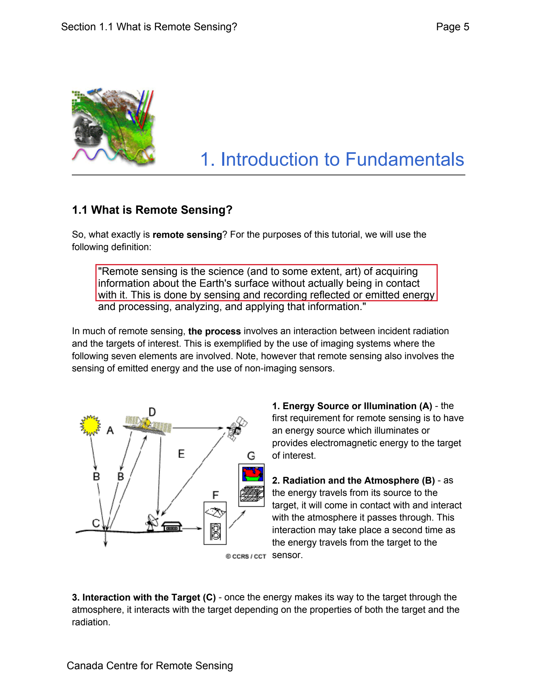

<figcaption><em>图 2　遥感的定义。</em><br/>来源：<a href="https://natural-resources.canada.ca/sites/nrcan/files/earthsciences/pdf/resource/tutor/fundam/pdf/fundamentals_e.pdf#page=5">CCRS《Fundamentals of Remote Sensing》</a>，PDF 第 5 页。</figcaption>
</figure>

<details>
<summary>展开查看另外 2 页手册</summary>

<figure id="page-ccrs-fundamentals-p019">

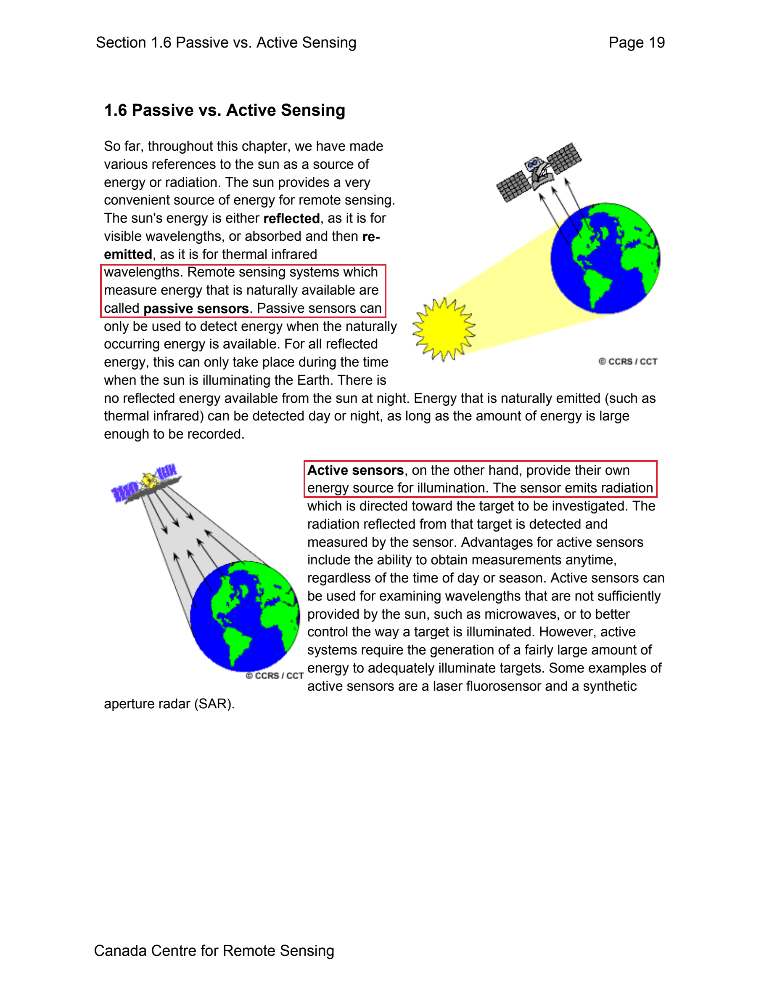

<figcaption><em>图 3　主动与被动遥感。</em><br/>来源：<a href="https://natural-resources.canada.ca/sites/nrcan/files/earthsciences/pdf/resource/tutor/fundam/pdf/fundamentals_e.pdf#page=19">CCRS《Fundamentals of Remote Sensing》</a>，PDF 第 19 页。</figcaption>
</figure>

<figure id="page-ccrs-fundamentals-p008">

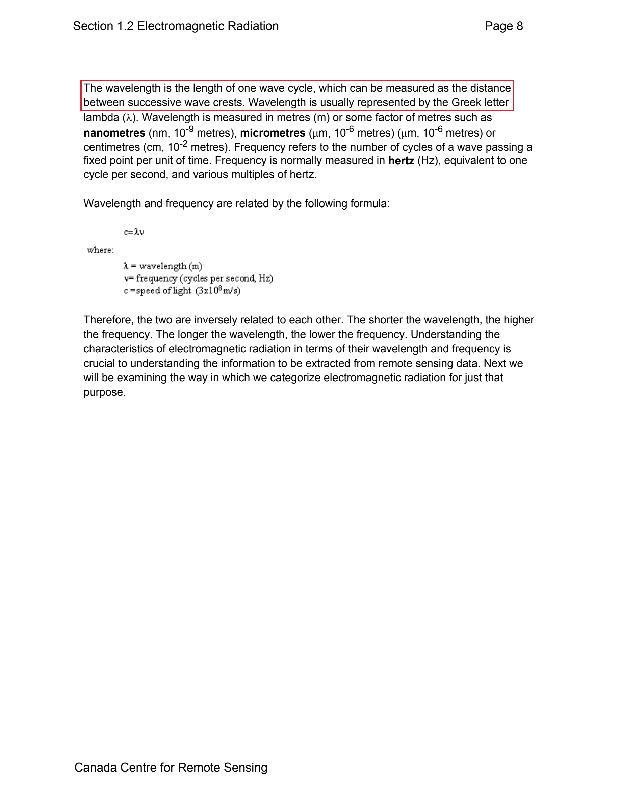

<figcaption><em>图 4　电磁波与波长。</em><br/>来源：<a href="https://natural-resources.canada.ca/sites/nrcan/files/earthsciences/pdf/resource/tutor/fundam/pdf/fundamentals_e.pdf#page=8">CCRS《Fundamentals of Remote Sensing》</a>，PDF 第 8 页。</figcaption>
</figure>

</details>

**波段**是传感器接收的一段波长范围。<strong>光谱响应函数</strong>描述仪器在这段范围内对不同波长的相对敏感程度；中心波长只是一种概括。<strong>半高全宽（FWHM）</strong>是响应曲线达到峰值一半时的宽度，常用于描述带宽。做物理校正时，需要进一步知道这个波段的波长范围和响应形状。

这些响应曲线可以实际下载：[Copernicus 的 MSI 文档目录](https://sentiwiki.copernicus.eu/web/s2-documents)保存了各版文件，其中 [2024 年 4.0 版 XLSX](https://sentiwiki.copernicus.eu/__attachments/a_ece6183b6698587e7ecd9804974bece3d82e39e151aa5aeca9d8fd95e1f1558c/COPE-GSEG-EOPG-TN-15-0007%20-%20Sentinel-2%20Spectral%20Response%20Functions%202024%20-%204.0.xlsx)包含 Sentinel‑2A、2B、2C 的逐波长响应。目录也收录后续版本，使用时可按卫星平台和处理版本选择相应文件。

<span id="evidence-08"></span>

<figure id="page-s2-psd-p439">

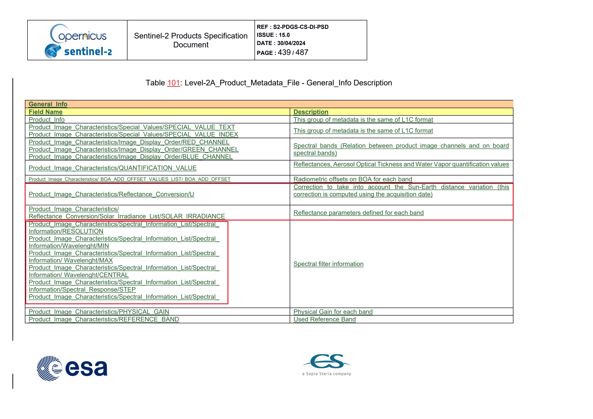

<figcaption><em>图 5　L2A 元数据中的波长、采样与太阳辐照度字段。</em><br/>来源：<a href="https://sentinels.copernicus.eu/documents/d/sentinel/s2-pdgs-cs-di-psd-v15-0#page=439">ESA《Sentinel-2 Products Specification Document》15.0</a>，PDF 第 439 页。</figcaption>
</figure>

<details>
<summary>展开查看另外 1 页手册</summary>

<figure id="page-modis-temperature-p010">

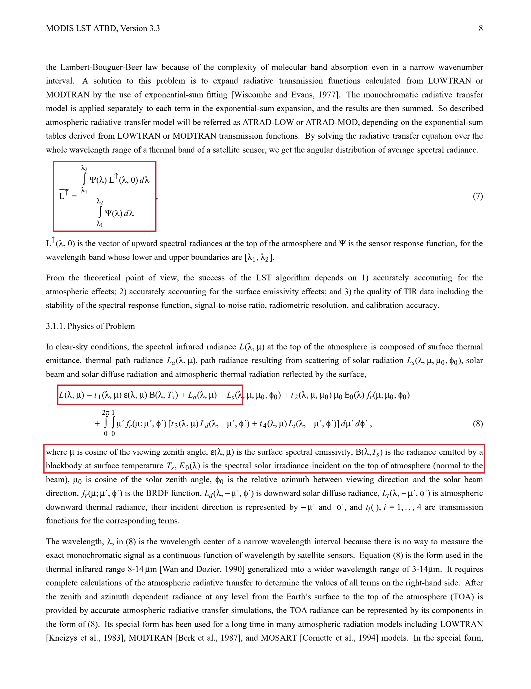

<figcaption><em>图 6　波段响应积分与热辐射模型。</em><br/>来源：<a href="https://modis.gsfc.nasa.gov/data/atbd/atbd_mod11.pdf#page=10">NASA《MODIS Land Surface Temperature ATBD》3.3</a>，PDF 第 10 页，书内第 8 页。</figcaption>
</figure>

</details>

<strong>“中心”和“带宽”也有计算约定。</strong>官方 4.0 版 XLSX 的 `Equivalent Wavelengths` 工作表使用响应加权平均：

$$
\lambda_{eq}=\frac{\int\lambda S(\lambda)\,\mathrm d\lambda}{\int S(\lambda)\,\mathrm d\lambda}.
$$

这里的 $S(\lambda)$ 表示仪器相对光谱响应；后文另用 $S$ 表示大气球面反照率。`Bandwidth and mid-wavelength` 工作表另用响应上升、下降两侧最陡斜率位置 $\lambda_1,\lambda_2$，定义带宽 $\Delta\lambda=\lambda_2-\lambda_1$、带宽中点 $\lambda_m=(\lambda_1+\lambda_2)/2$。*半高全宽*则取响应值达到峰值一半时的左右位置。两种定义各有用途，阅读文件中的 Bandwidth 时，最好连同计算约定一起看。

例如该文件给出 S2A B4 的等效波长约 664.622 nm，而带宽中点为 665 nm；两者使用了不同的计算定义。设计表的名义值、地面试验得到的平均响应、不同探测器的响应差异，也应分别看待。

<span id="evidence-32"></span>

<figure id="manual-srf-equivalent">

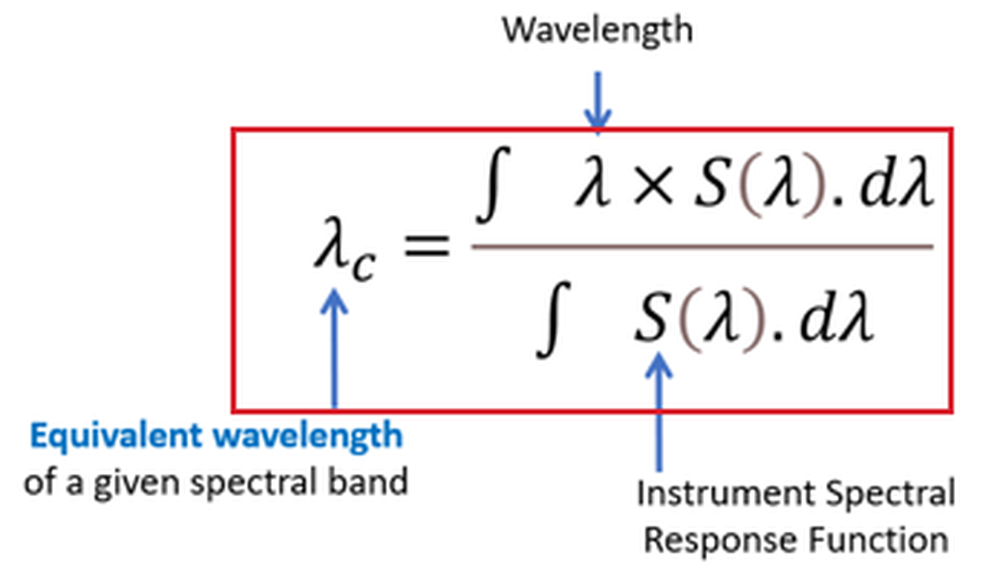

<figcaption><em>图 7　响应加权的等效波长。</em><br/>来源：<a href="https://sentiwiki.copernicus.eu/__attachments/a_ece6183b6698587e7ecd9804974bece3d82e39e151aa5aeca9d8fd95e1f1558c/COPE-GSEG-EOPG-TN-15-0007%20-%20Sentinel-2%20Spectral%20Response%20Functions%202024%20-%204.0.xlsx">MSI Spectral Response Functions 4.0</a>，工作表 <code>Equivalent Wavelengths</code>，附图起于 G4。</figcaption>
</figure>

<figure id="manual-srf-bandwidth">

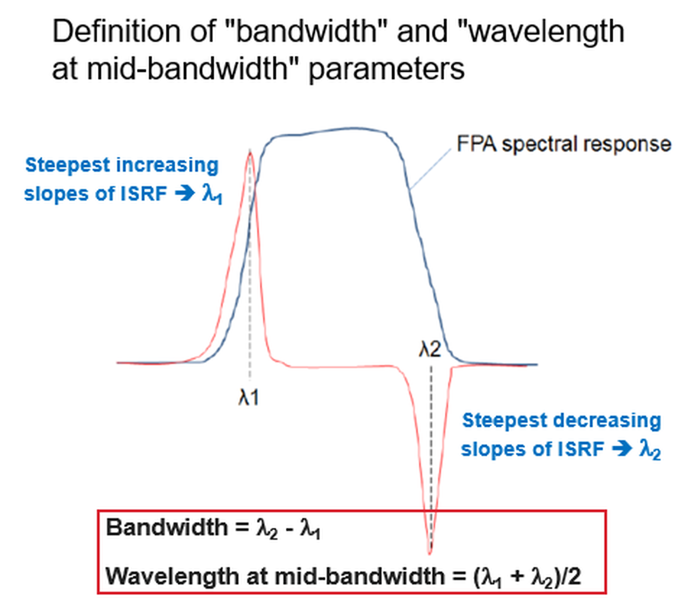

<figcaption><em>图 8　带宽与带宽中点的计算约定。</em><br/>来源：<a href="https://sentiwiki.copernicus.eu/__attachments/a_ece6183b6698587e7ecd9804974bece3d82e39e151aa5aeca9d8fd95e1f1558c/COPE-GSEG-EOPG-TN-15-0007%20-%20Sentinel-2%20Spectral%20Response%20Functions%202024%20-%204.0.xlsx">MSI Spectral Response Functions 4.0</a>，工作表 <code>Bandwidth and mid-wavelength</code>，附图起于 I5。</figcaption>
</figure>

还有一个<strong>采样</strong>容易混淆：`Spectral Responses (S2A)!A2:A2302` 的 `SR_WL` 从 300 到 2600 nm，每行相隔 1 nm。这里的 1 nm 是<u>响应曲线在波长轴上的数值采样步长</u>。地面采样距离用 m，波长采样步长和光谱带宽在这里用 nm，描述的维度不同。

### 1.2 像元与四种分辨率

影像通常是由行、列和波段组成的<strong>栅格</strong>。<strong>像元</strong>是网格上的一个采样单元，其数值代表一个地面空间足迹内、某个波段接收到的信号。一个像元里可能同时有树、土壤和道路，这叫<strong>混合像元</strong>。这些地物的信号共同进入这个像元；若想估计各自的比例，可结合不同地物的光谱特征进一步分析。仪器的<strong>瞬时视场（IFOV）</strong>是一个角范围；距离越远，同样角范围覆盖的地面足迹越大。产品的<strong>地面采样距离（GSD）</strong>则指输出网格相邻采样位置的地面间距。

<span id="evidence-02"></span>

<figure id="page-ccrs-fundamentals-p020">

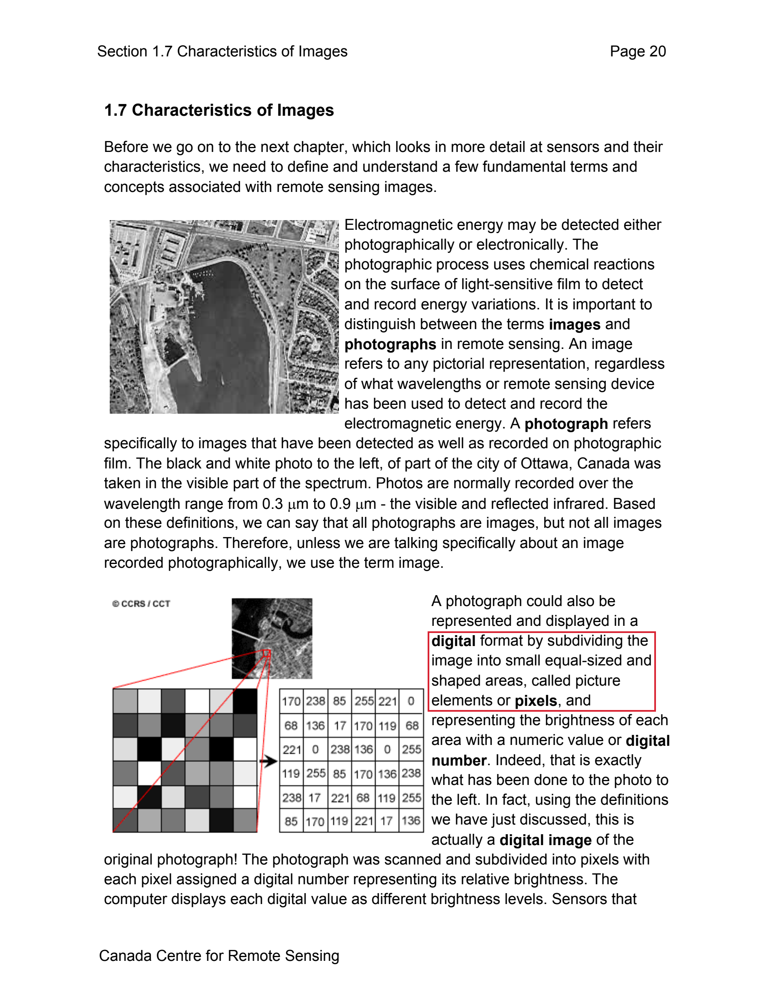

<figcaption><em>图 9　栅格影像与像元。</em><br/>来源：<a href="https://natural-resources.canada.ca/sites/nrcan/files/earthsciences/pdf/resource/tutor/fundam/pdf/fundamentals_e.pdf#page=20">CCRS《Fundamentals of Remote Sensing》</a>，PDF 第 20 页。</figcaption>
</figure>

<details>
<summary>展开查看另外 1 页手册</summary>

<figure id="page-ccrs-fundamentals-p039">

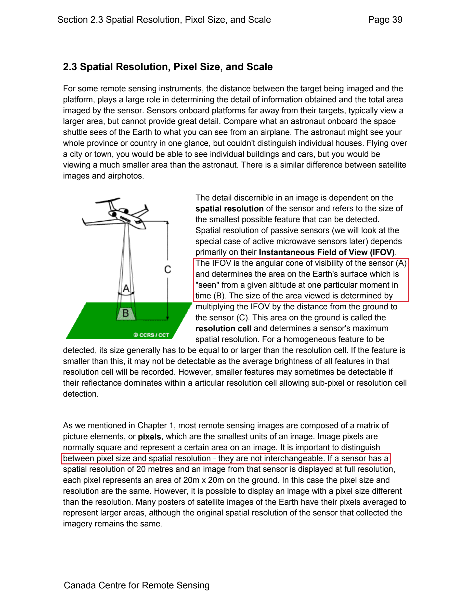

<figcaption><em>图 10　瞬时视场与地面空间分辨率。</em><br/>来源：<a href="https://natural-resources.canada.ca/sites/nrcan/files/earthsciences/pdf/resource/tutor/fundam/pdf/fundamentals_e.pdf#page=39">CCRS《Fundamentals of Remote Sensing》</a>，PDF 第 39 页。</figcaption>
</figure>

</details>

| 名称 | 它说明什么 | 阅读时留意什么 |
| --- | --- | --- |
| 空间分辨率 | 能分辨多细的地面空间结构；产品常用地面采样距离 GSD 表示像元间距 | 目标能否辨认，还取决于光学模糊、对比度和它在像元中的位置 |
| 光谱分辨率 | 对相近波长的区分能力，与带宽和响应曲线有关 | 波段数量、带宽和响应形状需要分别看 |
| 辐射分辨率 | 仪器把信号量化成多少数字等级的能力 | 仪器量化、文件存储位数和辐射准确度描述不同性质 |
| 时间分辨率 | 对同一区域重复观测的时间间隔 | 实际可用观测还受云量、覆盖范围和质量条件影响 |

<strong>多光谱</strong>是在若干波段采样，<strong>高光谱</strong>通常以密集、连续且更窄的波段观察光谱。后者更容易看清细小吸收特征，但也更依赖准确的定标、波段位置和足够的信噪比。信噪比表示有用信号相对于测量噪声的强弱。MSI 的 12 位仪器量化给出 $2^{12}=4096$ 个数字等级；L1C／L2A 经过定标与重新编码，仍可使用 16 位文件，仪器量化位数和产品存储位数在这里各有分工。下面波段原表的 SNR 与特定参考辐亮度 Lref 绑定。

<strong>辐射准确度</strong>关注测量值与校准参考值有多接近；信噪比关注随机噪声对信号的影响，量化位数关注可编码的等级数。高信噪比的仪器仍可能带有系统性的定标偏差，这类偏差仍需通过定标来处理。手册写出的“低于 5%、目标 3%”是 MSI 的辐射准确度设计要求。L2A 地表反射率的误差还取决于大气反演、地形和其他处理条件。

<span id="evidence-03"></span>

<figure id="page-ccrs-fundamentals-p041">

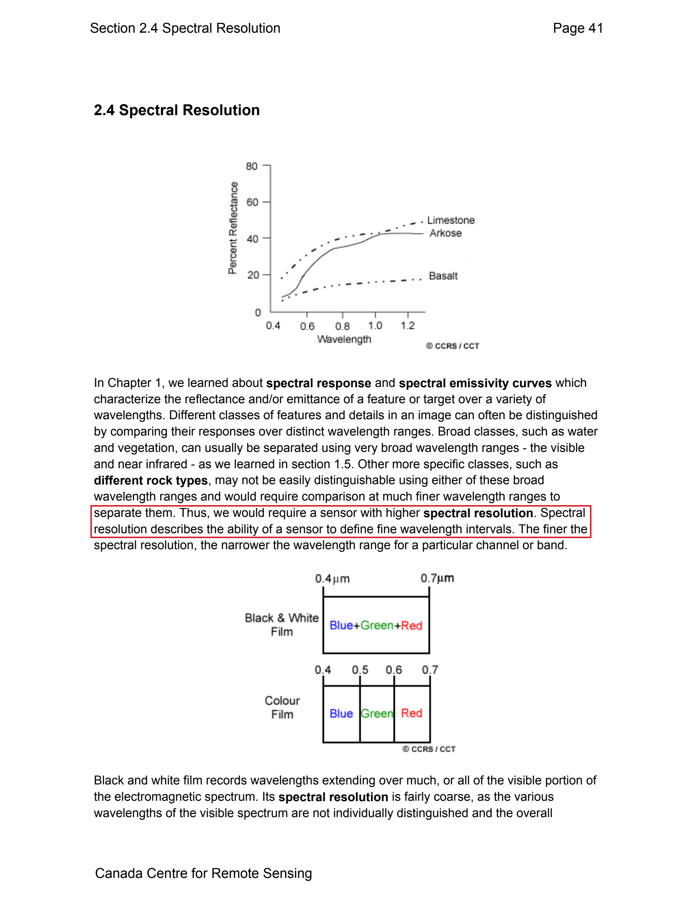

<figcaption><em>图 11　光谱分辨率。</em><br/>来源：<a href="https://natural-resources.canada.ca/sites/nrcan/files/earthsciences/pdf/resource/tutor/fundam/pdf/fundamentals_e.pdf#page=41">CCRS《Fundamentals of Remote Sensing》</a>，PDF 第 41 页。</figcaption>
</figure>

<details>
<summary>展开查看另外 3 页手册</summary>

<figure id="page-ccrs-fundamentals-p043">

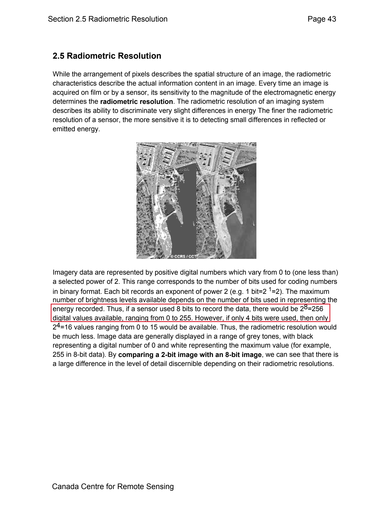

<figcaption><em>图 12　辐射分辨率与数字量化。</em><br/>来源：<a href="https://natural-resources.canada.ca/sites/nrcan/files/earthsciences/pdf/resource/tutor/fundam/pdf/fundamentals_e.pdf#page=43">CCRS《Fundamentals of Remote Sensing》</a>，PDF 第 43 页。</figcaption>
</figure>

<figure id="page-ccrs-fundamentals-p042">

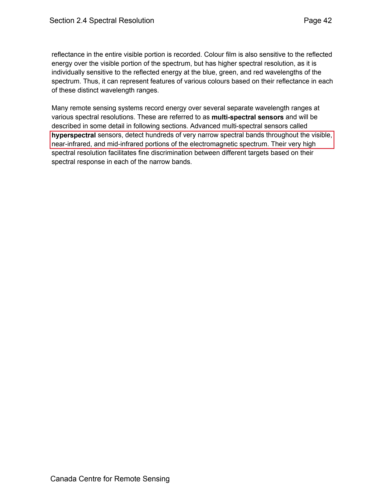

<figcaption><em>图 13　高光谱传感器。</em><br/>来源：<a href="https://natural-resources.canada.ca/sites/nrcan/files/earthsciences/pdf/resource/tutor/fundam/pdf/fundamentals_e.pdf#page=42">CCRS《Fundamentals of Remote Sensing》</a>，PDF 第 42 页。</figcaption>
</figure>

<figure id="page-ccrs-fundamentals-p044">

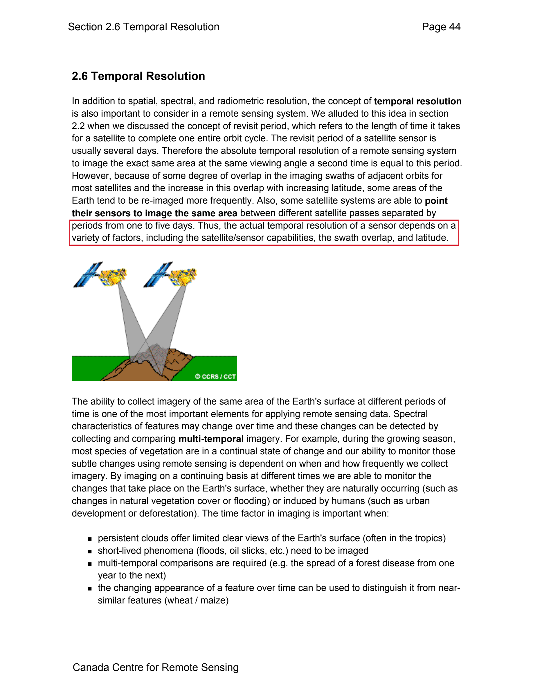

<figcaption><em>图 14　重复观测与时间分辨率。</em><br/>来源：<a href="https://natural-resources.canada.ca/sites/nrcan/files/earthsciences/pdf/resource/tutor/fundam/pdf/fundamentals_e.pdf#page=44">CCRS《Fundamentals of Remote Sensing》</a>，PDF 第 44 页。</figcaption>
</figure>

</details>

<span id="evidence-04"></span>

<figure id="page-s2-handbook-p053">

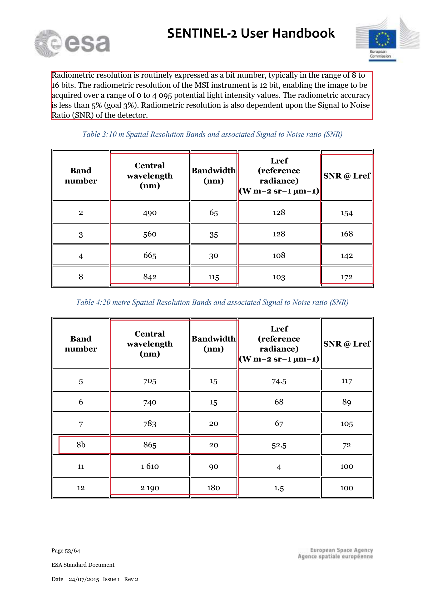

<figcaption><em>图 15　MSI 辐射指标与 10 m、20 m 波段参数。</em><br/>来源：<a href="https://sentinels.copernicus.eu/documents/247904/685211/Sentinel-2_User_Handbook#page=53">ESA《Sentinel-2 User Handbook》（2015，Issue 1 Rev 2）</a>，PDF 第 53 页。</figcaption>
</figure>

### 1.3 Sentinel‑2 的 13 个波段

MSI 的 13 个波段分别采用 10、20、60 m 的原生采样间距。下表采用《Sentinel‑2 User Handbook》2015 年版第 53–54 页表 3–5 的<strong>任务设计中心波长和带宽</strong>，各平台的实际响应另见对应测量文件；不同卫星的实际中心和响应曲线略有差别，计算时应使用对应平台的元数据或官方响应文件。[ESA 任务资料](https://sentiwiki.copernicus.eu/web/s2-mission)提供波段与采样说明。

| 波段 | 名义中心波长 | 设计带宽 | 原生采样间距 | 主要信息 |
| --- | --- | --- | --- | --- |
| B1 | 443 nm | 20 nm | 60 m | 沿海蓝光，对大气散射敏感 |
| B2 | 490 nm | 65 nm | 10 m | 蓝光 |
| B3 | 560 nm | 35 nm | 10 m | 绿光 |
| B4 | 665 nm | 30 nm | 10 m | 红光，植被叶绿素吸收明显 |
| B5 | 705 nm | 15 nm | 20 m | 红边 |
| B6 | 740 nm | 15 nm | 20 m | 红边 |
| B7 | 783 nm | 20 nm | 20 m | 红边／近红外过渡 |
| B8 | 842 nm | 115 nm | 10 m | 宽近红外，常与 B4 计算 NDVI |
| B8A | 865 nm | 20 nm | 20 m | 较窄近红外，响应范围和采样间距与 B8 不同 |
| B9 | 945 nm | 20 nm | 60 m | 水汽吸收区域 |
| B10 | 1375 nm | 30 nm | 60 m | 卷云检测，标准 L2A 不提供其地表反射率 |
| B11 | 1610 nm | 90 nm | 20 m | 短波红外，对含水状况等敏感 |
| B12 | 2190 nm | 180 nm | 20 m | 短波红外，对含水、矿物、烧毁地表等敏感 |

<span id="evidence-05"></span>

10 m 波段的设计参数列在[图 15](#page-s2-handbook-p053)的表 3。

<span id="evidence-06"></span>

20 m 波段见同页的表 4。

<span id="evidence-07"></span>

<figure id="page-s2-handbook-p054">

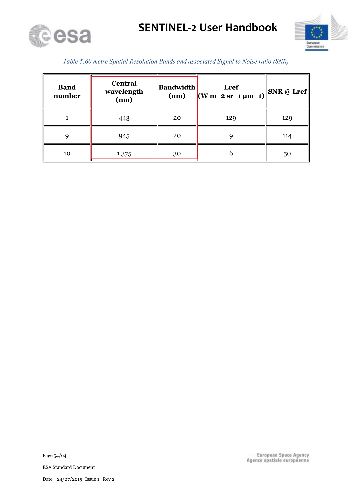

<figcaption><em>图 16　MSI 的 60 m 波段参数。</em><br/>来源：<a href="https://sentinels.copernicus.eu/documents/247904/685211/Sentinel-2_User_Handbook#page=54">ESA《Sentinel-2 User Handbook》（2015，Issue 1 Rev 2）</a>，PDF 第 54 页。</figcaption>
</figure>

<details>
<summary>展开查看另外 1 页手册</summary>

<figure id="page-s2-psd-p049">

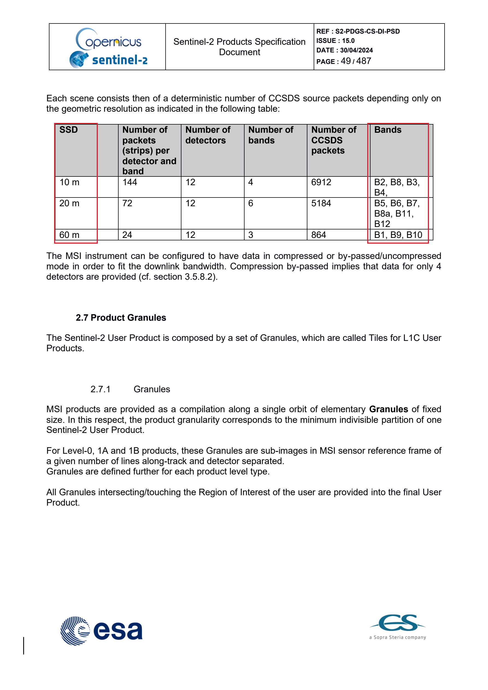

<figcaption><em>图 17　13 个波段的原生采样分组。</em><br/>来源：<a href="https://sentinels.copernicus.eu/documents/d/sentinel/s2-pdgs-cs-di-psd-v15-0#page=49">ESA《Sentinel-2 Products Specification Document》15.0</a>，PDF 第 49 页。</figcaption>
</figure>

</details>

**红边**是健康植被光谱从红光强吸收向近红外较高反射快速上升的区域。B5–B7 用来观察这段光谱变化。2015 年手册将窄近红外波段记作 8b，本文采用现行名称 B8A。

如果把 60 m 的 B9 重采样到 10 m，只是让网格更密，水汽观测没有获得新的 10 m 细节。<strong>重采样</strong>是在新网格上计算数值：连续量可以按目的使用最近邻、双线性等方法；分类编码则适合最近邻等保留类别的方法，让“云类”“植被类”等整数仍保持原来的含义。

Sen2Cor ATBD 2.10 的第 15 页还明确写出：没有在 10 m 空间尺度进行 AOT 和 WV 反演。因而读 10 m 输出时，可以把三个尺度分开看：原生观测网格、算法运算网格和输出网格。

<span id="evidence-09"></span>

<figure id="page-ccrs-fundamentals-p152">

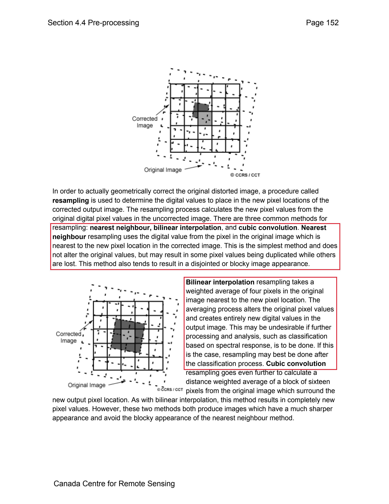

<figcaption><em>图 18　影像重采样的方法。</em><br/>来源：<a href="https://natural-resources.canada.ca/sites/nrcan/files/earthsciences/pdf/resource/tutor/fundam/pdf/fundamentals_e.pdf#page=152">CCRS《Fundamentals of Remote Sensing》</a>，PDF 第 152 页。</figcaption>
</figure>

<details>
<summary>展开查看另外 2 页手册</summary>

<figure id="page-sen2cor-atbd-p011">

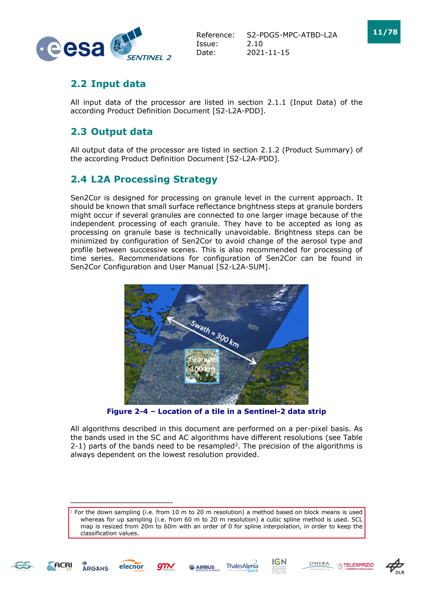

<figcaption><em>图 19　Sen2Cor 的重采样规则。</em><br/>来源：<a href="https://sentiwiki.copernicus.eu/__attachments/a_2e88ffb8dabc4e1ec9efb71ba27cc9bcf70feeb378c084a2e80ba990273ebe5c/S2-PDGS-MPC-ATBD-L2A%20-%20Level%202A%20Algorithm%20Theoretical%20Basis%20Document%202021%20-%202.10.pdf#page=11">ESA《Sen2Cor L2A Algorithm Theoretical Basis Document》2.10</a>，PDF 第 11 页。</figcaption>
</figure>

<figure id="page-sen2cor-atbd-p015">

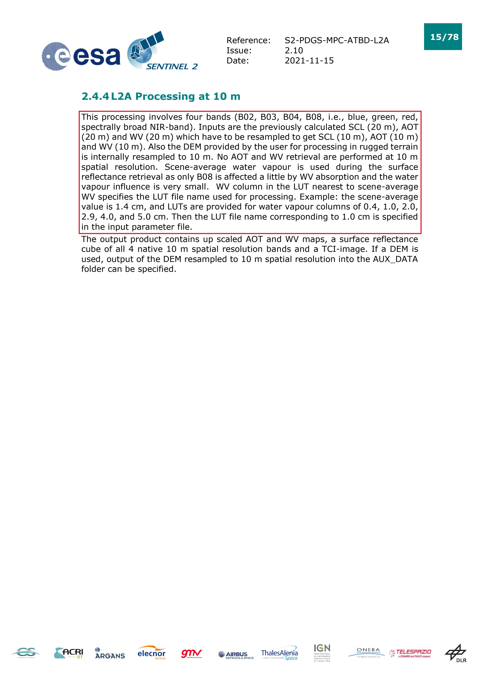

<figcaption><em>图 20　Sen2Cor 的 10 m 处理流程。</em><br/>来源：<a href="https://sentiwiki.copernicus.eu/__attachments/a_2e88ffb8dabc4e1ec9efb71ba27cc9bcf70feeb378c084a2e80ba990273ebe5c/S2-PDGS-MPC-ATBD-L2A%20-%20Level%202A%20Algorithm%20Theoretical%20Basis%20Document%202021%20-%202.10.pdf#page=15">ESA《Sen2Cor L2A Algorithm Theoretical Basis Document》2.10</a>，PDF 第 15 页。</figcaption>
</figure>

</details>

## 2. DN、辐亮度、反射率：先认清数字的身份

### 2.1 怎样从 DN 读出物理量

DN 是 Digital Number，即文件中的数字量化值。它既可能表示经过仪器定标的辐射信号，也可能是某种物理量乘上比例系数、加上偏移后保存的整数。

> 同样是整数，可能存着不同的物理量。解释 DN，要先读产品的编码约定。

假设一个产品用

$$
\rho=s\,DN+o
$$

恢复反射率，$s$ 是比例系数（scale），$o$ 是偏移量（offset）。只有读过该产品的定义，才能解释 3200。若 $s=0.0001,o=0$，它对应 0.32；若 $o=-0.1$，则对应 0.22。

**NoData** 用特殊编码表示“这个位置没有有效观测”；**饱和**表示信号超过仪器可记录范围。处理时先识别并筛选这些值，再对有效像元计算物理量。

<span id="evidence-10"></span>

<figure id="page-s2-psd-p397">

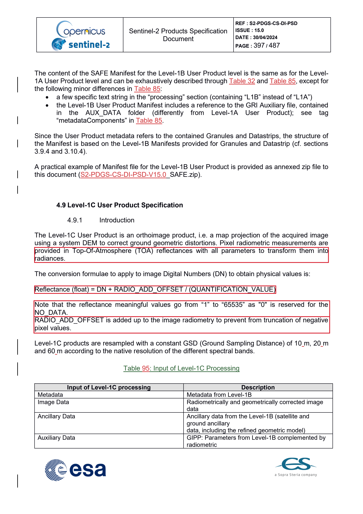

<figcaption><em>图 21　L1C 的 TOA 反射率及整数编码。</em><br/>来源：<a href="https://sentinels.copernicus.eu/documents/d/sentinel/s2-pdgs-cs-di-psd-v15-0#page=397">ESA《Sentinel-2 Products Specification Document》15.0</a>，PDF 第 397 页。</figcaption>
</figure>

### 2.2 辐亮度与辐照度

<strong>辐亮度</strong>（radiance，$L_\lambda$）描述传感器从某个方向接收到的辐射强弱。常用单位为

$$
\mathrm{W\,m^{-2}\,sr^{-1}\,\mu m^{-1}}.
$$

W 是功率单位瓦特；$\mathrm{m^{-2}}$ 对应单位投影面积；sr 是<strong>球面度</strong>，即立体角单位，用来区分不同方向；$\mathrm{\mu m^{-1}}$ 表示单位波长间隔。这些单位把方向、面积和光谱范围都写进了测量定义。

把这个含义写成数学定义，令 $\Phi$ 为辐射功率、$A$ 为面积、$\Omega$ 为立体角、$\theta$ 为光线与表面法线的夹角，则**光谱辐亮度**为

$$
L_\lambda=\frac{\mathrm d^3\Phi}{\cos\theta\,\mathrm dA\,\mathrm d\Omega\,\mathrm d\lambda}.
$$

这里的 $\mathrm d$ 表示取很小的面积、方向范围和波长间隔；$\cos\theta\,\mathrm dA$ 是垂直于光线的投影面积。这一定义解释了为什么辐亮度的单位同时包含面积、方向和波长。[NIST《辐射传感器定标推荐规范》§1.2.1、§1.3](https://nvlpubs.nist.gov/nistpubs/Legacy/hb/nisthandbook152.pdf#page=13)给出辐亮度与光谱密度的定义。

<strong>辐照度</strong>（irradiance，$E$）描述落到表面单位面积上的辐射功率。它把入射方向的贡献积分起来，所以不像辐亮度那样保留 $\mathrm{sr^{-1}}$。两者名字相近，但一个强调方向上的信号，一个强调表面收到的能量。

在同一波长处，二者的关系为

$$
E_\lambda=\int_{\Omega^+}L_{\lambda,i}(\theta_i,\varphi_i)\cos\theta_i\,\mathrm d\Omega_i.
$$

$\Omega^+$ 是表面上方的入射半球；下标 $i$ 表示入射，$\varphi_i$ 是方位角，$\mathrm d\Omega_i=\sin\theta_i\,\mathrm d\theta_i\,\mathrm d\varphi_i$。积分的意思是把所有入射方向的贡献相加，斜着照到表面的光按余弦权重计入。于是 $E_\lambda$ 的单位是 $\mathrm{W\,m^{-2}\,\mu m^{-1}}$。[NIST 的辐射量定义与传输关系](https://nvlpubs.nist.gov/nistpubs/Legacy/hb/nisthandbook152.pdf#page=16)可用来核对这两类量。

实际波段接收的是一段光谱。若 $R_b(\lambda)$ 表示第 $b$ 个波段的相对响应，可以定义响应加权的平均光谱辐亮度：

$$
\overline L_b=\frac{\int L_\lambda(\lambda)R_b(\lambda)\,\mathrm d\lambda}{\int R_b(\lambda)\,\mathrm d\lambda}.
$$

波段值汇集了一段波长范围内的信号。这个式子是解释用的归一化定义，具体产品仍须遵循自己的定标约定；涉及辐亮度与太阳辐照度时，也应使用相容的波段响应。[NIST 光谱辐亮度定标手册](https://nvlpubs.nist.gov/nistpubs/Legacy/SP/nbsspecialpublication250-1.pdf)说明了响应函数如何进入测量积分。

<span id="evidence-11"></span>

<figure id="page-nist-radiometry-p013">

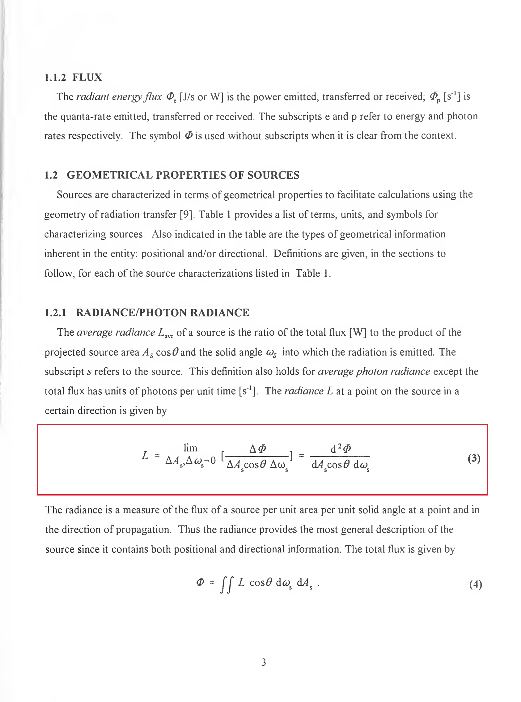

<figcaption><em>图 22　辐亮度的定义。</em><br/>来源：<a href="https://nvlpubs.nist.gov/nistpubs/Legacy/hb/nisthandbook152.pdf#page=13">NIST《Handbook 152：Recommended Practice—Radiometric Sensor Calibration》</a>，PDF 第 13 页，书内第 3 页。</figcaption>
</figure>

<details>
<summary>展开查看另外 2 页手册</summary>

<figure id="page-nist-radiometry-p016">

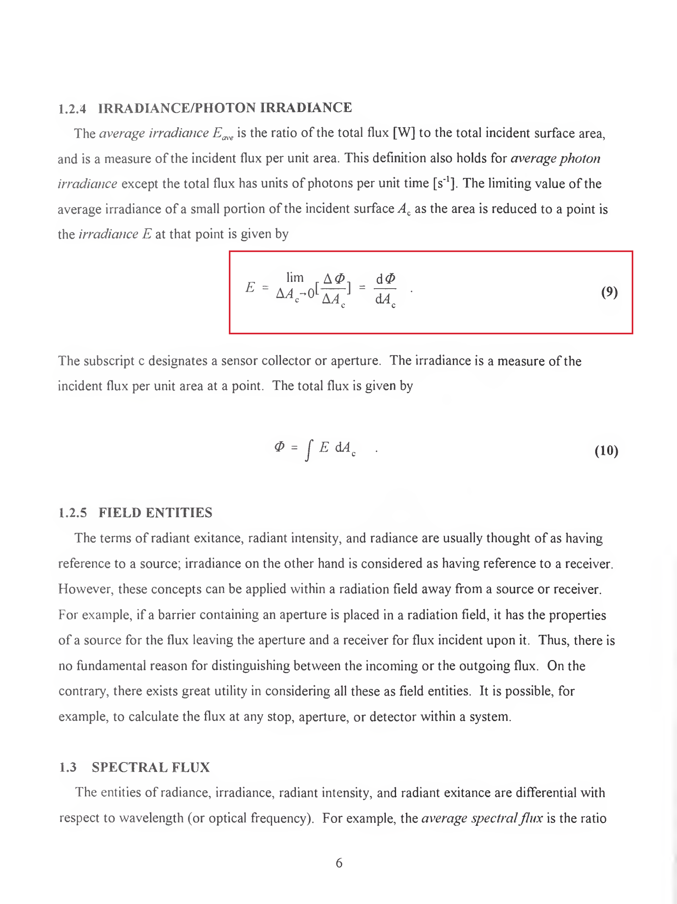

<figcaption><em>图 23　辐照度的定义。</em><br/>来源：<a href="https://nvlpubs.nist.gov/nistpubs/Legacy/hb/nisthandbook152.pdf#page=16">NIST《Handbook 152：Recommended Practice—Radiometric Sensor Calibration》</a>，PDF 第 16 页，书内第 6 页。</figcaption>
</figure>

<figure id="page-nist-radiometry-p017">

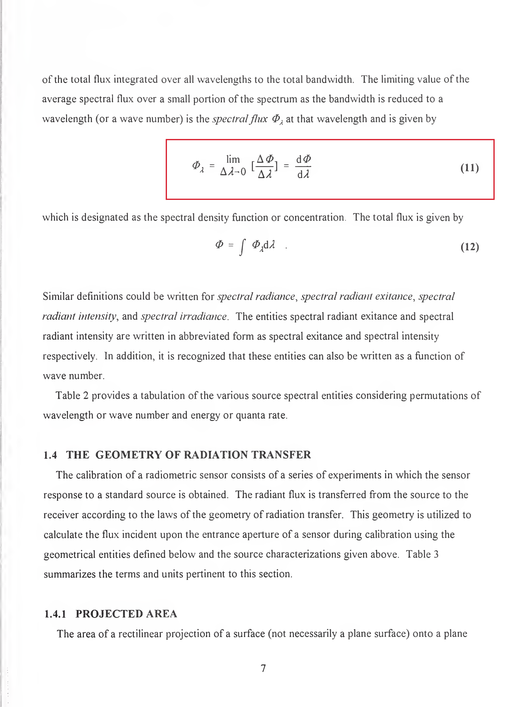

<figcaption><em>图 24　光谱密度的定义。</em><br/>来源：<a href="https://nvlpubs.nist.gov/nistpubs/Legacy/hb/nisthandbook152.pdf#page=17">NIST《Handbook 152：Recommended Practice—Radiometric Sensor Calibration》</a>，PDF 第 17 页，书内第 7 页。</figcaption>
</figure>

</details>

<span id="evidence-12"></span>

<figure id="page-ocean-protocols-p021">

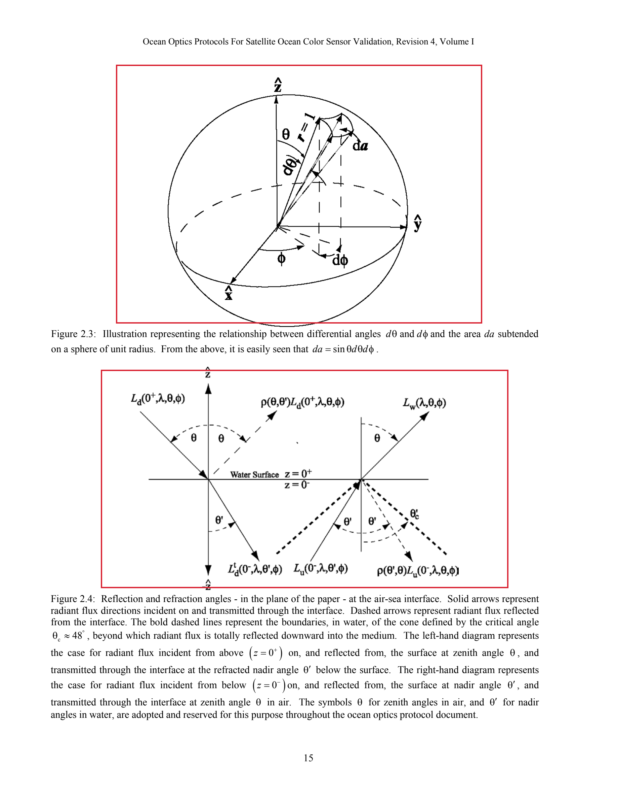

<figcaption><em>图 25　立体角与水面反射几何。</em><br/>来源：<a href="https://oceancolor.gsfc.nasa.gov/files/resources/docs/technical/protocols_ver4_voli.pdf#page=21">NASA《Ocean Optics Protocols》Rev. 4，Vol. I</a>，PDF 第 21 页，书内第 15 页。</figcaption>
</figure>

### 2.3 反射率与方向性

直观上，<strong>反射率</strong>描述表面反射了多少入射辐射，是无量纲的量。在理想的总量意义下，若照到表面的能量为 100、向所有方向反射的总量为 20，反射率就是 0.2。

卫星从有限方向接收信号。因此遥感产品中的“反射率”还带有观测方向和模型约定。常用的简化是假设表面为<strong>朗伯体</strong>：反射辐亮度不随观察方向改变，此时有 $L=E\rho/\pi$。真实树冠、水面、雪地和坡面通常不完全符合这一假设。

<strong>BRDF（双向反射分布函数）</strong>描述反射如何随入射方向和观察方向变化。大气校正后，同一片森林在不同太阳、传感器角度下仍可能有不同测值，原因之一就在这里。

在给定波长、入射方向与出射方向下，它的定义为

$$
f_r(\theta_i,\varphi_i;\theta_r,\varphi_r;\lambda)
=\frac{\mathrm dL_{\lambda,r}}{\mathrm dE_{\lambda,i}}.
$$

下标 $r$ 表示反射；分子是该入射贡献产生的反射辐亮度，分母是相应入射辐照度。BRDF 的单位为 $\mathrm{sr^{-1}}$，保留了反射在方向上的分布信息。[NIST 的 BRDF 定义](https://pages.nist.gov/ScatterMIST/docs/Introduction.htm)给出相应的功率、角度与立体角关系。

对于从一个方向入射的光，向整个出射半球反射的比例称为<strong>方向—半球反射率</strong>：

$$
\rho_{dh}(\theta_i,\varphi_i;\lambda)
=\int_{\Omega^+}f_r(\theta_i,\varphi_i;\theta_r,\varphi_r;\lambda)
\cos\theta_r\,\mathrm d\Omega_r.
$$

若表面是朗伯体，$f_r=\rho_{dh}/\pi$，因为半球上的 $\int\cos\theta_r\,\mathrm d\Omega_r=\pi$；这正是前面 $L=E\rho/\pi$ 的来由。[NIST 朗伯反射模型](https://pages.nist.gov/SCATMECH/docs/lambert.htm)采用这一关系。在定向照明约定下，常定义<strong>双向反射因子</strong> $\mathrm{BRF}=\pi f_r$，表示表面比同照明下理想白色朗伯面在该方向亮多少。方向性明显时，它可以超过 1，而被动表面向全部方向反射的总功率比例不能超过 1；解释卫星产品异常值时，要先区分这些量。

<span id="evidence-13"></span>

<figure id="page-nist-brdf-p019">

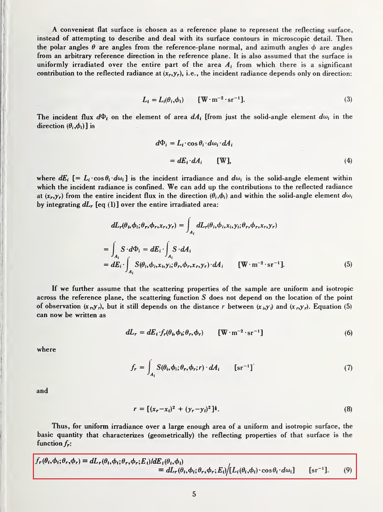

<figcaption><em>图 26　BRDF 的定义。</em><br/>来源：<a href="https://nvlpubs.nist.gov/nistpubs/Legacy/MONO/nbsmonograph160.pdf#page=19">NBS/NIST《Monograph 160：Geometrical Considerations and Nomenclature for Reflectance》</a>，PDF 第 19 页，书内第 5 页。</figcaption>
</figure>

<details>
<summary>展开查看另外 3 页手册</summary>

<figure id="page-nist-brdf-p025">

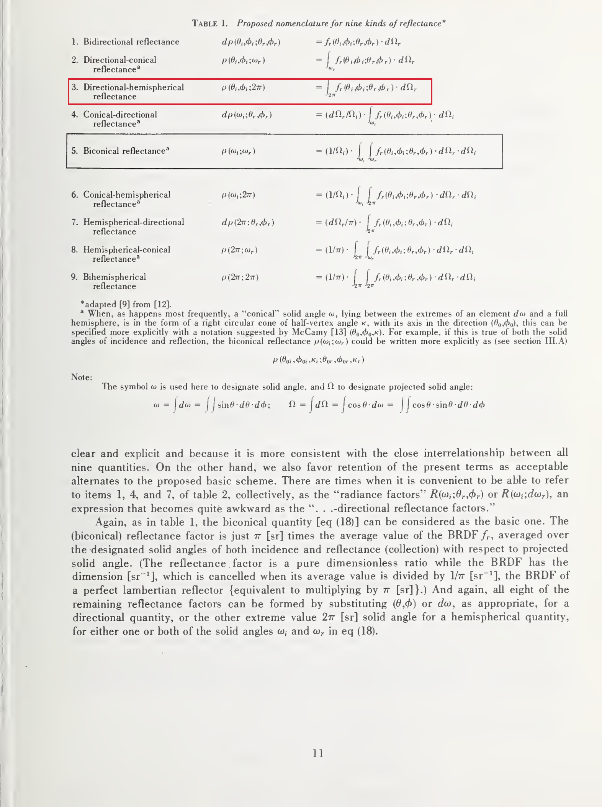

<figcaption><em>图 27　反射率的几何分类。</em><br/>来源：<a href="https://nvlpubs.nist.gov/nistpubs/Legacy/MONO/nbsmonograph160.pdf#page=25">NBS/NIST《Monograph 160：Geometrical Considerations and Nomenclature for Reflectance》</a>，PDF 第 25 页，书内第 11 页。</figcaption>
</figure>

<figure id="page-nist-brdf-p026">

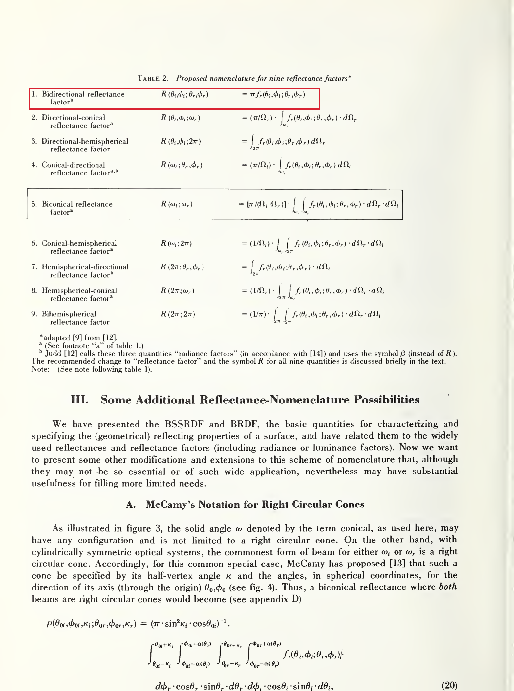

<figcaption><em>图 28　反射因子的几何分类。</em><br/>来源：<a href="https://nvlpubs.nist.gov/nistpubs/Legacy/MONO/nbsmonograph160.pdf#page=26">NBS/NIST《Monograph 160：Geometrical Considerations and Nomenclature for Reflectance》</a>，PDF 第 26 页，书内第 12 页。</figcaption>
</figure>

<figure id="page-nist-brdf-p057">

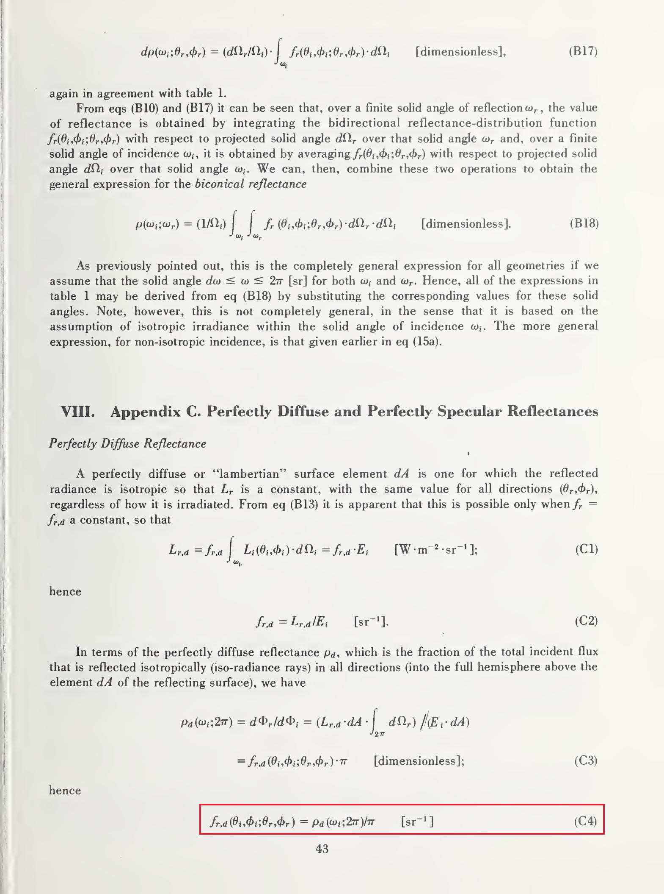

<figcaption><em>图 29　朗伯表面与反射率。</em><br/>来源：<a href="https://nvlpubs.nist.gov/nistpubs/Legacy/MONO/nbsmonograph160.pdf#page=57">NBS/NIST《Monograph 160：Geometrical Considerations and Nomenclature for Reflectance》</a>，PDF 第 57 页，书内第 43 页。</figcaption>
</figure>

</details>

## 3. TOA 与 BOA：同叫反射率，位置不同

<strong>TOA（Top Of Atmosphere，大气顶）反射率</strong>把卫星观测的辐亮度按太阳照明条件归一化，但没有去掉大气吸收、散射贡献。<strong>BOA（Bottom Of Atmosphere，大气底）反射率</strong>是经大气校正估计的地表反射率，通常也称 SR（Surface Reflectance）。BOA 是结合卫星观测与模型得到的反演估计。

在常见约定下，TOA 反射率与辐亮度的关系可写为：

$$
\rho_{TOA}=\frac{\pi L_\lambda d^2}{E_{0,\lambda}\cos\theta_s}.
$$

$E_{0,\lambda}$ 是按波段响应定义的太阳辐照度；$d$ 是日地距离，以天文单位计；$\theta_s$ 是<strong>太阳天顶角</strong>，即太阳方向和当地竖直方向的夹角。太阳高度角是它的余角。<strong>太阳方位角</strong>描述太阳在水平面的方向，通常从北向顺时针计，具体约定仍应查软件。

对于 Sentinel‑2，产品中的日地距离修正因子 $U$ 对应 $1/d^2$。由 TOA 恢复辐亮度时，关系成为：

$$
L_\lambda=\frac{\rho_{TOA}E_{0,\lambda}U\cos\theta_s}{\pi}.
$$

这一步恢复传感器接收到的辐亮度，为后续大气校正准备输入。太阳辐照度、距离修正因子和角度可在对应产品的元数据中查找。[Copernicus L1C 处理说明](https://s2.pages.eopf.copernicus.eu/msi/s2msi/main/PDFS_ADFS/L1/PDFS_S2_MSI_L1C.html)给出相应关系。

<span id="evidence-14"></span>

<figure id="page-sen2cor-atbd-p067">

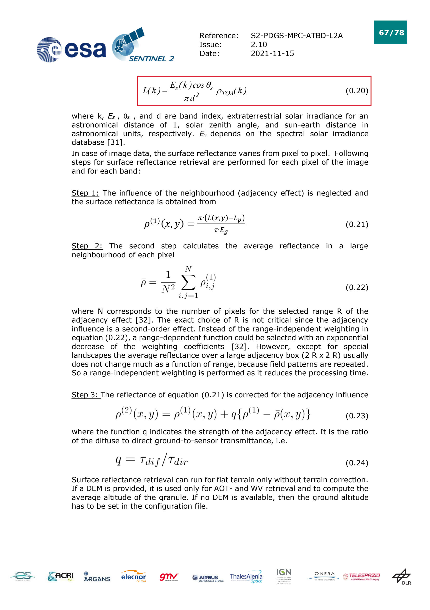

<figcaption><em>图 30　TOA 反射率与辐亮度的转换。</em><br/>来源：<a href="https://sentiwiki.copernicus.eu/__attachments/a_2e88ffb8dabc4e1ec9efb71ba27cc9bcf70feeb378c084a2e80ba990273ebe5c/S2-PDGS-MPC-ATBD-L2A%20-%20Level%202A%20Algorithm%20Theoretical%20Basis%20Document%202021%20-%202.10.pdf#page=67">ESA《Sen2Cor L2A Algorithm Theoretical Basis Document》2.10</a>，PDF 第 67 页。</figcaption>
</figure>

<details>
<summary>展开查看另外 1 页手册</summary>

<figure id="page-landsat-handbook-p063">

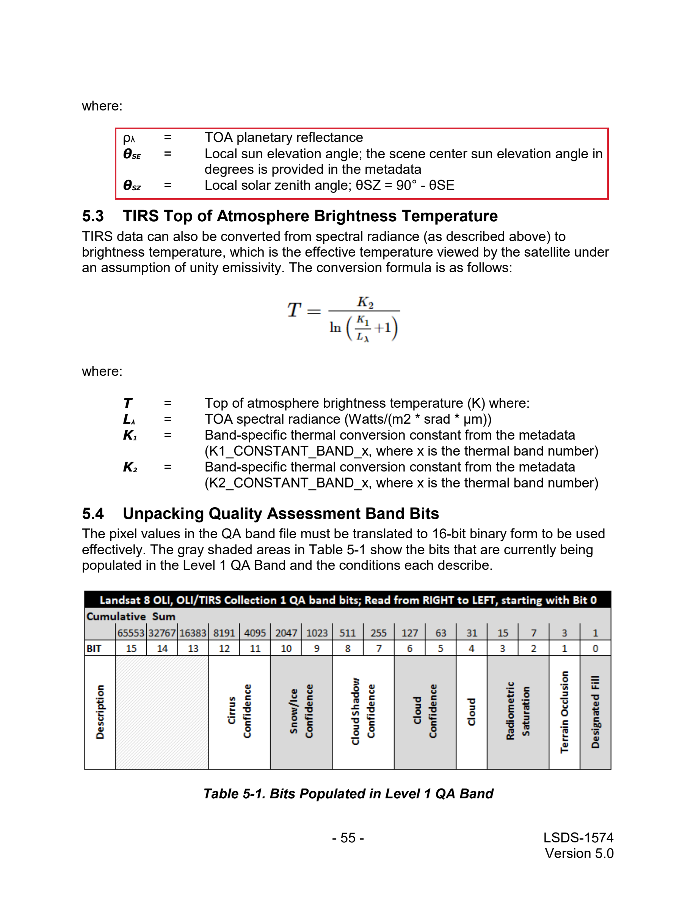

<figcaption><em>图 31　太阳天顶角与高度角。</em><br/>来源：<a href="https://d9-wret.s3.us-west-2.amazonaws.com/assets/palladium/production/s3fs-public/atoms/files/LSDS-1574_L8_Data_Users_Handbook-v5.0.pdf#page=63">USGS《Landsat 8 Data Users Handbook》v5.0</a>，PDF 第 63 页，书内第 55 页。</figcaption>
</figure>

</details>

相关原页见[图 5](#page-s2-psd-p439)（L2A 元数据中的波长、采样与太阳辐照度字段）。

## 4. 大气究竟怎样改变信号

### 4.1 吸收、散射与路径辐射

<strong>吸收</strong>使辐射能量转移给气体或颗粒。水汽、臭氧等在特定波长吸收，因而不同波段的影响并不相同。吸收很强的波段中，传感器能够接收到的地表信息也较少。

<strong>散射</strong>改变光的传播方向。分子散射一般对短波影响更强；气溶胶的影响还取决于颗粒大小、组成和数量。<strong>气溶胶</strong>是悬浮在空气中的固体或液体颗粒，包括烟尘、海盐和沙尘等；水汽则是气态水，两者对辐射的作用不同。

<strong>路径辐亮度</strong>是太阳光没有在目标地表反射，却被大气散射进传感器的贡献。它常给暗地物叠上一层亮的背景。<strong>透过率</strong>表示沿一条传播路径保留下来的辐射比例。

<span id="evidence-15"></span>

<figure id="page-ccrs-fundamentals-p012">

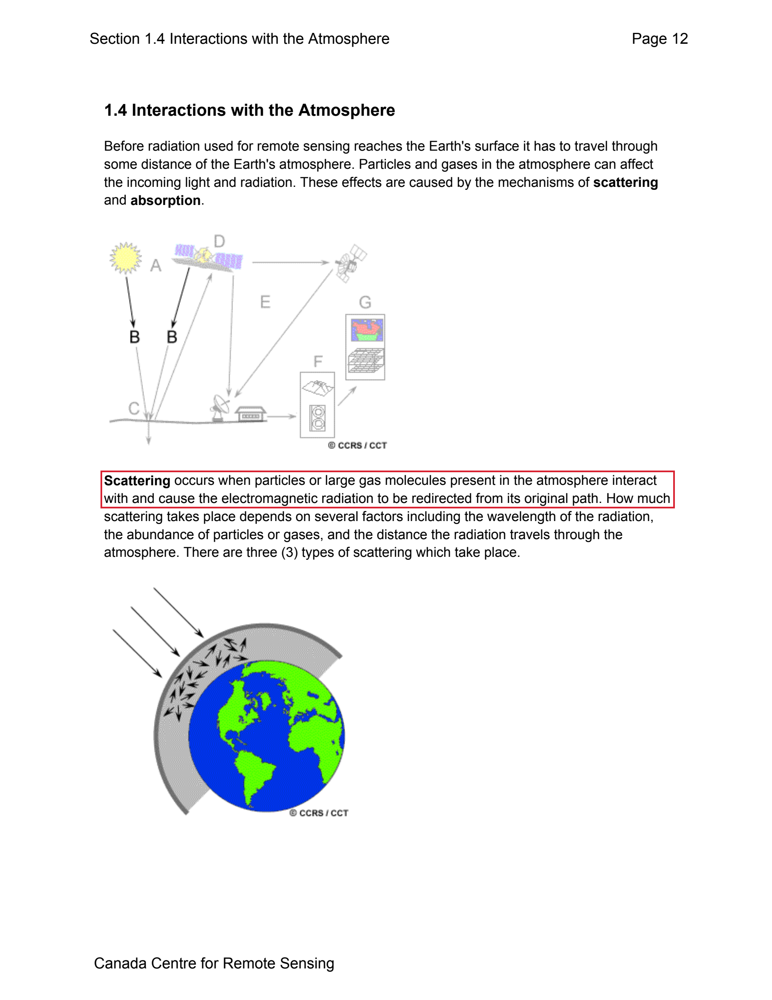

<figcaption><em>图 32　大气散射。</em><br/>来源：<a href="https://natural-resources.canada.ca/sites/nrcan/files/earthsciences/pdf/resource/tutor/fundam/pdf/fundamentals_e.pdf#page=12">CCRS《Fundamentals of Remote Sensing》</a>，PDF 第 12 页。</figcaption>
</figure>

<details>
<summary>展开查看另外 1 页手册</summary>

<figure id="page-ccrs-fundamentals-p014">

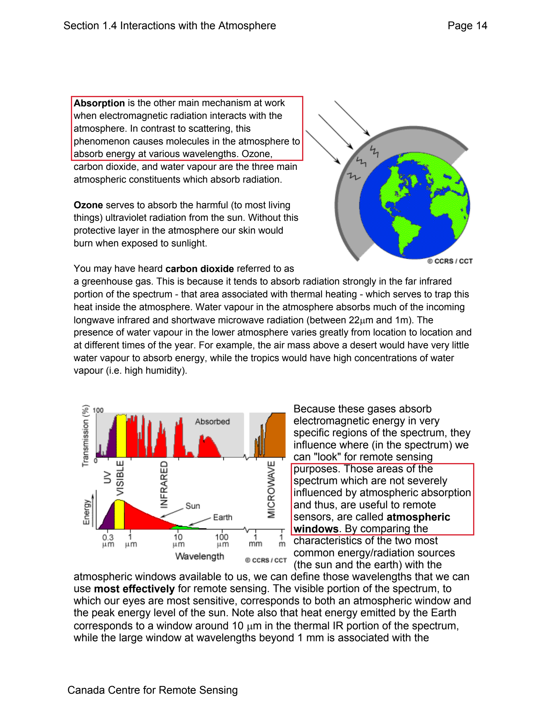

<figcaption><em>图 33　大气吸收与窗口。</em><br/>来源：<a href="https://natural-resources.canada.ca/sites/nrcan/files/earthsciences/pdf/resource/tutor/fundam/pdf/fundamentals_e.pdf#page=14">CCRS《Fundamentals of Remote Sensing》</a>，PDF 第 14 页。</figcaption>
</figure>

</details>

用一个解释性的简化式，可以把传感器观测写成：

$$
L_{sensor}\approx L_{path}
+T_{\uparrow}\frac{E_{\downarrow}}{\pi}\rho_s.
$$

$L_{path}$ 是路径辐亮度；$T_{\uparrow}$ 是地表至传感器的上行透过率；$E_{\downarrow}$ 是到达地表的直射和散射辐照度；$\rho_s$ 是地表反射率。式子说明大气既会增加信号，也会削弱信号。真实模型还包括多次散射和空间相邻地物的贡献。

<span id="evidence-16"></span>

<figure id="page-modis-atmosphere-p021">

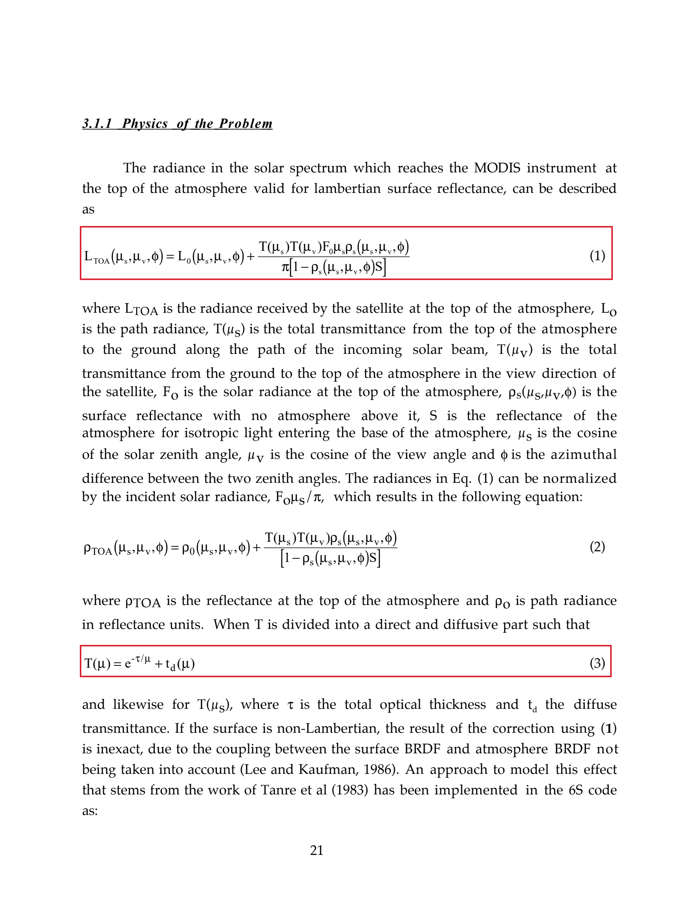

<figcaption><em>图 34　大气辐射传输的基本关系。</em><br/>来源：<a href="https://modis.gsfc.nasa.gov/data/atbd/atbd_mod08.pdf#page=21">NASA《MODIS Atmospheric Correction ATBD》4.0</a>，PDF 第 21 页。</figcaption>
</figure>

### 4.2 邻近效应与几个大气参数

<strong>邻近效应</strong>是大气散射把周围地物的信号带进目标像元的视线。暗水体旁边的亮沙滩，可能影响水体观测；混合像元描述像元内部同时有岸与水；邻近效应描述周围信号经过大气进入观测，两者可以同时出现。

<figure>


<figcaption><em>图 35　水体观测中的邻近效应。橙色折线示意亮岸反射经大气散射进入传感器，淡蓝线示意水体方向的信号。AI 绘制的概念示意。</em></figcaption>
</figure>

<span id="evidence-17"></span>

<figure id="page-modis-atmosphere-p023">

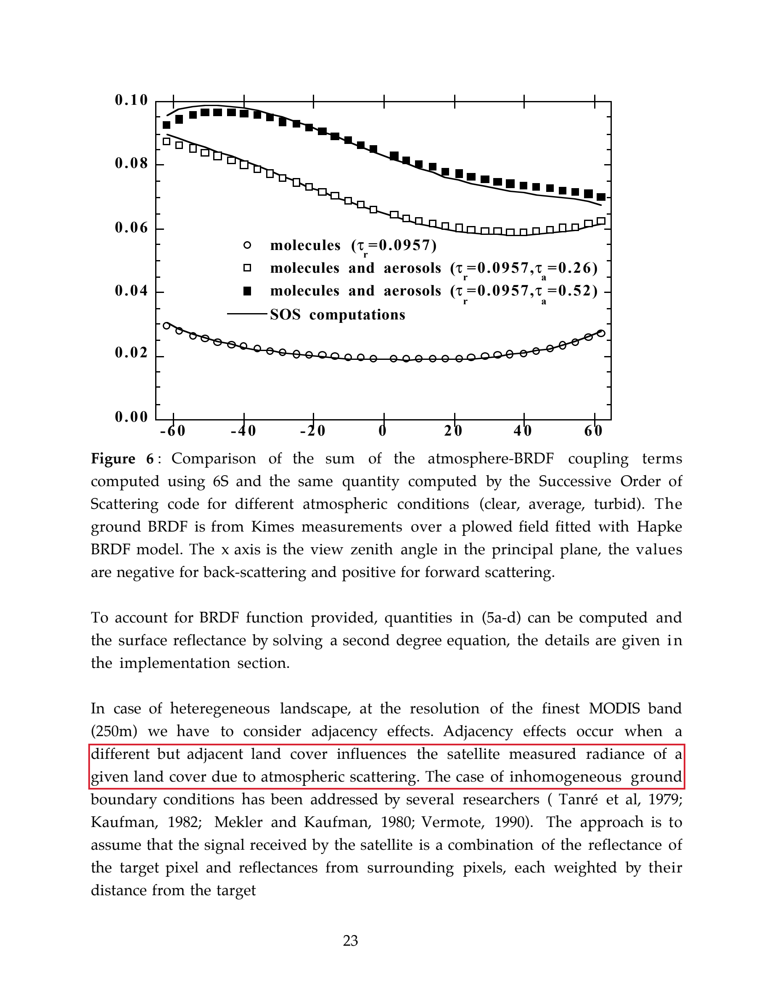

<figcaption><em>图 36　邻近地物对观测的影响。</em><br/>来源：<a href="https://modis.gsfc.nasa.gov/data/atbd/atbd_mod08.pdf#page=23">NASA《MODIS Atmospheric Correction ATBD》4.0</a>，PDF 第 23 页。</figcaption>
</figure>

<strong>气溶胶光学厚度</strong>（AOT，也常称 AOD）是沿大气柱积分的消光程度，是无量纲量，必须同时说明波长。数值越大，直接穿过该柱的光通常衰减越强。它描述整根大气柱的光学影响；地面颗粒物浓度和空气质量指数关注的量有所不同。

用 $\beta_{ext,a}(\lambda,z)$ 表示高度 $z$ 处气溶胶的<strong>消光系数</strong>，即吸收与散射使直射光衰减的强度，垂直柱的 AOT 定义为

$$
\tau_a(\lambda)=\int_{z_0}^{z_{top}}\beta_{ext,a}(\lambda,z)\,\mathrm dz.
$$

$z_0$、$z_{top}$ 分别为柱的下界和上界；若系数用 $\mathrm{km^{-1}}$，高度就用 km，积分后没有单位。[NOAA 对分层消光与光学厚度的说明](https://gml.noaa.gov/grad/agasp2.html)可核对这一含义。

对于没有散射补入的直射束，Beer–Lambert 衰减关系给出

$$
T_{dir}(\lambda)=e^{-\tau_{path}(\lambda)}.
$$

这里 $\tau_{path}$ 是沿实际光路的<strong>总</strong>消光光学厚度。若只研究气溶胶这一项，在平行平面大气近似下，其斜程光学厚度为 $\tau_{path,a}\approx\tau_a/\cos\theta$，$\theta$ 是光路天顶角；接近地平线时，这个简单近似不可靠。例如垂直气溶胶 AOT 为 0.2，仅该项对应的直射透过率为 $e^{-0.2}\approx0.819$。真实大气还含气体吸收、分子散射，地表也接收散射光，因此完整的大气校正还要考虑这些贡献。[NOAA SURFRAD 的 AOD 与 Beer 定律说明](https://www.gml.noaa.gov/grad/surfrad/aod/)解释了直射束测量中这些贡献的分离。

<span id="evidence-18"></span>

<figure id="page-ocean-protocols-p032">

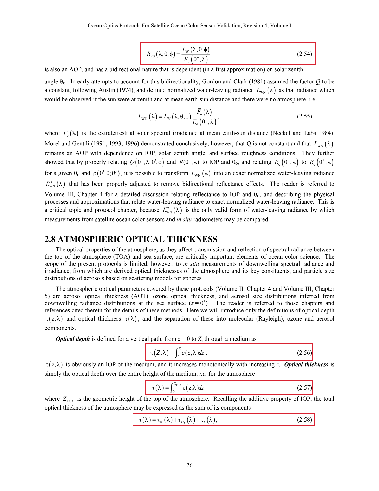

<figcaption><em>图 37　遥感反射率与光学厚度。</em><br/>来源：<a href="https://oceancolor.gsfc.nasa.gov/files/resources/docs/technical/protocols_ver4_voli.pdf#page=32">NASA《Ocean Optics Protocols》Rev. 4，Vol. I</a>，PDF 第 32 页，书内第 26 页。</figcaption>
</figure>

<strong>能见度</strong>以距离表达近地面大气对目标辨识的影响，常用于模型的气溶胶负载参数化。它侧重近地面条件，AOT 则累积整层大气的影响。

**水汽柱含量**是单位地面面积上方整根大气柱里的水汽总量。常用“可降水量”表达：若这根气柱的水汽全部凝结，会形成多厚的水层。相对湿度描述局部空气距离饱和有多近；水汽柱含量则把上方各高度的水汽累积起来。

<span id="evidence-19"></span>

<figure id="page-s2-l2a-p039">

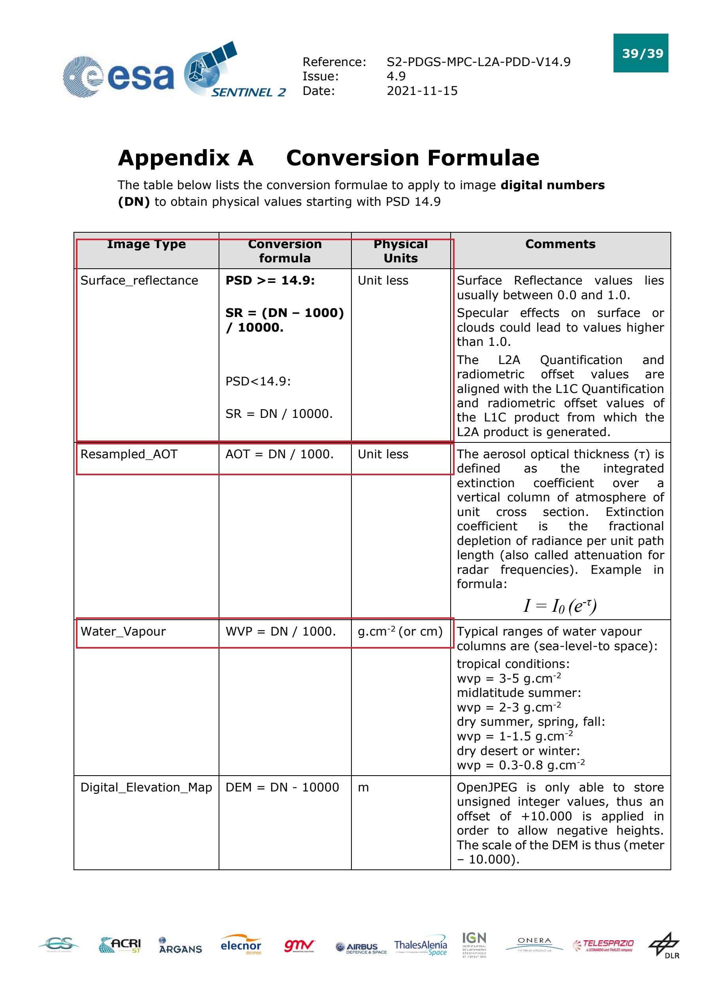

<figcaption><em>图 38　反射率、AOT 与水汽柱含量的编码。</em><br/>来源：<a href="https://step.esa.int/thirdparties/sen2cor/2.10.0/docs/S2-PDGS-MPC-L2A-PDD-V14.9-v4.9.pdf#page=39">ESA《Sentinel-2 Level-2A Product Definition Document》4.9</a>，PDF 第 39 页。</figcaption>
</figure>

<details>
<summary>展开查看另外 1 页手册</summary>

<figure id="page-envi-flaash-p021">

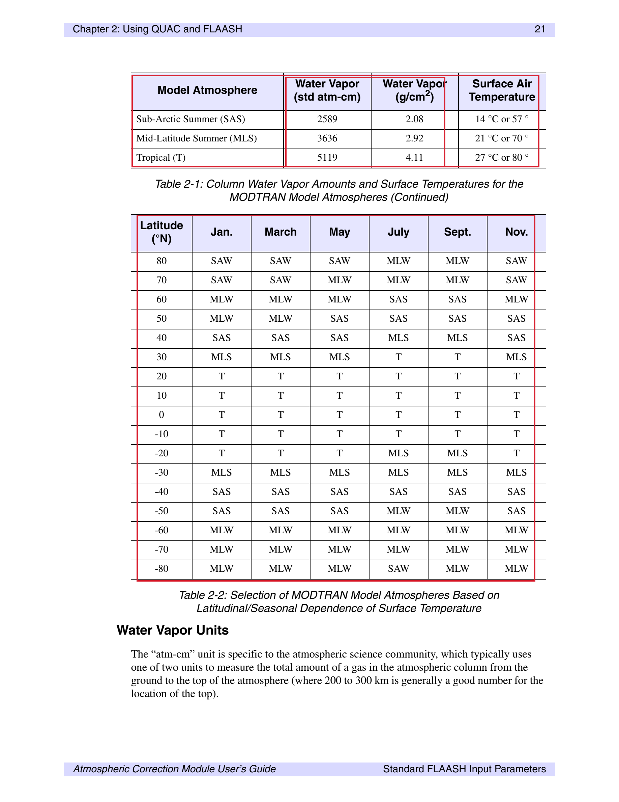

<figcaption><em>图 39　大气模型的温度、水汽与季节条件。</em><br/>来源：<a href="https://www.nv5geospatialsoftware.com/portals/0/pdfs/envi/QUAC_FLAASH_Module.pdf#page=21">《ENVI Atmospheric Correction Module User’s Guide》（2009，经典版）</a>，PDF 第 21 页。</figcaption>
</figure>

</details>

### 4.3 大气校正能带来什么

大气校正利用测得的辐亮度、观测几何和大气假设，估计地表反射率。这叫<strong>反演</strong>：从观测结果反推产生它的条件。辐射传输模型计算“大气和地表给定时会观测到什么”，校正算法则反过来求地表参数。

大气校正让观测更接近地表自身的性质，也改善了跨日期比较的条件。做时间序列或跨传感器分析时，还需统一波段响应、太阳角度、空间分辨率和处理版本。模型与输入的误差，可以在结果验证中进一步评估。

> <strong>校正与筛选各有作用。</strong>厚云下的地表缺少有效观测，分析时通常通过云掩膜排除这些像元；云影、雪、饱和和薄云也需要相应筛选。

Sen2Cor 的 ATBD 还把计算系数存入<strong>查找表（LUT）</strong>：先对若干太阳／观察角、高程和大气状态计算传播关系，处理影像时再按条件选取或插值。查找表使逐像元处理可行，也意味着结果受表的参数范围与插值近似约束。所引用的 Sen2Cor 版本使用 LibRadtran 生成相应 LUT；FLAASH 则通过 MODTRAN 计算模型系数。

<span id="evidence-38"></span>

<figure id="page-sen2cor-atbd-p051">

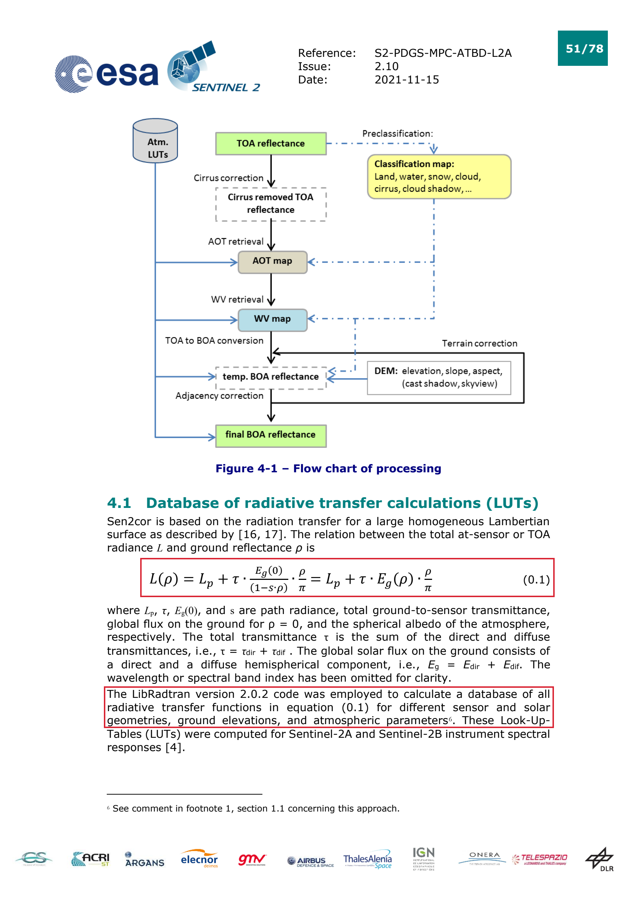

<figcaption><em>图 40　Sen2Cor 辐射传输关系与查找表。</em><br/>来源：<a href="https://sentiwiki.copernicus.eu/__attachments/a_2e88ffb8dabc4e1ec9efb71ba27cc9bcf70feeb378c084a2e80ba990273ebe5c/S2-PDGS-MPC-ATBD-L2A%20-%20Level%202A%20Algorithm%20Theoretical%20Basis%20Document%202021%20-%202.10.pdf#page=51">ESA《Sen2Cor L2A Algorithm Theoretical Basis Document》2.10</a>，PDF 第 51 页。</figcaption>
</figure>

## 5. 辐射、几何、正射校正分别解决什么

| 操作 | 解决的问题 | 与其他步骤的关系 |
| --- | --- | --- |
| 辐射定标 | 把仪器编码转换为辐亮度等物理量，或依据产品元数据恢复它们 | 定标公式随产品而定，大气贡献在后续校正中处理 |
| 大气校正 | 从大气顶观测估计地表反射率 | 结合云掩膜筛选有效观测 |
| 几何校正 | 确定像元在地图上的位置，修正成像几何误差 | 主要处理位置，与辐射量转换分别进行 |
| 影像配准 | 使两幅影像的同一地物落在对应位置 | 地图坐标相同仍可能存在亚像元错位 |
| 正射校正 | 利用传感器几何和地形修正位置偏移，生成地图投影影像 | 利用 DEM 修正位置，坡面明暗由地形照明校正处理 |
| 地形照明校正 | 处理坡度、坡向造成的日照差异 | 与大气校正配合处理山区影像 |
| 云与阴影掩膜 | 标记并排除不适合分析的像元 | 保留适合分析的像元，排除遮挡区域 |

<strong>DEM（数字高程模型）</strong>是地面高程的栅格表示。<strong>坐标参考系统</strong>说明位置依据的基准和坐标方式；<strong>地图投影</strong>把曲面位置表达为平面坐标。Sentinel‑2 标准瓦片采用 WGS84 基准及 UTM 投影，UTM 将地球划分为纵向投影带，以米表达平面位置。EPSG 编号是坐标系统的登记代码，例如本文公开文件的 `EPSG:32633` 表示 WGS84／UTM 33N。

把不同分辨率的波段组合成一个多波段栅格，称为<strong>波段堆叠</strong>。堆叠前需统一投影、覆盖范围、像元大小、网格原点与 NoData；这样相同的行列位置才对应相同地面位置。

<span id="evidence-36"></span>

<figure id="page-ccrs-fundamentals-p151">

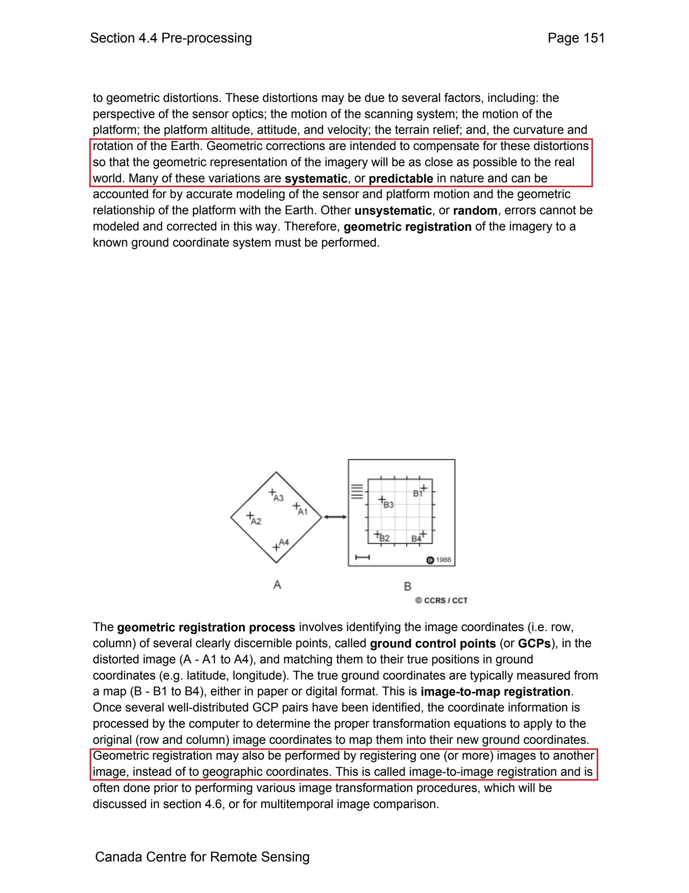

<figcaption><em>图 41　几何校正与影像配准。</em><br/>来源：<a href="https://natural-resources.canada.ca/sites/nrcan/files/earthsciences/pdf/resource/tutor/fundam/pdf/fundamentals_e.pdf#page=151">CCRS《Fundamentals of Remote Sensing》</a>，PDF 第 151 页。</figcaption>
</figure>

<details>
<summary>展开查看另外 1 页手册</summary>

<figure id="page-sen2cor-atbd-p068">

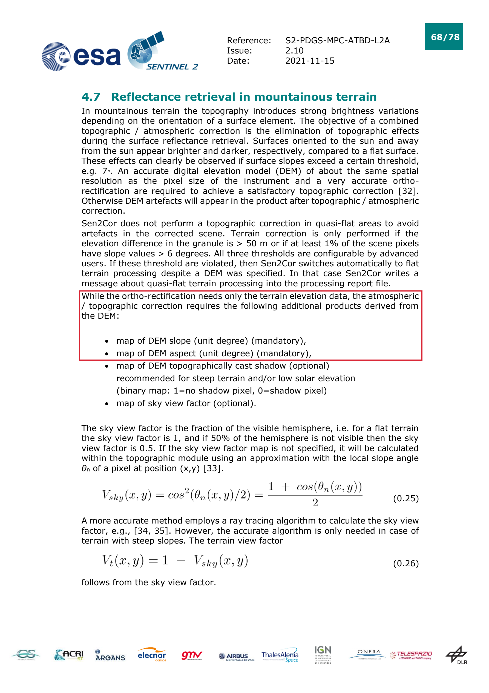

<figcaption><em>图 42　坡面照明与地形校正。</em><br/>来源：<a href="https://sentiwiki.copernicus.eu/__attachments/a_2e88ffb8dabc4e1ec9efb71ba27cc9bcf70feeb378c084a2e80ba990273ebe5c/S2-PDGS-MPC-ATBD-L2A%20-%20Level%202A%20Algorithm%20Theoretical%20Basis%20Document%202021%20-%202.10.pdf#page=68">ESA《Sen2Cor L2A Algorithm Theoretical Basis Document》2.10</a>，PDF 第 68 页。</figcaption>
</figure>

</details>

<span id="evidence-20"></span>

<figure id="page-s2-psd-p054">

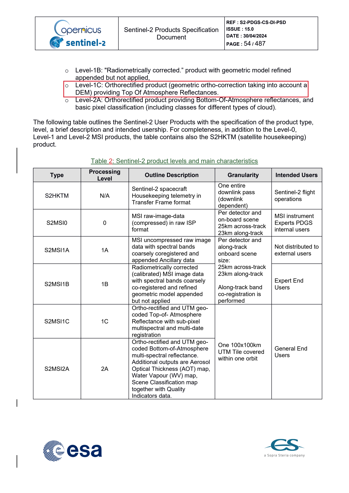

<figcaption><em>图 43　Sentinel-2 的处理级别。</em><br/>来源：<a href="https://sentinels.copernicus.eu/documents/d/sentinel/s2-pdgs-cs-di-psd-v15-0#page=54">ESA《Sentinel-2 Products Specification Document》15.0</a>，PDF 第 54 页。</figcaption>
</figure>

<details>
<summary>展开查看另外 1 页手册</summary>

<figure id="page-s2-handbook-p045">

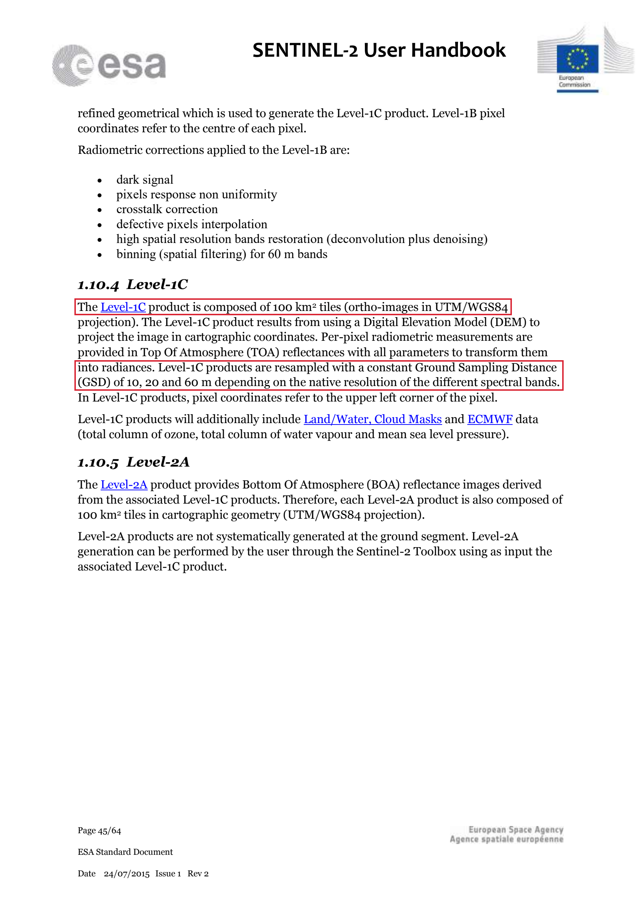

<figcaption><em>图 44　L1C 的 UTM／WGS84 网格。</em><br/>来源：<a href="https://sentinels.copernicus.eu/documents/247904/685211/Sentinel-2_User_Handbook#page=45">ESA《Sentinel-2 User Handbook》（2015，Issue 1 Rev 2）</a>，PDF 第 45 页。</figcaption>
</figure>

</details>

## 6. L1C、L2A：要看具体任务的定义

### 6.1 Sentinel‑2 L1C：经过定标和正射的大气顶反射率

在 Sentinel‑2 体系里，L1B 提供传感器几何下的定标辐亮度；<strong>L1C 已经过正射校正，像元代表 TOA 反射率</strong>。L2A 则是在 L1C 基础上生成的 BOA 反射率和配套质量信息。[ESA 产品定义](https://sentinels.copernicus.eu/sentinel-data-access/sentinel-products/sentinel-2-data-products)明确区分这两类常用产品。

相关原页见[图 21](#page-s2-psd-p397)（L1C 的 TOA 反射率及整数编码）。

对原生 SAFE L1C 产品，通常应按元数据恢复：

$$
\rho_{TOA,b}=\frac{DN_b+\mathrm{RADIO\_ADD\_OFFSET}_b}{\mathrm{QUANTIFICATION\_VALUE}}.
$$

下标 $b$ 表示波段；偏移量可能逐波段记录。L2A 对应 BOA 的偏移与反射率量化字段。Processing Baseline（<strong>处理基线</strong>，PB）是产品处理规范／软件配置的版本。从 PB 04.00 开始引入辐射偏移，以便整数编码保留一定范围的负信号；读取新版产品时，解码公式需要同时带入偏移量。[Copernicus 产品说明](https://sentiwiki.copernicus.eu/web/s2-products)解释了偏移的应用方式。

例如元数据给出偏移 $-1000$、量化值 $10000$，有效像元 $DN=3200$ 对应 $(3200-1000)/10000=0.22$。这是一组*教学数值*，读取实际文件时，可先排除 NoData 的 0，再使用自身元数据中的偏移和量化值。

### 6.2 L2A 还提供哪些辅助文件

<strong>Sen2Cor</strong> 是 ESA 提供的 Sentinel‑2 L1C 至 L2A 处理器，包含场景分类和大气校正等步骤。官方 L2A 已完成相应处理；常规植被分析通常可以直接选合适的 L2A，进行正确解码和质量筛选，随后即可进入分析。[Sen2Cor 官方页面](https://step.esa.int/main/snap-supported-plugins/sen2cor/)提供软件与文档。

| 名称 | 内容 | 应怎样使用 |
| --- | --- | --- |
| BOA 波段 | 地表反射率估计，常仍以整数保存 | 根据自身产品或资产的 scale／offset 解码 |
| SCL（Scene Classification Layer） | 每个像元的场景分类，如植被、水体、云、云影、雪冰 | 以类别编号筛选像元 |
| AOT | 气溶胶光学厚度，产品定义对应 550 nm | 检查校正条件与空间分布，另有自己的缩放规则 |
| WVP／WV | 水汽柱含量图 | 按水汽资产自己的单位和缩放规则读取 |
| TCI | B4、B3、B2 合成的真彩色显示图 | 用于浏览；计算 NDVI 时读取相应反射率波段 |

在所引用的 L2A 产品定义附录 A 中，AOT 按 $DN/1000$ 解码，单位为 1；WVP 按 $DN/1000$ 解码，单位是 $\mathrm{g\,cm^{-2}}$。按液态水密度约 $1\ \mathrm{g\,cm^{-3}}$ 换算，$1\ \mathrm{g\,cm^{-2}}$ 相当于 1 cm、即 10 mm 可降水量。公开平台可能重新编码这些资产，仍应读取各自的 scale、offset 和单位。

PSD 15.0 将类别 2 写作 `CAST_SHADOWS`，较早产品可能使用暗地物等名称。标准 SCL 的编码为：0 无数据，1 饱和／坏像元，2 暗地物或地形阴影（名称随处理版本调整），3 云影，4 植被，5 非植被，6 水体，7 未分类，8 中概率云，9 高概率云，10 薄卷云，11 雪冰。常规地表分析至少应认真处理 0、1、3、8–11，其他类是否保留由研究目的决定。SCL 是算法估计，边缘云和薄云仍可能漏检。

<span id="evidence-21"></span>

<figure id="page-s2-psd-p291">

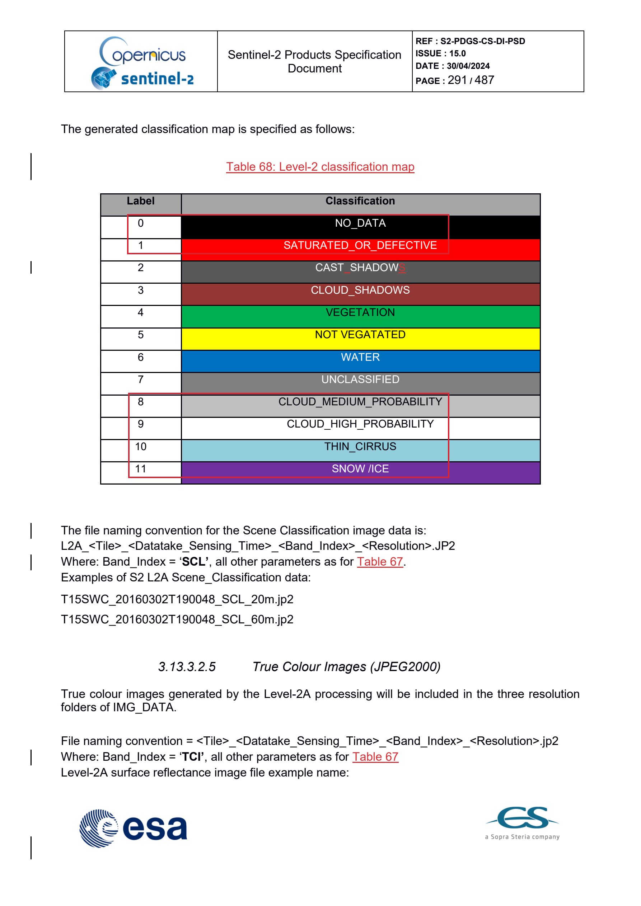

<figcaption><em>图 45　场景分类层 SCL 的类别表。</em><br/>来源：<a href="https://sentinels.copernicus.eu/documents/d/sentinel/s2-pdgs-cs-di-psd-v15-0#page=291">ESA《Sentinel-2 Products Specification Document》15.0</a>，PDF 第 291 页。</figcaption>
</figure>

<span id="evidence-22"></span>

相关原页见[图 38](#page-s2-l2a-p039)（反射率、AOT 与水汽柱含量的编码）。

<figure id="page-s2-l2a-p013">

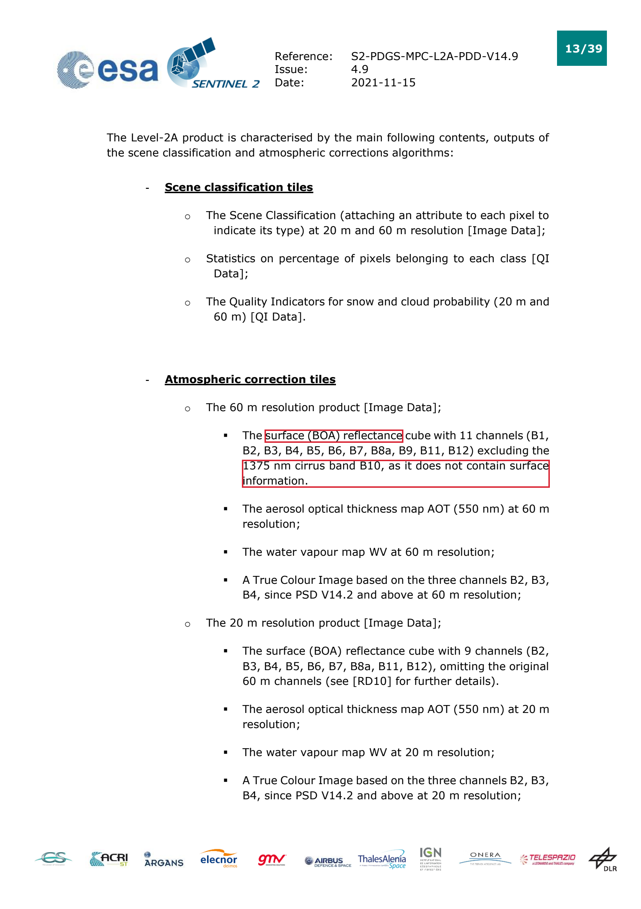

<figcaption><em>图 46　L2A 地表反射率与波段组成。</em><br/>来源：<a href="https://step.esa.int/thirdparties/sen2cor/2.10.0/docs/S2-PDGS-MPC-L2A-PDD-V14.9-v4.9.pdf#page=13">ESA《Sentinel-2 Level-2A Product Definition Document》4.9</a>，PDF 第 13 页。</figcaption>
</figure>

### 6.3 Landsat 的 Level‑1 与 Level‑2

Landsat Collection 2 Level‑1 的编码可用 MTL 元数据里的 `RADIANCE_MULT_BAND_x` 和 `RADIANCE_ADD_BAND_x` 换算为辐亮度：

$$
L_\lambda=M_L\,DN+A_L.
$$

这里 $M_L$ 是波段乘数，$A_L$ 是加数。这个公式来自 [USGS Landsat Level‑1 使用说明](https://www.usgs.gov/landsat-missions/using-usgs-landsat-level-1-data-product)，使用时配合 Landsat 的 MTL 文件。

同样，[Landsat Collection 2 Level‑2](https://www.usgs.gov/landsat-missions/landsat-collection-2-level-2-science-products)既有地表反射率也有地表温度产品；其 SR 编码常用 $\rho=DN\times0.0000275-0.2$。Landsat 与 Sentinel‑2 各有自己的编码约定。

> **读数据级别时，把任务、物理量和处理版本一起读。**

<span id="evidence-23"></span>

<figure id="page-landsat-handbook-p062">

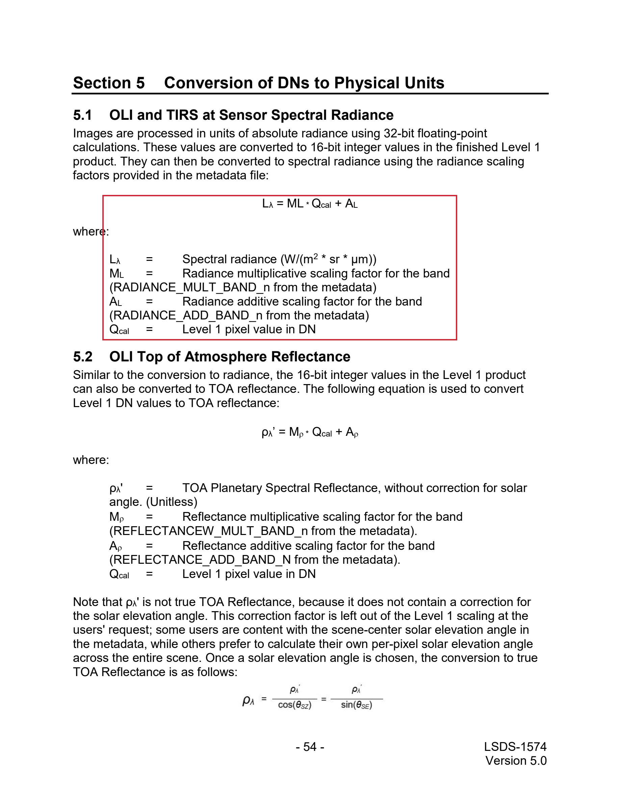

<figcaption><em>图 47　Landsat 辐亮度定标。</em><br/>来源：<a href="https://d9-wret.s3.us-west-2.amazonaws.com/assets/palladium/production/s3fs-public/atoms/files/LSDS-1574_L8_Data_Users_Handbook-v5.0.pdf#page=62">USGS《Landsat 8 Data Users Handbook》v5.0</a>，PDF 第 62 页，书内第 54 页。</figcaption>
</figure>

<details>
<summary>展开查看另外 1 页手册</summary>

<figure id="page-landsat-c2-p018">

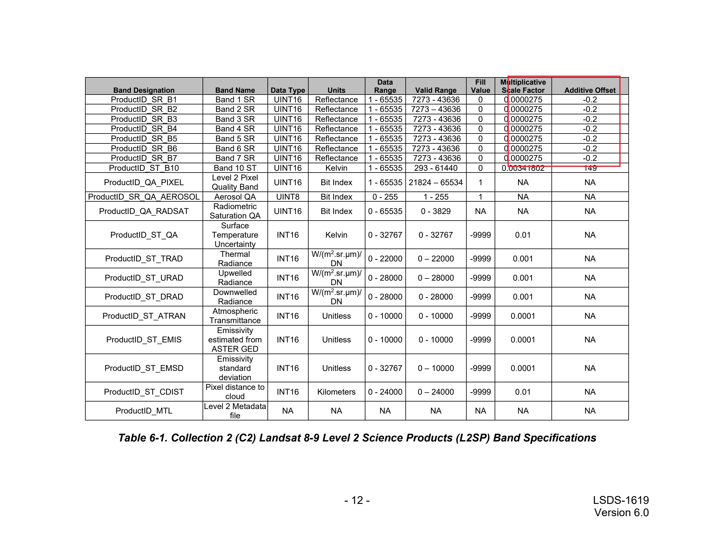

<figcaption><em>图 48　Collection 2 地表反射率的缩放。</em><br/>来源：<a href="https://d9-wret.s3.us-west-2.amazonaws.com/assets/palladium/production/s3fs-public/media/files/LSDS-1619_Landsat8-9-Collection2-Level2-Science-Product-Guide-v6.pdf#page=18">USGS《Landsat 8–9 Collection 2 Level 2 Science Product Guide》v6.0</a>，PDF 第 18 页，书内第 12 页。</figcaption>
</figure>

</details>

## 7. NDVI 中哪些影响会抵消，哪些会留下

NDVI 是<strong>归一化植被指数</strong>，常定义为：

$$
\mathrm{NDVI}=\frac{\rho_{NIR}-\rho_{red}}{\rho_{NIR}+\rho_{red}}.
$$

绿色植被在红光有较强吸收，在近红外因叶片结构有较强散射，因而常得到较高 NDVI。Sentinel‑2 常用 10 m 的 B8 与 B4，NDVI 是植被光谱的一个指标，解释覆盖率或长势时，还要考虑裸土、阴影和冠层结构等因素。

如果两个波段都只乘上同一个系数 $k$，比值确实不变：

$$
\frac{k\rho_{NIR}-k\rho_{red}}{k\rho_{NIR}+k\rho_{red}}
=\frac{\rho_{NIR}-\rho_{red}}{\rho_{NIR}+\rho_{red}}.
$$

但真实大气对不同波长的影响不同，且路径辐射带来<strong>加性贡献</strong>。即便两个波段都加同一个 $c$，分母也增加 $2c$，比值就改变了。

把这个过程写全，令 $N$、$R$ 分别为近红外与红光反射率，则

$$
\mathrm{NDVI}'=\frac{(N+c)-(R+c)}{(N+c)+(R+c)}
=\frac{N-R}{N+R+2c}.
$$

在 $N>R\ge0$、$c>0$ 的教学条件下，分子不变、分母增大，因此 NDVI 降低。实际大气贡献通常并非两个波段相同，这里只是隔离“共同加性项”的影响；这个代数推演有助于看清比值对加性项的反应。NDVI 的基础定义可核对 [USGS 官方说明](https://www.usgs.gov/landsat-missions/landsat-normalized-difference-vegetation-index)。

做一个教学例子：地表红光反射率为 0.10、近红外为 0.50，NDVI 约为 0.667。若观测受到不同的加性贡献，红光变成 0.16、近红外变成 0.52，则 NDVI 约为 0.529。这组教学数值展示了加性贡献如何改变比值。

文件编码的 offset 也会破坏“直接用 DN 算比值”的做法。只有两个波段同尺度、<strong>无加性偏移</strong>且特殊值已排除等条件满足时，共同乘法缩放才能抵消。跨时间、跨传感器定量比较应使用相容产品、正确解码和质量控制；这些步骤有助于让比值真正对应可比较的地表状态。

<span id="evidence-24"></span>

<figure id="page-modis-vi-p028">

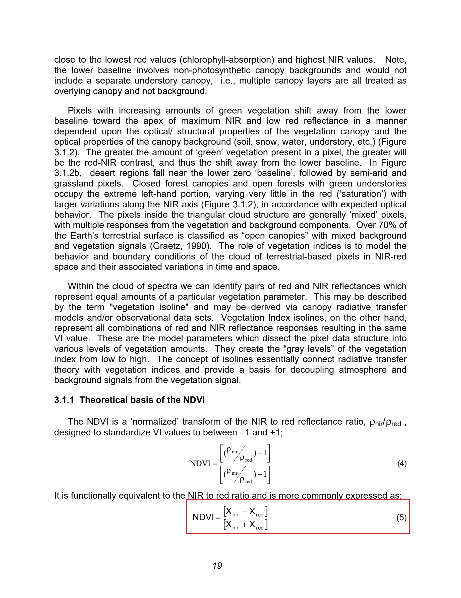

<figcaption><em>图 49　NDVI 的差／和定义。</em><br/>来源：<a href="https://modis.gsfc.nasa.gov/data/atbd/atbd_mod13.pdf#page=28">NASA《MODIS Vegetation Index ATBD》3</a>，PDF 第 28 页，书内第 19 页。</figcaption>
</figure>

<details>
<summary>展开查看另外 1 页手册</summary>

<figure id="page-modis-vi-p040">

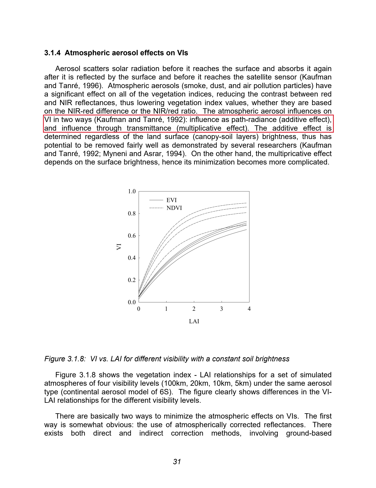

<figcaption><em>图 50　大气的加性与乘性影响。</em><br/>来源：<a href="https://modis.gsfc.nasa.gov/data/atbd/atbd_mod13.pdf#page=40">NASA《MODIS Vegetation Index ATBD》3</a>，PDF 第 40 页，书内第 31 页。</figcaption>
</figure>

</details>

## 8. FLAASH 怎样从辐亮度估计地表

FLAASH 的名称通常展开为 <strong>Fast Line‑of‑sight Atmospheric Analysis of Spectral Hypercubes</strong>。它是 ENVI 大气校正模块中的物理模型方法，由 Spectral Sciences 等机构在美国政府支持下开发。[模块介绍](https://www.nv5geospatialsoftware.com/docs/AboutAtmosphericCorrectionModule.html)说明了开发背景。

<strong>MODTRAN</strong> 是模拟辐射在大气中传播的模型。FLAASH 依据大气组成、温度与气体的垂直分布、气溶胶和太阳／传感器几何计算传播关系，再反推地表反射率。<strong>大气剖面</strong>指这些性质随高度怎样变化。

FLAASH 的背景文档给出的模型关系可写为：

$$
L=\frac{A\rho}{1-\rho_eS}
+\frac{B\rho_e}{1-\rho_eS}+L_a.
$$

这里 $L$ 为传感器辐亮度，$\rho$ 为目标像元反射率，$\rho_e$ 为周围区域的平均反射率；$L_a$ 为路径辐亮度，$S$ 为大气的球面反照率，$A,B$ 是与大气、几何有关的系数。球面反照率在这里描述大气将来自下方的辐射再向下散射的能力；分母体现地表与大气间的多次反射。第二项表达周围地物的贡献。[FLAASH 科学背景](https://www.nv5geospatialsoftware.com/docs/backgroundflaash.html)讨论了这个近似的假设。

如果模型系数与周围反射率 $\rho_e$ 已经估计出来，且 $A\ne0$、$1-\rho_eS\ne0$，上式可整理为

$$
\rho=\frac{(L-L_a)(1-\rho_eS)-B\rho_e}{A}.
$$

这个代数式让“反演”更具体：先扣除路径辐射，再处理多次反射与周围贡献，最后恢复目标反射率。实际处理还包括用 MODTRAN 求系数、估计水汽和区域平均反射率等步骤。系数、$\rho_e$ 或单位不正确，都能使结果偏离地表性质。

理解这个式子，有助于判断参数怎样影响结果。FLAASH 面向反射太阳光谱范围，其适用性与场景、气溶胶、地形和输入条件有关；热红外温度反演使用相应的热辐射模型。

<span id="evidence-25"></span>

<figure id="page-envi-flaash-p010">

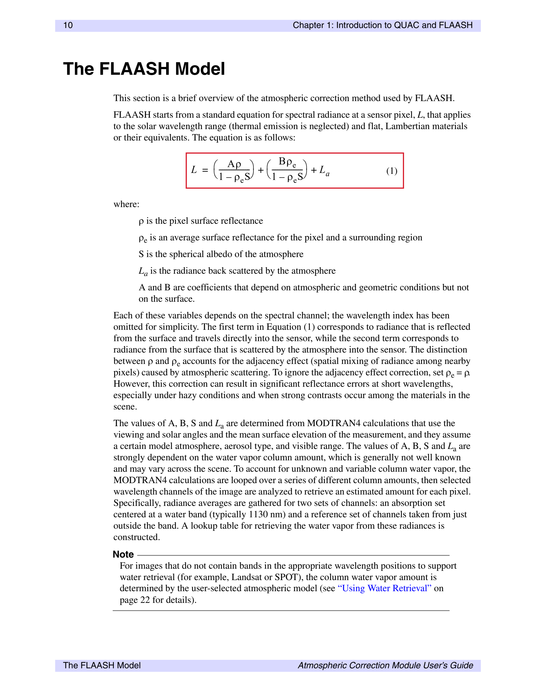

<figcaption><em>图 51　FLAASH 的辐射传输模型。</em><br/>来源：<a href="https://www.nv5geospatialsoftware.com/portals/0/pdfs/envi/QUAC_FLAASH_Module.pdf#page=10">《ENVI Atmospheric Correction Module User’s Guide》（2009，经典版）</a>，PDF 第 10 页。</figcaption>
</figure>

## 9. FLAASH 的关键参数怎样理解

### 9.1 高度、像元大小与时间

<figure id="page-envi-flaash-p020">

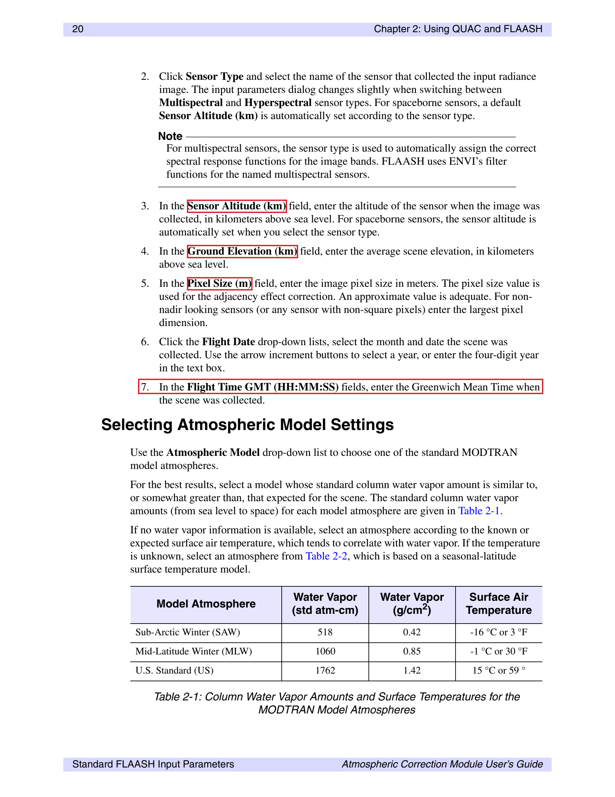

<figcaption><em>图 52　FLAASH 高度、像元大小与时间字段。</em><br/>来源：<a href="https://www.nv5geospatialsoftware.com/portals/0/pdfs/envi/QUAC_FLAASH_Module.pdf#page=20">《ENVI Atmospheric Correction Module User’s Guide》（2009，经典版）</a>，PDF 第 20 页。</figcaption>
</figure>

| 参数 | 物理意义 | Sentinel‑2 操作中应注意什么 |
| --- | --- | --- |
| Input Radiance Image | 进入模型的辐亮度输入 | 由 L1C 元数据转换为辐亮度，或确认当前 ENVI 的自动定标路径 |
| Sensor Type | 传感器及其响应定义 | 优先用软件支持的 MSI 定义；使用 Unknown 时提供正确波长、带宽／响应 |
| Sensor Altitude | 传感器高程，经典界面为 km | Sentinel‑2 名义轨道高度约 786 km；有正确预设时核对其值 |
| Ground Elevation | 场景平均海拔，经典界面为 km | 500 m 应填 0.5；山区大范围影像的单一平均值有局限 |
| Pixel Size | 输入栅格像元大小，经典界面为 m | 实际输入为 10 m 时填 10；若堆叠网格为 20 m，则填 20，单位按界面中的 m 读取 |
| Date／Time | 实际采集时刻 | 元数据中带 Z 的时间为协调世界时 UTC；GMT 指格林尼治时间，这里填写影像采集的 UTC 时刻；北京时间为 UTC+8 |
| Scene Center／Viewing Geometry | 场景位置及观察方向 | 从对应元数据读取；太阳天顶角与传感器视线天顶角是两种不同角度 |
| Output Reflectance／Directory | 科学输出和运行文件的位置 | 连同头文件、日志、参数保存，确保路径可写和磁盘空间足够 |

<span id="evidence-34"></span>

<figure id="page-envi-flaash-p017">

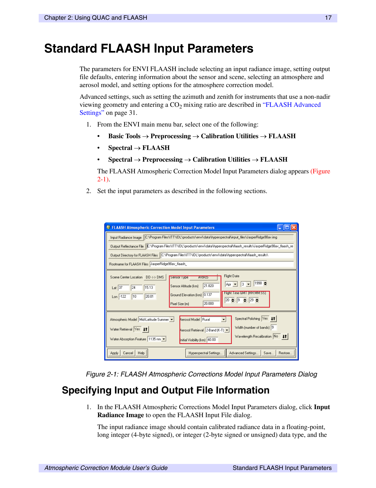

<figcaption><em>图 53　经典 FLAASH 参数界面。</em><br/>来源：<a href="https://www.nv5geospatialsoftware.com/portals/0/pdfs/envi/QUAC_FLAASH_Module.pdf#page=17">《ENVI Atmospheric Correction Module User’s Guide》（2009，经典版）</a>，PDF 第 17 页。</figcaption>
</figure>

相关原页见[图 52](#page-envi-flaash-p020)（FLAASH 高度、像元大小与时间字段）。

### 9.2 大气模型与气溶胶模型

Tropical、Mid‑Latitude Summer／Winter 等<strong>大气模型</strong>是代表性的温度、压力、气体垂直剖面。这些标准剖面为模型提供初始大气条件。季节、温度、水汽和海拔资料都应参与判断。

Rural、Urban、Maritime 等<strong>气溶胶模型</strong>表示颗粒物光学特性的假设。Urban 侧重气溶胶的光学性质；海边城市可能受海盐影响，农村也可能受沙尘或烟霾影响。选项应反映成像时的大气，并结合土地利用与气象背景判断。

**气溶胶反演**利用特定波段和暗目标假设估计气溶胶负载。所谓暗目标，是在合适波段反射较弱、能够帮助区分大气贡献的地物。K‑T 方法通常指 Kaufman–Tanré 波段关系方法，需要合适波段及场景条件；没有可靠目标时，结果可能退回指定能见度。选 None 时，校正按设置的大气、气溶胶与能见度条件计算。相关参数见 [FLAASH 任务接口](https://www.nv5geospatialsoftware.com/docs/enviflaashtask.html)。

<span id="evidence-26"></span>

相关原页见[图 39](#page-envi-flaash-p021)（大气模型的温度、水汽与季节条件）。

### 9.3 水汽反演需要怎样的波段配置

Sentinel‑2 的 B9 位于约 945 nm 的水汽吸收区域，设计带宽约 20 nm、原生采样 60 m。但 FLAASH 的水汽反演需要<strong>适合其算法的吸收和参考波段配置</strong>，其中吸收和参考位置要与算法相匹配。吸收波段观察水汽使信号下降的位置，参考波段帮助估计附近未发生同等吸收时的光谱背景。

其文档列出覆盖 1050–1210、870–1020 或 770–870 nm 区域、15 nm 或更细光谱分辨率等条件，并说明大多数多光谱传感器的默认水汽反演为 No。Sentinel‑2 采用离散的多光谱波段，配置时需要结合 MSI 的实际响应。[当前 FLAASH 输入与水汽说明](https://www.nv5geospatialsoftware.com/docs/FLAASH.html)可核对条件。

对具体 ENVI 版本，只有确认 MSI 波段定义、自定义参考／吸收配置和相应方法有效时，才使用其支持的水汽反演。Water Retrieval 为 No 时，校正使用模型给定的水汽柱。Sen2Cor 则有针对 MSI 的 B8A／B9 配置，具体实现见下面的算法原页。

另一个容易混淆的选项是 <strong>MODTRAN 光谱分辨率</strong>。它以 $\mathrm{cm^{-1}}$ 表示模型在波数坐标上的计算精细程度；波数是波长的倒数。这与传感器的 nm 带宽、地面像元的 m 大小都不同。把模型算得更细会增加计算量，其细化的是模型计算，MSI 的观测带宽仍由仪器决定。邻近效应开关也是模型设置，应根据场景与验证结果选择，它处理来自周围地物的大气散射贡献。

这里采用光谱学中定义为波长倒数的波数 $\widetilde\nu$，单位换算为

$$
\widetilde\nu\,[\mathrm{cm^{-1}}]=\frac{10^4}{\lambda\,[\mu\mathrm m]}.
$$

例如 $1\ \mu\mathrm m$ 对应 $10000\ \mathrm{cm^{-1}}$，$2\ \mu\mathrm m$ 对应 $5000\ \mathrm{cm^{-1}}$。因倒数关系，相同的波数间隔在不同波长处不对应相同的 nm 间隔。[FLAASH 官方文档](https://www.nv5geospatialsoftware.com/docs/FLAASH.html)列出 MODTRAN Resolution 的波数单位与选项。

<span id="evidence-27"></span>

<figure id="page-envi-flaash-p022">

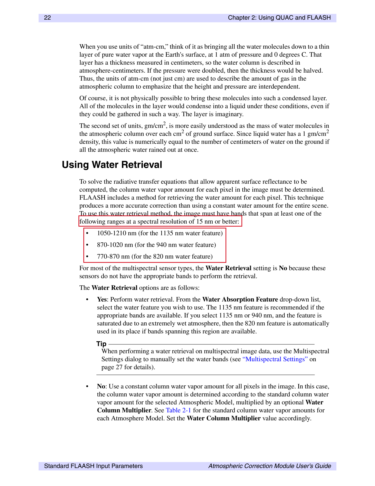

<figcaption><em>图 54　FLAASH 水汽反演的光谱条件。</em><br/>来源：<a href="https://www.nv5geospatialsoftware.com/portals/0/pdfs/envi/QUAC_FLAASH_Module.pdf#page=22">《ENVI Atmospheric Correction Module User’s Guide》（2009，经典版）</a>，PDF 第 22 页。</figcaption>
</figure>

<details>
<summary>展开查看另外 1 页手册</summary>

<figure id="page-sen2cor-atbd-p064">

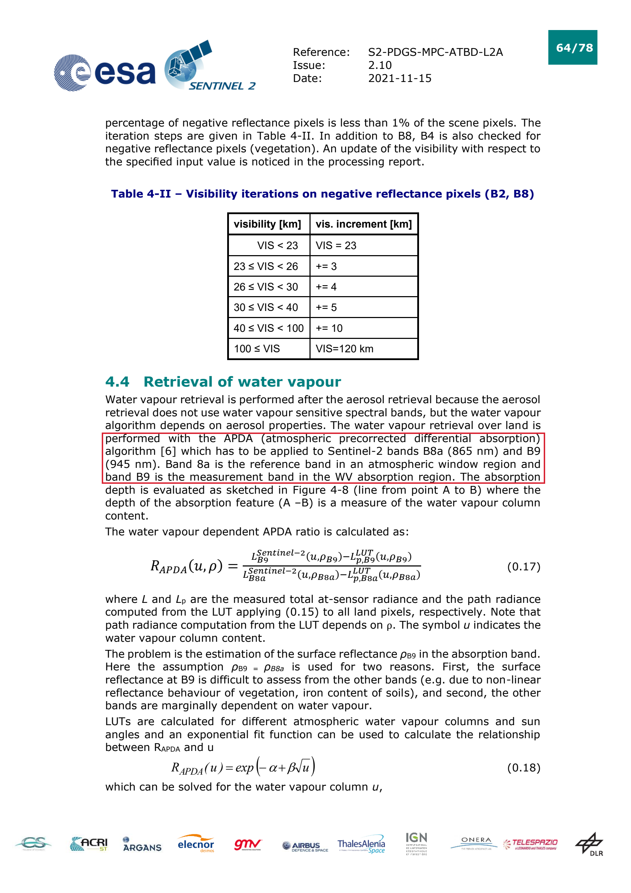

<figcaption><em>图 55　B8A／B9 水汽反演。</em><br/>来源：<a href="https://sentiwiki.copernicus.eu/__attachments/a_2e88ffb8dabc4e1ec9efb71ba27cc9bcf70feeb378c084a2e80ba990273ebe5c/S2-PDGS-MPC-ATBD-L2A%20-%20Level%202A%20Algorithm%20Theoretical%20Basis%20Document%202021%20-%202.10.pdf#page=64">ESA《Sen2Cor L2A Algorithm Theoretical Basis Document》2.10</a>，PDF 第 64 页。</figcaption>
</figure>

</details>

<span id="evidence-39"></span>

<figure id="page-nist-radiometry-p012">

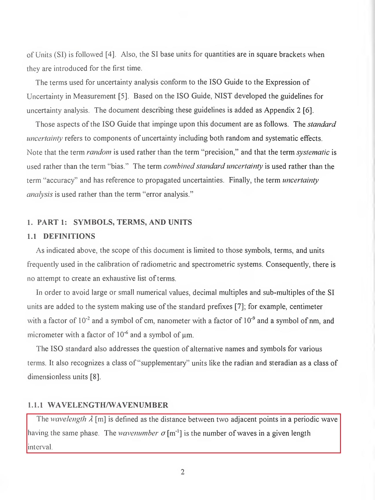

<figcaption><em>图 56　波长、频率与波数。</em><br/>来源：<a href="https://nvlpubs.nist.gov/nistpubs/Legacy/hb/nisthandbook152.pdf#page=12">NIST《Handbook 152：Recommended Practice—Radiometric Sensor Calibration》</a>，PDF 第 12 页。</figcaption>
</figure>

<details>
<summary>展开查看另外 1 页手册</summary>

<figure id="page-envi-flaash-p012">

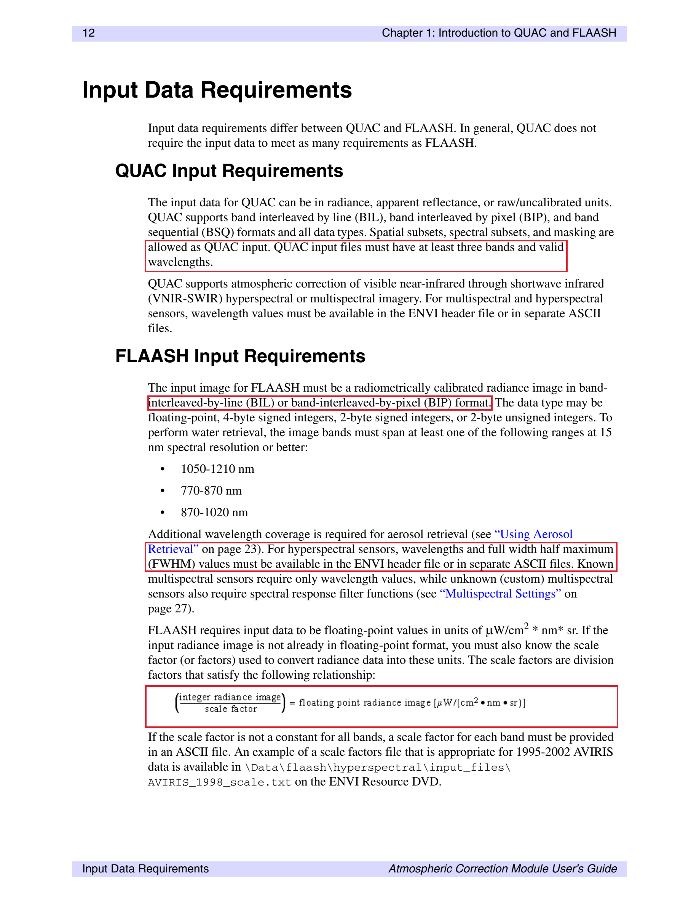

<figcaption><em>图 57　FLAASH 输入条件、单位与缩放。</em><br/>来源：<a href="https://www.nv5geospatialsoftware.com/portals/0/pdfs/envi/QUAC_FLAASH_Module.pdf#page=12">《ENVI Atmospheric Correction Module User’s Guide》（2009，经典版）</a>，PDF 第 12 页。</figcaption>
</figure>

</details>

### 9.4 辐亮度单位与 Input Scale

FLAASH 使用的辐亮度单位为 $\mathrm{\mu W\,cm^{-2}\,nm^{-1}\,sr^{-1}}$。许多定标工具输出 $\mathrm{W\,m^{-2}\,\mu m^{-1}\,sr^{-1}}$，两者数值关系为：

$$
1\ \mathrm{W\,m^{-2}\,\mu m^{-1}\,sr^{-1}}
=0.1\ \mathrm{\mu W\,cm^{-2}\,nm^{-1}\,sr^{-1}}.
$$

瓦特变微瓦乘 $10^6$，每平方米变每平方厘米乘 $10^{-4}$，每微米变每纳米乘 $10^{-3}$，总计乘 0.1。

<u>Input Scale 在 FLAASH 中是除数</u>：若输入数值仍采用前一种单位，通常对应 10；若已乘过 0.1 转成目标单位，则对应 1。必须核对实际文件与软件自动定标行为，单位换算只做一次。辐亮度单位换算与 Sentinel‑2 反射率整数解码分属两个步骤。

输出也可能是反射率乘 10000 后的整数，应读取输出头文件的 Reflectance Scale Factor，再据此恢复反射率。

<span id="evidence-33"></span>

相关原页见[图 57](#page-envi-flaash-p012)（FLAASH 输入条件、单位与缩放）。

### 9.5 BIL、BIP、BSQ 与版本差异

这三个词描述<strong>多波段数值在文件里的存放顺序</strong>，对应的是存储结构：

| 格式 | 排列方式 | 用三波段、小栅格理解 |
| --- | --- | --- |
| BSQ：Band Sequential | 按波段依次存完整图像 | 先存完整红波段，再存完整绿波段、蓝波段 |
| BIL：Band Interleaved by Line | 每一行内依次存各波段 | 第一行红、绿、蓝，然后第二行红、绿、蓝 |
| BIP：Band Interleaved by Pixel | 每个像元内依次存各波段 | 第一个像元红、绿、蓝，再第二个像元红、绿、蓝 |

相关原页见[图 57](#page-envi-flaash-p012)（FLAASH 输入条件、单位与缩放）。

当前 ENVI 6.3 在线文档说明可接受任意 interleave，并可对非辐亮度输入自动定标； [ENVI 5.7 更新记录](https://www.nv5geospatialsoftware.com/docs/whats_new_5_7.html)也记录了自动辐射校正的改进。自动转换仍需要软件识别传感器和有效元数据，读取器依靠这些信息完成转换。旧教程、经典界面和当前工具的操作要求需要分开核对。

## 10. 两条可执行的 Sentinel‑2 流程

<figure>


<figcaption><em>图 58　Sentinel-2 的两条处理路线：L1C 经辐亮度转换进入 FLAASH，L2A 解码并筛选后进入分析。</em></figcaption>
</figure>

### 10.1 常规 NDVI、地表变化分析：从 L2A 开始

先取得 L2A，并保留元数据与 SCL。对于 Sentinel‑2 原生 SAFE，读取 BOA 的量化值与偏移；对于云端转换的 GeoTIFF，读取该资产的 scale／offset 和提供者处理说明，确认偏移在转换和读取两个环节中只应用一次。

选择 B4 和 B8，确认两者在相同 10 m 网格；将 SCL 以最近邻方式映射到该网格，筛选 NoData、坏像元、云、云影等。用解码后的浮点反射率计算 NDVI，并处理分母接近零的像元。跨日期比较时还应控制季节、观测角度、处理版本和空间配准。

### 10.2 需要自行做 FLAASH：从 L1C 和元数据开始

1. <strong>从产品元数据打开影像。</strong>通过 ENVI 的 Sentinel‑2 读取路径打开 `MTD_MSIL1C.xml`，核对软件实际识别到的传感器、波段与基线。当前[辐射定标支持表](https://www.nv5geospatialsoftware.com/docs/radiometriccalibration.html)列出 Sentinel‑2 XML 产品支持辐亮度转换；使用旧版时，可查看对应版本的支持说明。
2. <strong>检查整数解码与辐亮度转换。</strong>确认定标工具是否处理 RADIO_ADD_OFFSET、量化值、太阳辐照度、$U$ 和太阳几何。手动解码和读取器自动转换可选适合的一条路径，让编码换算只进行一次。抽查若干有效像元，核对输入数值与单位。
3. <strong>确定输入波段与共同网格。</strong>常规地表反射率分析选择含有地表信息的波段，B10 留作卷云识别。若选择不同采样间距的波段，应按研究目的统一网格，例如共同的 20 m 网格；各波段的信息精细程度仍与原生观测有关。
4. <strong>保留光谱与空间元数据。</strong>波段堆叠后的波段顺序、波长、FWHM／响应定义要一致。传感器配置依靠这些字段和响应信息。
5. <strong>核对单位和版本支持。</strong>显式辐亮度路线中确认 Input Scale；若使用新版自动定标，确认日志中的实际转换，避免重复。按该版本选择支持的存储格式。
6. <strong>设置模型与几何。</strong>填写真实采集时间、位置、输入像元大小和高程，依据观测条件选择大气／气溶胶模型。只有算法与波段条件满足时才开启水汽、气溶胶反演，并记录无法反演时采用的默认值。
7. <strong>小范围检查后再运行整景。</strong>保留输出栅格、`.hdr` 头文件、参数和日志。小范围适合检查单位和数值；气溶胶估计、邻近效应与精度验证，则需要结合有足够空间范围的影像和参考资料。

ENVI 的输出常见为一个二进制数据文件与一个文本 `.hdr` 头文件：后者记录行列、波段、数据类型、存放顺序、坐标和缩放等信息。解释 `.dat` 文件中的数值需要这些信息，移动或分享时通常把头文件一起带上。

## 11. 一次真实观测：产品页面与文件下载

下面选取 Sentinel‑2A 于 **2020‑09‑15** 获取的 **T33TVM** 瓦片。MGRS 是 Military Grid Reference System，即一种用字母数字组合标识地理网格的系统；T33TVM 是其中的瓦片标识。这块边缘瓦片覆盖中欧、意大利东北部及邻近地区，可以用来熟悉产品目录与实际文件的对应关系。

<span id="evidence-37"></span>

<figure id="page-s2-psd-p398">

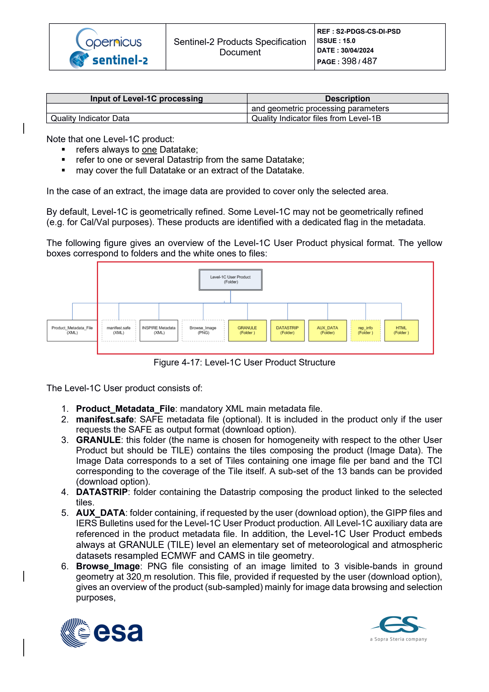

<figcaption><em>图 59　L1C 产品目录结构。</em><br/>来源：<a href="https://sentinels.copernicus.eu/documents/d/sentinel/s2-pdgs-cs-di-psd-v15-0#page=398">ESA《Sentinel-2 Products Specification Document》15.0</a>，PDF 第 398 页。</figcaption>
</figure>

<details>
<summary>展开查看另外 1 页手册</summary>

<figure id="page-s2-psd-p050">

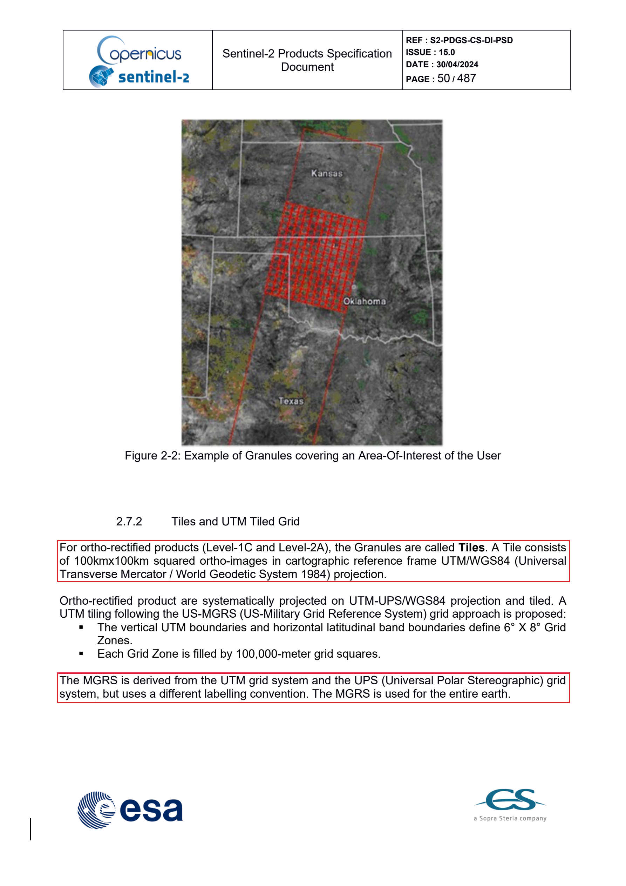

<figcaption><em>图 60　UTM 与 MGRS 瓦片网格。</em><br/>来源：<a href="https://sentinels.copernicus.eu/documents/d/sentinel/s2-pdgs-cs-di-psd-v15-0#page=50">ESA《Sentinel-2 Products Specification Document》15.0</a>，PDF 第 50 页。</figcaption>
</figure>

</details>

### 11.1 官方 L1C 与 L2A：同次观测、PB 05.00

真实产品名称分别为：

```text
S2A_MSIL1C_20200915T101031_N0500_R022_T33TVM_20230415T174104.SAFE
S2A_MSIL2A_20200915T101031_N0500_R022_T33TVM_20230416T031135.SAFE
```

`S2A` 是平台，`MSIL1C/MSIL2A` 是产品级别，前一时间字段描述观测所属采集时段，`N0500` 是处理基线 05.00，`R022` 是相对轨道编号，`T33TVM` 是瓦片，末尾时间是产品生成时刻。<strong>这次观测发生在 2020 年，产品于 2023 年重新生成。</strong>瓦片自己的精确采集时刻应查 `MTD_TL.xml`，采集时刻和生成时刻各有对应字段。

| 产品 | 实际目录记录 | 整包下载地址 |
| --- | --- | --- |
| L1C，UUID `2a5995bb-dafc-4e69-b1ba-5b10aab579bc` | [官方 JSON 产品页](https://catalogue.dataspace.copernicus.eu/odata/v1/Products%282a5995bb-dafc-4e69-b1ba-5b10aab579bc%29) | [下载 L1C 产品](https://download.dataspace.copernicus.eu/odata/v1/Products%282a5995bb-dafc-4e69-b1ba-5b10aab579bc%29/$value) |
| L2A，UUID `1ddbbbb3-f0c0-4380-98df-b57a0becc0c7` | [官方 JSON 产品页](https://catalogue.dataspace.copernicus.eu/odata/v1/Products%281ddbbbb3-f0c0-4380-98df-b57a0becc0c7%29) | [下载 L2A 产品](https://download.dataspace.copernicus.eu/odata/v1/Products%281ddbbbb3-f0c0-4380-98df-b57a0becc0c7%29/$value) |

JSON 页就是可核对的机器可读产品记录，包含名称、获取时段、覆盖范围和文件大小。也可以在 [Copernicus Browser](https://browser.dataspace.copernicus.eu/)里定位日期和瓦片，选择对应产品。

<strong>目录和文件清单可匿名查询，CDSE 科学数据下载需要账户／访问令牌。</strong>打开 `$value` 下载端点时，需要随请求提供有效认证。使用规则和令牌下载方式见 [CDSE OData 官方文档](https://documentation.dataspace.copernicus.eu/APIs/OData.html#product-download)。下面的目录和文件名来自这两个产品的节点清单。

### 11.2 L1C 包里实际存在的文件

SAFE 是 <strong>Standard Archive Format for Europe</strong>，是一种产品目录组织方式。<strong>JP2</strong> 是 JPEG 2000 影像文件；<strong>XML</strong> 是带字段名与层级的元数据文本。L1C 包中的结构为：

```text
S2A_MSIL1C_...N0500...SAFE/
├── MTD_MSIL1C.xml
├── manifest.safe
└── GRANULE/
    └── L1C_T33TVM_A027332_20200915T101550/
        ├── MTD_TL.xml
        └── IMG_DATA/
            ├── T33TVM_20200915T101031_B04.jp2
            ├── T33TVM_20200915T101031_B08.jp2
            └── T33TVM_20200915T101031_B09.jp2
```

`manifest.safe` 是文件组织与关联的清单；`GRANULE` 是产品中的瓦片数据单元。产品 XML 提供处理基线、量化、偏移及反射率转换参数；瓦片 XML 提供该瓦片的采集时间、坐标网格与角度等。太阳角度网格与场景平均角度各自描述不同尺度的太阳几何。

以下地址来自该产品的<strong>Nodes 清单</strong>，可在相应记录中逐项查阅。表中的“文件页”显示其所属文件夹的记录；下载需要上文所述认证。

| 文件 | 内容 | 记录大小 | 实际文件页与下载 |
| --- | --- | --- | --- |
| `MTD_MSIL1C.xml` | 产品级元数据：量化、偏移、辐照度等 | 46,019 字节 | [文件页](https://download.dataspace.copernicus.eu/odata/v1/Products%282a5995bb-dafc-4e69-b1ba-5b10aab579bc%29/Nodes%28S2A_MSIL1C_20200915T101031_N0500_R022_T33TVM_20230415T174104.SAFE%29/Nodes) · [下载](https://download.dataspace.copernicus.eu/odata/v1/Products%282a5995bb-dafc-4e69-b1ba-5b10aab579bc%29/Nodes%28S2A_MSIL1C_20200915T101031_N0500_R022_T33TVM_20230415T174104.SAFE%29/Nodes%28MTD_MSIL1C.xml%29/$value) |
| `MTD_TL.xml` | 瓦片级元数据：采集时间、投影、角度等 | 192,348 字节 | [文件页](https://download.dataspace.copernicus.eu/odata/v1/Products%282a5995bb-dafc-4e69-b1ba-5b10aab579bc%29/Nodes%28S2A_MSIL1C_20200915T101031_N0500_R022_T33TVM_20230415T174104.SAFE%29/Nodes%28GRANULE%29/Nodes%28L1C_T33TVM_A027332_20200915T101550%29/Nodes) · [下载](https://download.dataspace.copernicus.eu/odata/v1/Products%282a5995bb-dafc-4e69-b1ba-5b10aab579bc%29/Nodes%28S2A_MSIL1C_20200915T101031_N0500_R022_T33TVM_20230415T174104.SAFE%29/Nodes%28GRANULE%29/Nodes%28L1C_T33TVM_A027332_20200915T101550%29/Nodes%28MTD_TL.xml%29/$value) |
| `T33TVM_20200915T101031_B04.jp2` | 红光，10 m | 30,909,264 字节 | [文件页](https://download.dataspace.copernicus.eu/odata/v1/Products%282a5995bb-dafc-4e69-b1ba-5b10aab579bc%29/Nodes%28S2A_MSIL1C_20200915T101031_N0500_R022_T33TVM_20230415T174104.SAFE%29/Nodes%28GRANULE%29/Nodes%28L1C_T33TVM_A027332_20200915T101550%29/Nodes%28IMG_DATA%29/Nodes) · [下载](https://download.dataspace.copernicus.eu/odata/v1/Products%282a5995bb-dafc-4e69-b1ba-5b10aab579bc%29/Nodes%28S2A_MSIL1C_20200915T101031_N0500_R022_T33TVM_20230415T174104.SAFE%29/Nodes%28GRANULE%29/Nodes%28L1C_T33TVM_A027332_20200915T101550%29/Nodes%28IMG_DATA%29/Nodes%28T33TVM_20200915T101031_B04.jp2%29/$value) |
| `T33TVM_20200915T101031_B08.jp2` | 近红外，10 m | 40,828,814 字节 | [文件页](https://download.dataspace.copernicus.eu/odata/v1/Products%282a5995bb-dafc-4e69-b1ba-5b10aab579bc%29/Nodes%28S2A_MSIL1C_20200915T101031_N0500_R022_T33TVM_20230415T174104.SAFE%29/Nodes%28GRANULE%29/Nodes%28L1C_T33TVM_A027332_20200915T101550%29/Nodes%28IMG_DATA%29/Nodes) · [下载](https://download.dataspace.copernicus.eu/odata/v1/Products%282a5995bb-dafc-4e69-b1ba-5b10aab579bc%29/Nodes%28S2A_MSIL1C_20200915T101031_N0500_R022_T33TVM_20230415T174104.SAFE%29/Nodes%28GRANULE%29/Nodes%28L1C_T33TVM_A027332_20200915T101550%29/Nodes%28IMG_DATA%29/Nodes%28T33TVM_20200915T101031_B08.jp2%29/$value) |
| `T33TVM_20200915T101031_B09.jp2` | 水汽波段，60 m | 1,281,120 字节 | [文件页](https://download.dataspace.copernicus.eu/odata/v1/Products%282a5995bb-dafc-4e69-b1ba-5b10aab579bc%29/Nodes%28S2A_MSIL1C_20200915T101031_N0500_R022_T33TVM_20230415T174104.SAFE%29/Nodes%28GRANULE%29/Nodes%28L1C_T33TVM_A027332_20200915T101550%29/Nodes%28IMG_DATA%29/Nodes) · [下载](https://download.dataspace.copernicus.eu/odata/v1/Products%282a5995bb-dafc-4e69-b1ba-5b10aab579bc%29/Nodes%28S2A_MSIL1C_20200915T101031_N0500_R022_T33TVM_20230415T174104.SAFE%29/Nodes%28GRANULE%29/Nodes%28L1C_T33TVM_A027332_20200915T101550%29/Nodes%28IMG_DATA%29/Nodes%28T33TVM_20200915T101031_B09.jp2%29/$value) |

### 11.3 无需登录的波段文件：同次观测的 PB 02.14 L2A

为了让读者直接取得练习材料，这里另外列出 Earth Search 收录的 L2A Cloud Optimized GeoTIFF（<strong>COG，云优化 GeoTIFF</strong>）。GeoTIFF 将影像与地理定位信息存放在一起；COG 的内部组织支持按 HTTP 范围读取，不必每次下载整幅图。

其[实际 STAC 文件页](https://earth-search.aws.element84.com/v1/collections/sentinel-2-l2a/items/S2A_33TVM_20200915_0_L2A)对应：

```text
Item: S2A_33TVM_20200915_0_L2A
Product: S2A_MSIL2A_20200915T101031_N0214_R022_T33TVM_20200915T130644.SAFE
```

<strong>STAC（时空资产目录）</strong>用一个 Item 记录一次数据项的时空和处理信息，用 assets 列出各个文件的 URL、分辨率、缩放等。这里的 PB <strong>02.14</strong> 与前面官方 PB <strong>05.00</strong> 不同：两个处理版本对同一观测给出了各自的产品。这一公开版本用于文件练习；正式分析应选择适合的统一产品版本。

<span id="evidence-28"></span>

<figure id="page-ogc-cog-p017">

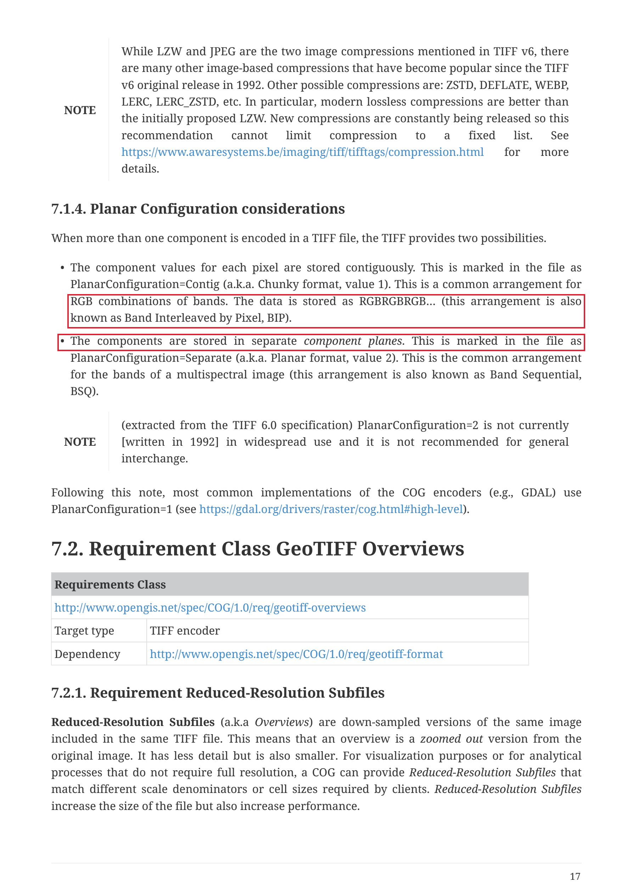

<figcaption><em>图 61　GeoTIFF 的分量存放顺序。</em><br/>来源：<a href="https://docs.ogc.org/is/21-026/21-026.pdf#page=17">OGC《Cloud Optimized GeoTIFF Standard》1.0</a>，PDF 第 17 页。</figcaption>
</figure>

<details>
<summary>展开查看另外 1 页手册</summary>

<figure id="page-ogc-cog-p025">

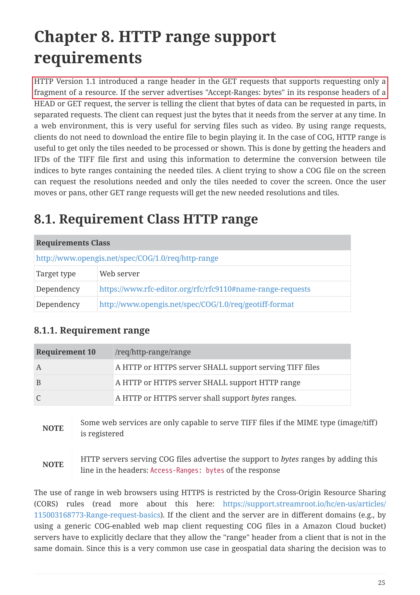

<figcaption><em>图 62　COG 与 HTTP 范围读取。</em><br/>来源：<a href="https://docs.ogc.org/is/21-026/21-026.pdf#page=25">OGC《Cloud Optimized GeoTIFF Standard》1.0</a>，PDF 第 25 页。</figcaption>
</figure>

</details>

<figure>


<figcaption><em>图 63　2020 年 9 月 15 日 T33TVM 瓦片的真彩色预览。包含修改后的 Copernicus Sentinel 数据（2020）。有效覆盖约 28.15%，右侧白色为无数据区域。<a href="https://sentinel-cogs.s3.us-west-2.amazonaws.com/sentinel-s2-l2a-cogs/33/T/VM/2020/9/S2A_33TVM_20200915_0_L2A/thumbnail.jpg">下载原缩略图</a>。</em></figcaption>
</figure>

| 文件 | 内容／资产网格 | 实际下载地址 |
| --- | --- | --- |
| `B02.tif` | 蓝光，10 m | [下载 B02.tif](https://sentinel-cogs.s3.us-west-2.amazonaws.com/sentinel-s2-l2a-cogs/33/T/VM/2020/9/S2A_33TVM_20200915_0_L2A/B02.tif) |
| `B03.tif` | 绿光，10 m | [下载 B03.tif](https://sentinel-cogs.s3.us-west-2.amazonaws.com/sentinel-s2-l2a-cogs/33/T/VM/2020/9/S2A_33TVM_20200915_0_L2A/B03.tif) |
| `B04.tif` | 红光，10 m | [下载 B04.tif](https://sentinel-cogs.s3.us-west-2.amazonaws.com/sentinel-s2-l2a-cogs/33/T/VM/2020/9/S2A_33TVM_20200915_0_L2A/B04.tif) |
| `B08.tif` | 近红外，10 m | [下载 B08.tif](https://sentinel-cogs.s3.us-west-2.amazonaws.com/sentinel-s2-l2a-cogs/33/T/VM/2020/9/S2A_33TVM_20200915_0_L2A/B08.tif) |
| `B09.tif` | 水汽波段，60 m | [下载 B09.tif](https://sentinel-cogs.s3.us-west-2.amazonaws.com/sentinel-s2-l2a-cogs/33/T/VM/2020/9/S2A_33TVM_20200915_0_L2A/B09.tif) |
| `B11.tif` | 短波红外，20 m | [下载 B11.tif](https://sentinel-cogs.s3.us-west-2.amazonaws.com/sentinel-s2-l2a-cogs/33/T/VM/2020/9/S2A_33TVM_20200915_0_L2A/B11.tif) |
| `B12.tif` | 短波红外，20 m | [下载 B12.tif](https://sentinel-cogs.s3.us-west-2.amazonaws.com/sentinel-s2-l2a-cogs/33/T/VM/2020/9/S2A_33TVM_20200915_0_L2A/B12.tif) |
| `SCL.tif` | 场景分类 | [下载 SCL.tif](https://sentinel-cogs.s3.us-west-2.amazonaws.com/sentinel-s2-l2a-cogs/33/T/VM/2020/9/S2A_33TVM_20200915_0_L2A/SCL.tif) |
| `AOT.tif` | 气溶胶光学厚度 | [下载 AOT.tif](https://sentinel-cogs.s3.us-west-2.amazonaws.com/sentinel-s2-l2a-cogs/33/T/VM/2020/9/S2A_33TVM_20200915_0_L2A/AOT.tif) |
| `WVP.tif` | 水汽柱含量 | [下载 WVP.tif](https://sentinel-cogs.s3.us-west-2.amazonaws.com/sentinel-s2-l2a-cogs/33/T/VM/2020/9/S2A_33TVM_20200915_0_L2A/WVP.tif) |
| `TCI.tif` | 真彩色显示 | [下载 TCI.tif](https://sentinel-cogs.s3.us-west-2.amazonaws.com/sentinel-s2-l2a-cogs/33/T/VM/2020/9/S2A_33TVM_20200915_0_L2A/TCI.tif) |
| `granule_metadata.xml` | 瓦片 XML 元数据 | [下载 granule_metadata.xml](https://sentinel-cogs.s3.us-west-2.amazonaws.com/sentinel-s2-l2a-cogs/33/T/VM/2020/9/S2A_33TVM_20200915_0_L2A/granule_metadata.xml) |
| `tileinfo_metadata.json` | 瓦片 JSON 信息 | [下载 tileinfo_metadata.json](https://sentinel-cogs.s3.us-west-2.amazonaws.com/sentinel-s2-l2a-cogs/33/T/VM/2020/9/S2A_33TVM_20200915_0_L2A/tileinfo_metadata.json) |

文件页中本例 B4、B8 的 `raster:bands` 给出 `scale: 0.0001`、`offset: 0`、`nodata: 0`，所以排除 0 后按 $\rho=DN\times0.0001$ 恢复反射率。这组系数来自表中资产的处理版本，新版 SAFE 的偏移仍按其元数据读取。

COG 是从原生产品转换得到的公开分发文件。换一个 Item 后，仍须核对 scale／offset 及是否已应用 BOA 偏移的说明，避免重复修正。[提供者 Earth Search 文档](https://github.com/Element84/earth-search#sentinel-2-l1c-and-l2a-sentinel-2-l1c-and-sentinel-2-l2a)解释了数据源与缩放问题。

<strong>链接核验记录（2026‑10‑05）</strong>：表中 11 个 TIFF 科学／显示资产分别请求了前 8192 字节，均返回 HTTP 206、TIFF 文件头与总长度；XML、JSON 和缩略图完整下载成功。这些请求核对了下载地址和文件类型。官方 SAFE 仅核对目录、节点名称与记录大小。公开接口将来可能调整，获取新数据时仍应回到资产清单。

实际下载的 `granule_metadata.xml` 中还可以找到以下字段。这些是<strong>本例 PB 02.14 文件的原值</strong>，可用于查找实际采集时刻和太阳角度，PB 05.00 的元数据则随其产品分别保存：

```xml
<SENSING_TIME metadataLevel="Standard">2020-09-15T10:17:52.188978Z</SENSING_TIME>
<HORIZONTAL_CS_CODE>EPSG:32633</HORIZONTAL_CS_CODE>
<!-- 以下两项位于 Mean_Sun_Angle 内 -->
<ZENITH_ANGLE unit="deg">44.5345499321481</ZENITH_ANGLE>
<AZIMUTH_ANGLE unit="deg">165.865518596877</AZIMUTH_ANGLE>
```

其中 `deg` 表示度，太阳高度角约为 $90-44.53455=45.46545^\circ$。这展示了“去元数据里找时间和角度”究竟是在找什么；太阳角度与各波段的观察角度位于各自的元数据分组。

用 Python 标准库下载本例红光、近红外和 SCL，可以复制以下脚本。约需 132 MB 网络传输，文件写到一个新目录；目录已存在会停止，避免覆盖已有数据。

```python
from pathlib import Path
from urllib.request import urlopen
from shutil import copyfileobj

base = (
    "https://sentinel-cogs.s3.us-west-2.amazonaws.com/"
    "sentinel-s2-l2a-cogs/33/T/VM/2020/9/"
    "S2A_33TVM_20200915_0_L2A/"
)
folder = Path("sentinel-example")
folder.mkdir(exist_ok=False)
for filename in ["B04.tif", "B08.tif", "SCL.tif", "granule_metadata.xml"]:
    with urlopen(base + filename, timeout=120) as response:
        with (folder / filename).open("xb") as target:
            copyfileobj(response, target)
    print("已下载", filename)
```

## 12. 怎样判断校正是否可信

颜色更鲜艳，往往首先来自显示方式的变化。屏幕的<strong>拉伸</strong>会把数据范围映射到显示亮度，<strong>真彩色合成</strong>把红、绿、蓝波段映射到屏幕 RGB；评价反射率精度，则需要进一步检查数值与参考观测。<strong>假彩色</strong>把近红外等波段映射到可见颜色，用于突出地物差异，同样不改变原始物理量。

<span id="evidence-29"></span>

<figure id="page-ccrs-fundamentals-p021">

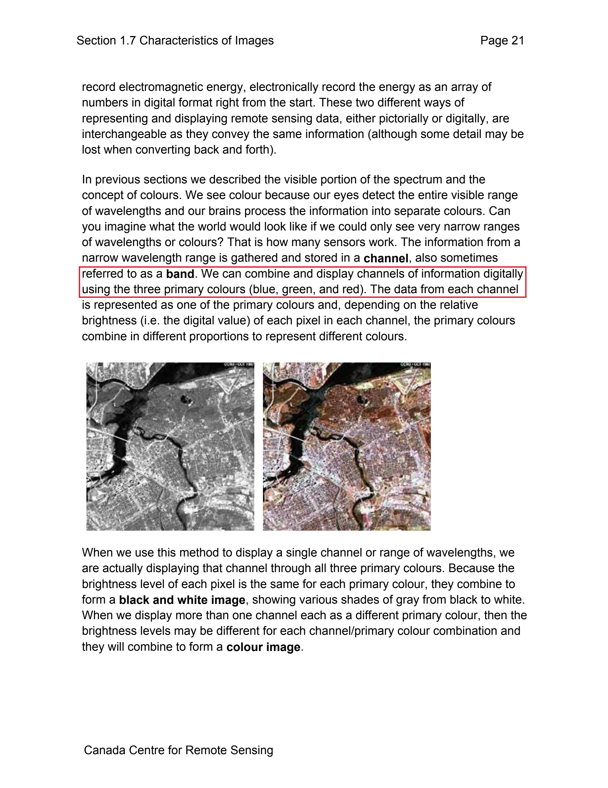

<figcaption><em>图 64　多波段影像的颜色合成。</em><br/>来源：<a href="https://natural-resources.canada.ca/sites/nrcan/files/earthsciences/pdf/resource/tutor/fundam/pdf/fundamentals_e.pdf#page=21">CCRS《Fundamentals of Remote Sensing》</a>，PDF 第 21 页。</figcaption>
</figure>

<details>
<summary>展开查看另外 1 页手册</summary>

<figure id="page-ccrs-fundamentals-p155">

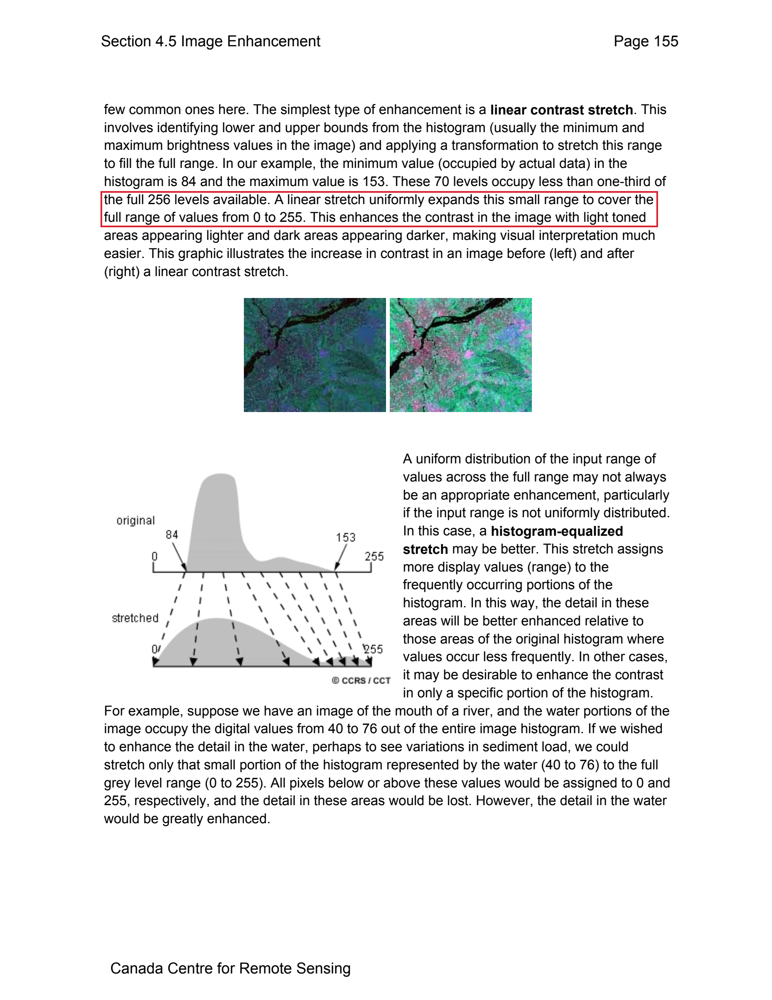

<figcaption><em>图 65　显示对比度与线性拉伸。</em><br/>来源：<a href="https://natural-resources.canada.ca/sites/nrcan/files/earthsciences/pdf/resource/tutor/fundam/pdf/fundamentals_e.pdf#page=155">CCRS《Fundamentals of Remote Sensing》</a>，PDF 第 155 页。</figcaption>
</figure>

</details>

先检查输入／输出物理量、单位、波段顺序、缩放和特殊值，再检查日志里是否真的执行了期望的定标及大气反演。Water Retrieval 或气溶胶反演失败后使用了默认参数，可在方法记录中写明这些运行条件。

然后查看不同地物的光谱是否合理，负值或异常高值集中在哪里。大量负值可能来自单位、偏移、模型或暗目标问题；超过 1 的值也可能和云、强方向性反射、饱和或处理误差有关。检查阶段可以保留这些值，结合位置和光谱寻找原因，再决定怎样筛选。

需要评价精度时，应使用独立证据：同期地面反射率、可靠参考目标、适配的辐射传输／校正结果和误差统计。对比官方 L2A 是有用的交叉检查，但 L2A 本身也是模型产品，同样带有模型和输入误差。不同算法之间的比较适合与独立参考观测一起进行。

<strong>QUAC（QUick Atmospheric Correction）</strong>是 ENVI 的经验校正方法，利用场景光谱统计，参数较少、通常运行较快。选择它时可以先看输入和场景条件：[官方使用说明](https://www.nv5geospatialsoftware.com/docs/quac.html)要求至少三个波段与有效波长，场景需要足够多样的材料等条件。纯海洋、大面积单一地物、复杂照明可能不满足它的假设。QUAC 和 FLAASH 的选择，可以围绕输入资料、场景和验证结果展开。

<span id="evidence-35"></span>

相关原页见[图 57](#page-envi-flaash-p012)（FLAASH 输入条件、单位与缩放）。

水质反演尤其需要谨慎：来自水体内部、穿过水面向上的<strong>离水辐亮度</strong>往往很弱，大气贡献、太阳耀斑（镜面反射阳光）与岸边邻近效应可能占很大比例。水色领域的<strong>遥感反射率</strong>常定义为 $R_{rs}=L_w/E_d$，即水面上方的离水辐亮度除以下行辐照度，单位是 $\mathrm{sr^{-1}}$；常说的无量纲离水反射率则可按相应约定写为 $\rho_w=\pi R_{rs}$。水色算法和一般陆地 SR 使用的量有所不同，使用时还需说明观测方向与归一化约定。[NASA 水色反射率说明](https://modis.gsfc.nasa.gov/data/dataprod/Rrs.php)解释了大气与水面贡献的分离。使用水质算法前应确认它究竟需要哪一种量。

<span id="evidence-30"></span>

相关原页见[图 37](#page-ocean-protocols-p032)（遥感反射率与光学厚度）、[图 25](#page-ocean-protocols-p021)（立体角与水面反射几何）。

温度反演需要热红外辐射、<strong>发射率</strong>与热大气模型。发射率描述实际表面在某波长的热辐射相对于同温度理想黑体的比例；理想黑体是在该波长完全吸收并按温度发射辐射的参考模型。地表的热辐射与大气自身的热发射都要处理，这类分析采用专门的热红外反演流程。

<span id="evidence-31"></span>

相关原页见[图 6](#page-modis-temperature-p010)（波段响应积分与热辐射模型）。

回到开头的 3200：只有当文件、元数据和处理链彼此一致，我们才知道这个数字意味着什么。理解每一步改变了什么、怎样读取文件，以及如何检验结果，这些细节共同组成可靠的遥感分析。

## 概念与原始文件的定位索引

下面的链接可以回到相应内容，完整原页、页码和文件来源放在附近，方便边读边查。

| 概念或细节 | 正文位置 | 原始文件中的位置 |
| --- | --- | --- |
| 遥感、主动／被动、波长 | [遥感、被动／主动观测与电磁波](#evidence-01) | CCRS §1.1、1.2、1.6，PDF 5、8、19 页 |
| 像元、IFOV、空间分辨率与 GSD | [像元、空间分辨率与采样的含义](#evidence-02)、[产品级别、DEM 正射与地理网格](#evidence-20) | CCRS 20、39 页；S2 Handbook 45 页 |
| 光谱／辐射／时间分辨率，高光谱、12 位与 16 位 | [四种分辨率中的光谱、辐射与时间](#evidence-03)、[MSI 的 12 位量化、辐射准确度与 SNR](#evidence-04)、[DN 与 NoData](#evidence-10) | CCRS 41–44 页；S2 Handbook 53 页；PSD 397 页 |
| 13 个波段、设计波长、带宽、10／20／60 m、Lref 与 SNR | [10 m 波段](#evidence-05)、[20 m 波段](#evidence-06)、[60 m 波段与原生采样分组](#evidence-07) | Handbook 53–54 页表 3–5；PSD 49 页 |
| 中心／等效波长、带宽中点、FWHM、1 nm 曲线步长 | [等效波长与带宽](#evidence-32)、[光谱信息需要读取文件里的实际字段](#evidence-08)、[波数单位与 FWHM 这个名字的完整含义](#evidence-39) | SRF 4.0 XLSX 的两个定义工作表与 S2A A2:A2302；PSD 439 页 |
| 重采样、最近邻、双线性、块均值、三次样条、SCL 保类别；10 m 产品的运算尺度 | [重采样改变网格，也可能改变数值](#evidence-09) | CCRS 152 页；Sen2Cor ATBD 11 页脚注 2、15 页 §2.4.4 |
| DN、NoData、饱和、scale／offset | [DN 与 NoData](#evidence-10)、[SCL 的每个整数都对应一个类别](#evidence-21)、[地表反射率、AOT 和 WVP 的换算各不相同](#evidence-22)、[Landsat 的 Level-1 辐亮度与 Collection 2 L2 编码](#evidence-23) | PSD 397、291 页；L2A PDD 39 页；USGS C2 指南 18 页 |
| 辐亮度、辐照度、光谱密度、波段响应积分、sr | [辐亮度、辐照度与光谱密度的原始定义](#evidence-11)、[立体角](#evidence-12)、[光谱信息需要读取文件里的实际字段](#evidence-08) | NIST HB152 PDF 13、16、17 页；NASA 协议 21 页；MODIS LST 10 页 |
| BRDF、方向—半球反射率、BRF、朗伯面 | [BRDF、反射因子与朗伯模型有不同定义](#evidence-13) | NBS Monograph 160 PDF 19、25、26、57 页 |
| TOA／BOA、太阳天顶／高度角、日地距离 U | [太阳天顶角、高度角与日地距离字段](#evidence-14)、[产品级别、DEM 正射与地理网格](#evidence-20)及手册原页 | Sen2Cor ATBD 67 页；Landsat 手册 63 页；PSD 54、397、439 页；PDD 13 页 |
| 吸收、散射、大气窗口、路径辐亮度、透过率 | [吸收、散射与大气窗口](#evidence-15)、[路径辐射、透过率与地表项进入同一个模型](#evidence-16)、[Sen2Cor 的查找表与透过率定义](#evidence-38) | CCRS 12、14 页；MODIS AC 21 页；Sen2Cor ATBD 51 页 |
| 邻近效应、混合像元、AOT／AOD、消光、Beer 衰减 | [邻近效应](#evidence-17)、[光学厚度](#evidence-18)、[路径辐射、透过率与地表项进入同一个模型](#evidence-16)、[NDVI 定义与大气的加性、乘性影响](#evidence-24) | MODIS AC 23、21 页；NASA 水色协议 32 页；MODIS VI 28 页 |
| 水汽柱、可降水量、g/cm² 与 atm-cm | [水汽柱含量的单位需要分清](#evidence-19)、[地表反射率、AOT 和 WVP 的换算各不相同](#evidence-22)、[大气模型是带有温度、水汽与季节条件的假设](#evidence-26) | L2A PDD 附录 A 第 39 页；FLAASH 手册表 2-1，第 21 页 |
| 定标、几何校正、配准、DEM、正射、坡度／坡向 | [Landsat 的 Level-1 辐亮度与 Collection 2 L2 编码](#evidence-23)、[配准、正射与坡面照明校正是不同步骤](#evidence-36)、[产品级别、DEM 正射与地理网格](#evidence-20) | Landsat 手册 62 页；CCRS 151 页；Sen2Cor ATBD 68 页；PSD 54 页 |
| L1B／L1C／L2A、Sen2Cor、LUT、SCL／AOT／WVP | [产品级别、DEM 正射与地理网格](#evidence-20)、[SCL 的每个整数都对应一个类别](#evidence-21)、[地表反射率、AOT 和 WVP 的换算各不相同](#evidence-22)、[Sen2Cor 的查找表与透过率定义](#evidence-38) | PSD 54、291 页；L2A PDD 39 页；Sen2Cor ATBD 51 页 |
| NDVI 定义、植被／背景混合、加性／乘性影响 | [NDVI 定义与大气的加性、乘性影响](#evidence-24) | MODIS VI ATBD PDF 28 页式 (5)、40 页 §3.1.4 |
| FLAASH、MODTRAN 原式、球面反照率与邻近地表 | [FLAASH 的模型原式](#evidence-25)、[大气模型是带有温度、水汽与季节条件的假设](#evidence-26)、[经典 FLAASH 参数的原始界面](#evidence-34) | FLAASH 手册第 10 页式 (1)、21 页表 2-1／2-2、17 页界面 |
| 高度 km、像元 m、时间 GMT、辐亮度输入单位与除法 scale | 手册原页、[经典 FLAASH 参数的原始界面](#evidence-34)、[辐亮度输入单位与除法缩放](#evidence-33) | FLAASH 手册 20、17、12 页 |
| 水汽反演覆盖范围、15 nm 条件、B8A／B9 APDA、波数 | [水汽反演](#evidence-27)、[波数单位与 FWHM 这个名字的完整含义](#evidence-39) | FLAASH 22 页；Sen2Cor ATBD 64 页；NIST HB152 12 页 |
| BIL／BIP／BSQ、GeoTIFF／COG、HTTP Range | 手册原页、[文件格式](#evidence-28) | FLAASH 12 页；OGC COG 17、25 页；现代 ENVI 文件文档见正文 |
| SAFE、XML／JP2、GRANULE、MGRS、UTM／WGS84 | [SAFE 文件组织与 MGRS 瓦片都有正式定义](#evidence-37)及第 11 节真实文件清单 | PSD 398 页图 4-17、50 页 §2.7.2；对应产品／瓦片 XML 与 Nodes 清单 |
| 显示拉伸、真／假彩色、TCI、QUAC 输入限制 | [真彩色、假彩色与显示拉伸](#evidence-29)、[QUAC 的输入波段条件也有明确限制](#evidence-35) | CCRS 21、155 页；FLAASH 12 页；PSD 291 页 TCI 小节 |
| 离水辐亮度、Rrs、归一化方向、水面反射与折射 | [离水辐亮度与水色遥感反射率](#evidence-30) | NASA Ocean Optics Protocols Vol. I PDF 32 页式 (2.54)、21 页图 2.4 |
| 热红外、发射率、黑体与大气热辐射 | [热红外反演包含地表发射、大气热辐射与发射率](#evidence-31) | MODIS LST ATBD PDF 10 页式 (8)及变量定义 |

## 技术手册与可核对材料

| 材料 | 本文用它核对什么 | 原文件／官方页面 |
| --- | --- | --- |
| ESA Sentinel‑2 User Handbook，2015，Issue 1 Rev 2 | 采样与波段原表：53–54 页；L1C 几何网格：45 页 | [原 PDF 下载](https://sentinels.copernicus.eu/documents/247904/685211/Sentinel-2_User_Handbook) |
| 加拿大遥感中心 CCRS Fundamentals of Remote Sensing | 基础定义：5–44 页；重采样：152 页；显示拉伸：155 页 | [原 PDF 下载](https://natural-resources.canada.ca/sites/nrcan/files/earthsciences/pdf/resource/tutor/fundam/pdf/fundamentals_e.pdf) |
| NBS/NIST Monograph 160，1977 | BRDF 与各类反射量：PDF 19、25、26、57 页 | [原 PDF 下载](https://nvlpubs.nist.gov/nistpubs/Legacy/MONO/nbsmonograph160.pdf) |
| ESA Sen2Cor L2A ATBD 2.10，2021‑11‑15 | 采样脚注：11 页；LUT：51 页；水汽：64 页；TOA 与地形：67–68 页 | [原 PDF 下载](https://sentiwiki.copernicus.eu/__attachments/a_2e88ffb8dabc4e1ec9efb71ba27cc9bcf70feeb378c084a2e80ba990273ebe5c/S2-PDGS-MPC-ATBD-L2A%20-%20Level%202A%20Algorithm%20Theoretical%20Basis%20Document%202021%20-%202.10.pdf) |
| NASA MODIS Vegetation Index ATBD 3，1999 | NDVI：PDF 28 页式 (5)；大气影响：40 页 | [原 PDF 下载](https://modis.gsfc.nasa.gov/data/atbd/atbd_mod13.pdf) |
| NASA MODIS Atmospheric Correction ATBD 4.0，1999 | 传播关系：21 页；邻近效应：23 页 | [原 PDF 下载](https://modis.gsfc.nasa.gov/data/atbd/atbd_mod08.pdf) |
| NASA MODIS Land Surface Temperature ATBD 3.3，1999 | 波段响应积分、热辐射模型：PDF 10 页 | [原 PDF 下载](https://modis.gsfc.nasa.gov/data/atbd/atbd_mod11.pdf) |
| NASA Ocean Optics Protocols Rev. 4，Vol. I，2003 | 立体角：PDF 21 页；Rrs 与光学厚度：32 页 | [原 PDF 下载](https://oceancolor.gsfc.nasa.gov/files/resources/docs/technical/protocols_ver4_voli.pdf) |
| USGS LSDS‑1574 Landsat 8 手册 v5.0，2019 | 辐亮度定标：PDF 62 页；太阳角度：63 页 | [原 PDF 下载](https://d9-wret.s3.us-west-2.amazonaws.com/assets/palladium/production/s3fs-public/atoms/files/LSDS-1574_L8_Data_Users_Handbook-v5.0.pdf) |
| USGS LSDS‑1619 Collection 2 L2 指南 v6.0 | SR 比例与偏移：PDF 18 页表 6-1 | [原 PDF 下载](https://d9-wret.s3.us-west-2.amazonaws.com/assets/palladium/production/s3fs-public/media/files/LSDS-1619_Landsat8-9-Collection2-Level2-Science-Product-Guide-v6.pdf) |
| OGC Cloud Optimized GeoTIFF Standard 1.0，2023 | 存储顺序：17 页；HTTP 范围读取：25 页 | [原 PDF 下载](https://docs.ogc.org/is/21-026/21-026.pdf) |
| Sentinel‑2 产品规范 15.0，2024‑04‑30 | L1C 物理量与量化字段，第 397 页；L2A 元数据，第 439 页 | [PDF 下载](https://sentinels.copernicus.eu/documents/d/sentinel/s2-pdgs-cs-di-psd-v15-0) |
| NIST Handbook 152 与光谱辐亮度定标手册 | 辐亮度、辐照度、光谱密度与响应积分 | [Handbook 152 PDF](https://nvlpubs.nist.gov/nistpubs/Legacy/hb/nisthandbook152.pdf) · [光谱定标 PDF](https://nvlpubs.nist.gov/nistpubs/Legacy/SP/nbsspecialpublication250-1.pdf) |
| NIST MIST／SCATMECH | BRDF 的量纲、方向性与朗伯反射模型 | [BRDF 定义](https://pages.nist.gov/ScatterMIST/docs/Introduction.htm) · [朗伯模型](https://pages.nist.gov/SCATMECH/docs/lambert.htm) |
| Copernicus MSI 光谱响应文件 | 真实逐波长响应、卫星平台及文件版本 | [官方文件目录](https://sentiwiki.copernicus.eu/web/s2-documents) · [4.0 版 XLSX 下载](https://sentiwiki.copernicus.eu/__attachments/a_ece6183b6698587e7ecd9804974bece3d82e39e151aa5aeca9d8fd95e1f1558c/COPE-GSEG-EOPG-TN-15-0007%20-%20Sentinel-2%20Spectral%20Response%20Functions%202024%20-%204.0.xlsx) |
| NOAA 消光与 SURFRAD AOD 说明 | 气溶胶垂直柱积分、直射衰减及其他大气贡献 | [消光说明](https://gml.noaa.gov/grad/agasp2.html) · [SURFRAD AOD](https://www.gml.noaa.gov/grad/surfrad/aod/) |
| Sentinel‑2 L2A 产品定义 4.9，2021‑11‑15 | BOA、分类、AOT／水汽及 B10，第 13–14 页 | [PDF 下载](https://step.esa.int/thirdparties/sen2cor/2.10.0/docs/S2-PDGS-MPC-L2A-PDD-V14.9-v4.9.pdf) |
| ENVI Atmospheric Correction Module User’s Guide，经典版 | BIL／BIP 与输入条件，第 12 页；单位，第 20 页；水汽条件，第 22 页 | [PDF 下载](https://www.nv5geospatialsoftware.com/portals/0/pdfs/envi/QUAC_FLAASH_Module.pdf) |
| 当前 ENVI FLAASH 文档，页面版本 6.3 | 现代界面、自动定标、Input Scale、水汽与波段要求 | [操作文档](https://www.nv5geospatialsoftware.com/docs/FLAASH.html) |
| FLAASH 科学背景与任务接口 | 辐射传输关系、近似假设、参数定义 | [科学背景](https://www.nv5geospatialsoftware.com/docs/backgroundflaash.html) · [任务接口](https://www.nv5geospatialsoftware.com/docs/enviflaashtask.html) |
| Copernicus SentiWiki／Sen2Cor | 处理基线、偏移和 L2A 处理器 | [产品说明](https://sentiwiki.copernicus.eu/web/s2-products) · [Sen2Cor](https://step.esa.int/main/snap-supported-plugins/sen2cor/) |
| CDSE OData 与 Earth Search | 实际 UUID、节点目录、下载认证、资产信息 | [OData 文档](https://documentation.dataspace.copernicus.eu/APIs/OData.html) · [Earth Search 文档](https://github.com/Element84/earth-search) |

图中的红框为本文标注。AI 概念示意的图注注明了绘制方式；真实预览和手册页面则附有各自的来源链接。

CCRS 原文摘图用于本篇非商业教学说明，来源为 Canada Centre for Remote Sensing／Natural Resources Canada；原教程第 256 页列出教育用途复制条件。NASA、NIST／NBS 和 USGS 文件在此作为物理定义的原始技术材料；历史算法文档的年份与版本均保留，便于按所使用的软件和产品版本查阅。


<script is:inline>
(() => {
  const reveal = (hash) => {
    const target = document.getElementById(decodeURIComponent(hash.slice(1)));
    if (!target) return;
    let parent = target.parentElement;
    while (parent) {
      if (parent.tagName === 'DETAILS') parent.open = true;
      parent = parent.parentElement;
    }
  };
  document.addEventListener('click', (event) => {
    const link = event.target.closest?.('a[href^="#page-"]');
    if (link) reveal(link.getAttribute('href'));
  });
  window.addEventListener('hashchange', () => reveal(location.hash));
  if (location.hash) reveal(location.hash);
})();
</script>
