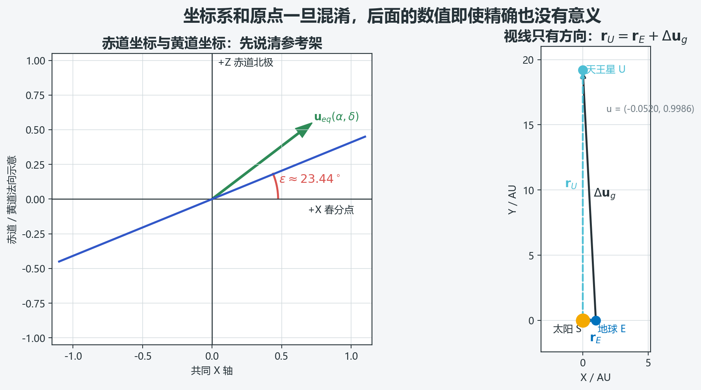
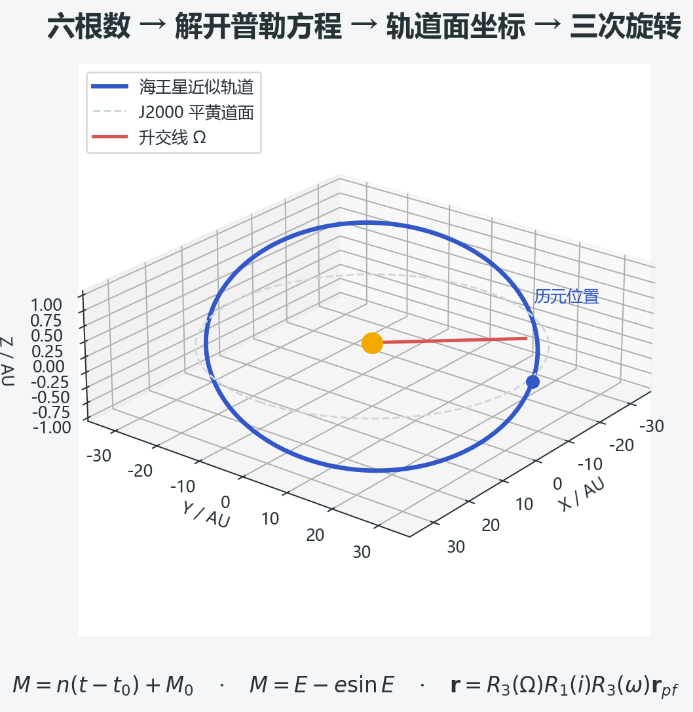
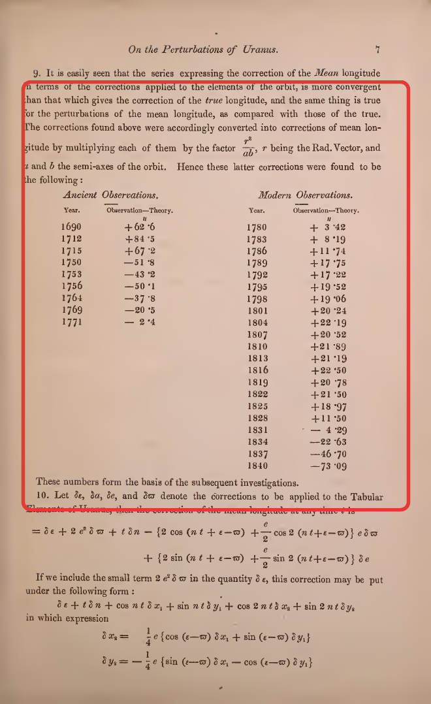
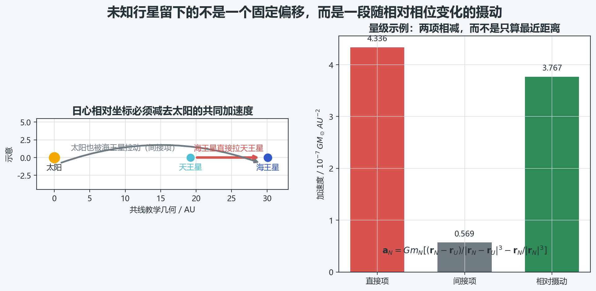
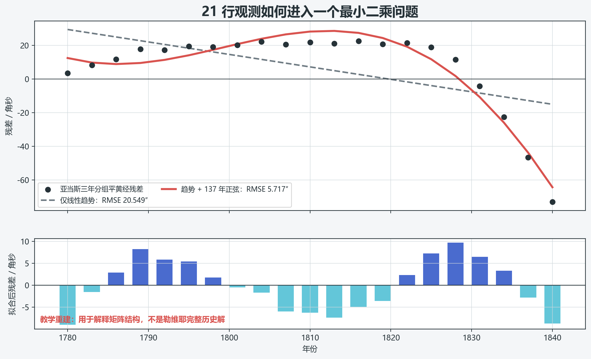
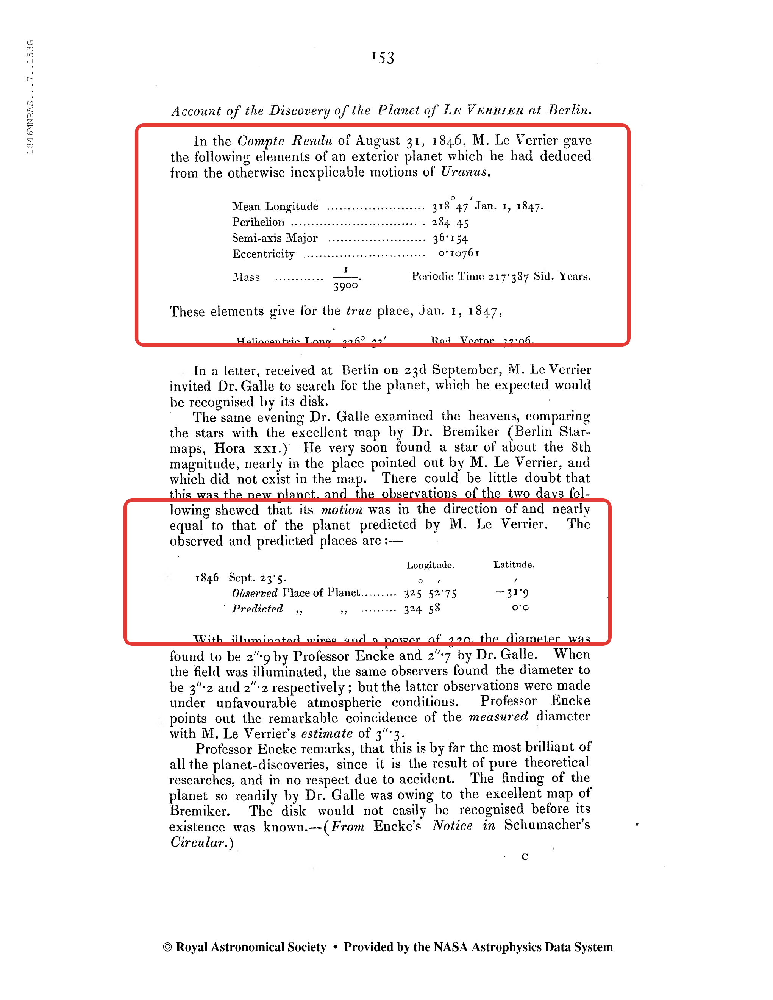
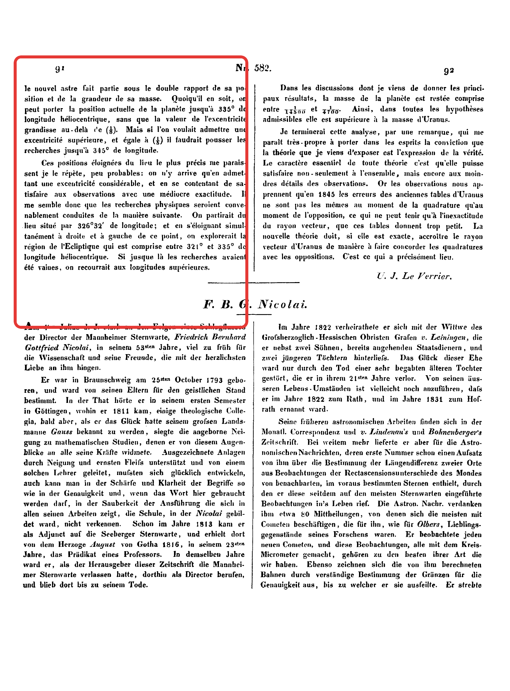
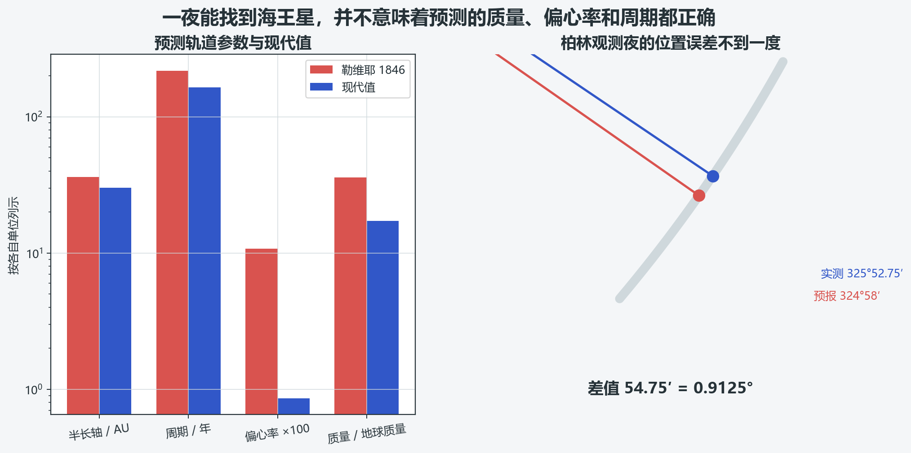
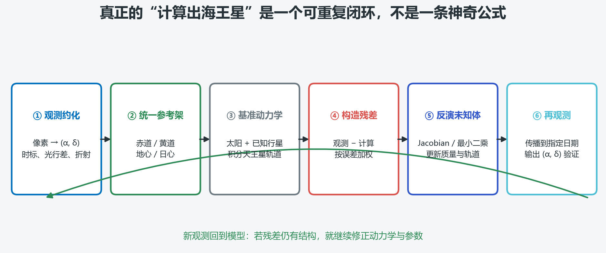

1846 年 9 月 23 日，柏林天文台的约翰·伽勒按照勒维耶寄来的位置搜索，当晚就在预报区域内辨认出海王星。这件事常被压缩成一句浪漫的叙述：**天文学家用纸和笔算出了一颗尚未见过的行星。**

这句话没有错，但它省略了真正困难的部分。所谓“算出海王星”，不是把某个公式代入一次，而是完成一条很长的计算链：

1. 把望远镜读数约化成同一时标、同一参考架下的方向；
2. 扣除地球公转造成的视差，把地心方向转换为日心几何；
3. 用太阳和已知行星的引力计算天王星的理论位置；
4. 从“观测值减计算值”的残差中识别系统性结构；
5. 假设一个未知行星，反复调整它的质量与轨道，使残差整体减小；
6. 将最终试算轨道传播到指定日期，再换算成望远镜可使用的赤经、赤纬；
7. 用新的观测检验预测，而不是只看拟合是否好看。

本文按照这条链逐步展开。为了避免把现代算法冒充历史原算，文中的材料分成三类：

| 标记 | 含义 | 本文中的例子 |
| --- | --- | --- |
| **史料原值** | 可在 1846 年论文或同期报告中直接核对 | 亚当斯残差表、伽勒报告的经度 |
| **现代记号复述** | 用向量、矩阵和数值积分重写同一物理问题 | 直接/间接摄动、加权最小二乘 |
| **教学重建** | 为解释算法而设计的简化数值，不等同于历史完整解 | 21 点正弦拟合、共线摄动量级 |

> **技术审校记录（2026-08-20）**：修正了 1846 历元黄赤交角及相应赤经赤纬；区分 JPL 两套不同区间的拟合根数；明确 DE440 使用海王星系统质量、光行时的发射时刻，以及角度残差的 $0/360^\circ$ 分支处理。



## 1. 先定义问题：我们到底要计算什么

“海王星的位置”至少有四种不同含义。它们的数字不能直接相减，也不能因为都写成角度就认为属于同一坐标系。

| 量 | 原点 | 参考面与轴 | 典型用途 |
| --- | --- | --- | --- |
| 日心黄道直角坐标 $\mathbf r_N$ | 太阳 | 黄道面，$+X$ 指向春分点 | 轨道积分、摄动计算 |
| 地心视线向量 $\boldsymbol\rho$ | 地心 | 可用黄道或赤道参考架表达 | 从地球看行星的方向和距离 |
| 地心黄经、黄纬 $(\lambda_g,\beta_g)$ | 地心 | 黄道面 | 19 世纪行星表和发现报告常用 |
| 赤经、赤纬 $(\alpha,\delta)$ | 地心或测站 | 天球赤道 | 星图、望远镜指向、现代星表 |

还要继续说明历元和时标。例如 J2000 平黄道、日期黄道、ICRF、真赤道真春分点并不是同一个参考架；UTC、TT、TDB 也不是可互换的时间变量。JPL Horizons 的底层计算在行星星历参考架中完成，再按用户要求输出 ICRF、黄道或其他参考架；它也明确区分几何位置、天体测量位置和视位置。实际项目应在每个数组旁保留 `frame`、`origin`、`epoch`、`time_scale` 和 `unit` 元数据，而不是只保存三列 $x,y,z$。参考 [JPL Horizons 参考架说明](https://ssd.jpl.nasa.gov/horizons/manual.html) 与 [NAIF/SPICE Frames Required Reading](https://naif.jpl.nasa.gov/pub/naif/toolkit_docs/MATLAB/req/frames.html)。

## 2. 从赤经、赤纬得到一条空间视线

经过仪器改正、折射改正和星表约化后，一次观测给出赤经 $\alpha$ 与赤纬 $\delta$。它们首先对应赤道参考架中的单位向量：

$$
\mathbf u_{eq}=
\begin{bmatrix}
\cos\delta\cos\alpha\\
\cos\delta\sin\alpha\\
\sin\delta
\end{bmatrix}.
$$

若后续动力学使用黄道坐标，需要绕共同的 $X$ 轴旋转。以固定黄赤交角 $\varepsilon$ 的教学写法为例，赤道转黄道为

$$
\mathbf u_{ecl}=R_1(-\varepsilon)\mathbf u_{eq}
=
\begin{bmatrix}
1&0&0\\
0&\cos\varepsilon&\sin\varepsilon\\
0&-\sin\varepsilon&\cos\varepsilon
\end{bmatrix}\mathbf u_{eq}.
$$

于是

$$
\lambda_g=\operatorname{atan2}(u_y,u_x),\qquad
\beta_g=\arcsin(u_z).
$$

这里必须使用 `atan2(y,x)`，而不能只算 $\arctan(y/x)$。后者会丢失象限信息，在 $x<0$ 时可能把目标放到天空的另一侧。

对两个角度作差时还要处理 $0/360^\circ$ 的分支。例如 $359.9^\circ$ 与 $0.1^\circ$ 相差的是 $0.2^\circ$，不是 $359.8^\circ$。工程上应写成

$$
\Delta\lambda=
\operatorname{wrap}_{(-\pi,\pi]}
\!\left(\lambda_{obs}-\lambda_{calc}\right).
$$

但请注意，$\mathbf u_g$ 仍然只是一条**方向**。单次角度观测没有直接给出行星距离。

## 3. 地球公转怎样进入计算

令 $\mathbf r_E$ 是观测时刻地球的日心位置，$\Delta$ 是目标的地心距离，$\mathbf u_g$ 是地心视线单位向量，则日心位置满足

$$
\boxed{\mathbf r_U=\mathbf r_E+\Delta\mathbf u_g}.
$$

这条向量式非常简单，却是整篇计算的几何底座。它说明地心黄经不能直接当作日心黄经；地球每年绕太阳移动 1 AU，外行星在天空中的位置会出现明显的年度视差和逆行。

如果试算轨道已经给出天王星日距 $r=\lVert\mathbf r_U\rVert$，对上式取模平方：

$$
r^2=\lVert\mathbf r_E\rVert^2
+2\Delta(\mathbf r_E\cdot\mathbf u_g)+\Delta^2.
$$

整理后，在本文讨论的外行星情形 $r>\lVert\mathbf r_E\rVert$ 且视线与试算日距球相交时，唯一的正距离根为：

$$
\boxed{
\Delta=-\mathbf r_E\cdot\mathbf u_g+
\sqrt{(\mathbf r_E\cdot\mathbf u_g)^2+r^2-\lVert\mathbf r_E\rVert^2}
}.
$$

### 一个可复算的二维例子

取太阳 $S=(0,0)$ AU、地球 $E=(1,0)$ AU、天王星 $U=(0,19.2)$ AU，则

$$
\boldsymbol\rho=U-E=(-1,19.2),
$$

$$
\Delta=\sqrt{(-1)^2+19.2^2}=19.226024\ \mathrm{AU},
$$

$$
\mathbf u_g=(-0.0520128,\,0.9986464).
$$

由此得到地心经度

$$
\lambda_g=\operatorname{atan2}(0.9986464,-0.0520128)
=92.981461^\circ,
$$

而日心经度是 $90^\circ$。仅仅因为观测者位于地球而不是太阳，角度便相差 $2.981461^\circ$。这远大于海王星发现夜“不到一度”的预报误差，因此地球位置绝不是可忽略的小修正。

在真实定轨中，不会凭一次观测和一个预设日距就宣布得到轨道，而是把多个时刻的方向观测、动力学传播和距离未知量一起求解。这里的二次方程只负责说明几何关系。

## 4. 从状态向量到六个轨道根数

若已经在同一日心惯性参考架中得到位置 $\mathbf r$ 和速度 $\mathbf v$，两体近似下可以构造瞬时密切轨道。严格的相对两体参数是 $\mu=G(M_\odot+m)$；忽略行星质量时才近似取 $GM_\odot$：

$$
\mathbf h=\mathbf r\times\mathbf v,
$$

$$
\mathbf e=\frac{\mathbf v\times\mathbf h}{\mu}-\frac{\mathbf r}{r},
\qquad e=\lVert\mathbf e\rVert,
$$

$$
\mathcal E=\frac{v^2}{2}-\frac{\mu}{r},
\qquad a=-\frac{\mu}{2\mathcal E}.
$$

轨道面倾角由角动量方向给出：

$$
i=\arccos\frac{h_z}{\lVert\mathbf h\rVert}.
$$

再用节点向量 $\mathbf n=\mathbf k\times\mathbf h$ 求升交点经度 $\Omega$，用 $\mathbf n$ 与偏心率向量求近心点幅角 $\omega$，最后由 $\mathbf e$ 和 $\mathbf r$ 求真近点角 $\nu$。工程实现应使用带叉积符号的 `atan2` 形式，以免在 $0$ 到 $360^\circ$ 的象限上出错。对于近圆轨道，$e\to0$ 时 $\omega$ 会变得病态；对于近共面轨道，$i\to0$ 时 $\Omega$ 也会失去稳定定义。因此优化变量不一定要直接采用传统六根数，也可以使用无奇异根数或直接优化笛卡尔状态向量。

这六个经典根数的几何含义如下：

| 根数 | 符号 | 决定什么 |
| --- | ---: | --- |
| 半长轴 | $a$ | 轨道尺度和平均运动 |
| 偏心率 | $e$ | 椭圆扁率 |
| 轨道倾角 | $i$ | 轨道面相对参考面的倾斜 |
| 升交点经度 | $\Omega$ | 轨道面与参考面的交线方向 |
| 近心点幅角 | $\omega$ | 椭圆长轴在轨道面内的方向 |
| 历元平近点角 | $M_0$ | 行星在指定历元位于轨道的哪里 |



## 5. 已知轨道后，怎样算任意时刻的位置

在两体近似中，平均运动为

$$
n=\sqrt{\frac{\mu}{a^3}},
$$

历元 $t_0$ 之后的平近点角为

$$
M(t)=M_0+n(t-t_0).
$$

下一步解开普勒方程

$$
\boxed{M=E-e\sin E},
$$

得到偏近点角 $E$。牛顿迭代为

$$
E_{k+1}=E_k-\frac{E_k-e\sin E_k-M}{1-e\cos E_k}.
$$

轨道平面（perifocal frame）中的位置是

$$
\mathbf r_{pf}=
\begin{bmatrix}
a(\cos E-e)\\
a\sqrt{1-e^2}\sin E\\
0
\end{bmatrix}.
$$

最后旋转到日心黄道参考架：

$$
\boxed{
\mathbf r_N=R_3(\Omega)R_1(i)R_3(\omega)\mathbf r_{pf}
}.
$$

这里采用主动、右手旋转；下文 MATLAB 中的 $R_1$、$R_3$ 给出了具体矩阵。如果软件库采用“旋转坐标轴”的被动约定，同一变换会写成相反的角号，不能只看函数名照搬。

JPL 页面给出了两套为不同时间范围拟合的近似根数，不能混称为同一组“现代常数”：

| JPL 拟合区间 | $a$ / AU | $e$ | $I$ |
| --- | ---: | ---: | ---: |
| 1800—2050 | 30.06992276 | 0.00859048 | $1.77004347^\circ$ |
| 公元前 3000—公元 3000 | 30.06952752 | 0.00895439 | $1.77005520^\circ$ |

上图沿用长时间拟合表的近似根数；后文历史比较表采用 1800—2050 表四舍五入后的 $e=0.00859$。JPL 特别说明，这些数值只是给定区间内的位置拟合参数，并不代表一组永久不变的平均根数。它们适合制图和教学，不应代替高精度星历。需要实际指向望远镜时，应使用 [JPL Horizons](https://ssd.jpl.nasa.gov/horizons/) 或 [SPICE](https://naif.jpl.nasa.gov/naif/) 的行星星历。两套根数、适用区间和标称误差见 [JPL Approximate Positions of the Planets](https://ssd.jpl.nasa.gov/planets/approx_pos.html)。

## 6. 为什么天王星的残差暗示存在一个遗漏的力

若模型完整且观测没有系统误差，经过角度分支处理的残差

$$
r_i=\operatorname{wrap}_{(-\pi,\pi]}
\!\left[\lambda_{obs}(t_i)-\lambda_{calc}(t_i)\right]
$$

应当围绕零随机散布。现实中，天文学家必须先处理三个层次的问题：

1. **观测误差**：仪器、钟差、星表、折射和读数造成的噪声；
2. **已知模型误差**：天王星自身轨道根数、木星和土星质量、截断摄动项不够准确；
3. **遗漏动力学**：模型中没有包含的未知天体或其他物理效应。

因此，看到残差不等于立刻证明存在新行星。真正有信息的是残差随时间呈现的连续结构，以及这种结构能否被一个具有物理一致性的引力模型同时解释。

### 亚当斯为何把真黄经残差换成平黄经残差

亚当斯 1846 年公开表格同时给出真日心经度误差和换算后的平经度误差。开普勒第二定律给出

$$
r^2\frac{df}{dt}=\sqrt{\mu a(1-e^2)},
$$

而

$$
\frac{dM}{dt}=n=\sqrt{\frac{\mu}{a^3}}.
$$

两式相除，并使用短半轴 $b=a\sqrt{1-e^2}$：

$$
\frac{dM}{df}=\frac{r^2}{ab}.
$$

若把近心点方向的改正另行处理，则一阶小量下真黄经改正与真近点角改正相同，平黄经改正与平近点角改正相同，于是

$$
\boxed{
\delta\lambda_{mean}\approx
\frac{r^2}{ab}\,\delta\lambda_{true}
}.
$$

亚当斯原文的说法正是将真黄经改正乘以 $r^2/(ab)$，得到平黄经改正。若近心点经度也作为同一项一起变化，就不能把 $\delta M$ 与 $\delta\lambda_{mean}$ 无条件视为同一个量。



> **图 7**　亚当斯 1846 年论文原页。红框内明确写出：把真黄经改正乘以 $r^2/(ab)$，即可得到平黄经改正；下方表格保留了各三年分组的历史数值。来源：J. C. Adams, “On the Perturbations of Uranus,” *Monthly Notices of the Royal Astronomical Society* 7 (1846), 149–152，[牛津学术原刊页](https://academic.oup.com/mnras/article/7/9/149/983965)，[1846 年单行本扫描](https://archive.org/details/explanationobse00Adam)。红框为本文校对时添加。

1840 年的史料原值为

$$
\delta f=-66.61'',\qquad \delta M=-73.09''.
$$

反推当时的换算因子为 $73.09/66.61=1.0972827$，乘回后正好得到 $-73.09''$。这一步把不等速运行造成的几何伸缩纳入条件方程，使不同时刻的误差更适合放在统一的轨道参数框架中比较。

## 7. 摄动加速度为什么有“直接项”和“间接项”

若以太阳为原点描述天王星相对太阳的运动，未知行星 $N$ 造成的相对摄动加速度是

$$
\boxed{
\mathbf a_N=Gm_N\left[
\frac{\mathbf r_N-\mathbf r_U}{\lVert\mathbf r_N-\mathbf r_U\rVert^3}
-\frac{\mathbf r_N}{\lVert\mathbf r_N\rVert^3}
\right].
}
$$

第一项是海王星直接拉动天王星；第二项是海王星同时拉动太阳。因为我们研究的是“天王星相对太阳”的运动，太阳的共同加速度必须减掉。只计算两颗行星之间的 $Gm/d^2$，会把参考原点本身的运动漏掉。



共线教学例中，取 $r_U=19.2$ AU、$r_N=30.1$ AU，并用 DE440 的海王星**系统**质量比近似 $m_N/M_\odot=1/19412$：

| 分量 | 数值 / $GM_\odot\,\mathrm{AU}^{-2}$ |
| --- | ---: |
| 直接项 | $4.335874682\times10^{-7}$ |
| 间接项 | $5.685867385\times10^{-8}$ |
| 相对摄动 | $3.767287944\times10^{-7}$ |

换算后约为 $2.2340\times10^{-9}\ \mathrm{m\,s^{-2}}$，只相当于太阳在 19.2 AU 处引力的 $1.3888\times10^{-4}$。它很小，但几十年持续积累后可以形成可测的经度偏差。正式计算中两颗行星的位置、夹角和距离都随时间变化，不能把上述共线量级当作常加速度使用。

这里的 DE440 数值严格说是海王星及其卫星的系统 $GM$。由 JPL 给出的 $GM_\odot$ 与 $GM_{\mathrm{Neptune\ system}}$ 可得比值约 $19412.26$；教学计算取整为 19412。参见 [JPL Astrodynamic Parameters](https://ssd.jpl.nasa.gov/astro_par.html)。

## 8. 从摄动方程变成可解的参数反演

设参数向量包含天王星初始状态修正、未知行星质量和轨道参数：

$$
\mathbf p=
\begin{bmatrix}
\delta\mathbf x_{U,0} & m_N & a_N & e_N & i_N & \Omega_N & \omega_N & M_{N,0}
\end{bmatrix}^{T}.
$$

给定一个初猜 $\mathbf p_0$，积分太阳、天王星、已知行星和试算未知行星的运动方程，得到每个观测时刻的计算经度。对参数作一阶线性化：

$$
\mathbf r\approx A\,\delta\mathbf p,
$$

其中

$$
A_{ij}=\left.\frac{\partial\lambda_{calc}(t_i)}{\partial p_j}\right|_{\mathbf p_0}.
$$

现代程序可以同时积分变分方程得到 $A$，也可以用经过步长检验的中心差分近似。给定观测协方差 $C$，通常取 $W=C^{-1}$。最小化

$$
\chi^2=(\mathbf r-A\delta\mathbf p)^TW(\mathbf r-A\delta\mathbf p)
$$

得到正规方程

$$
\boxed{(A^TWA)\delta\mathbf p=A^TW\mathbf r}.
$$

计算时通常不直接求逆矩阵 $(A^TWA)^{-1}$，而使用 QR、SVD 或带阻尼的 Levenberg–Marquardt 方法。原因是短时间观测弧会让质量、半长轴和相位高度相关：几组很不相同的轨道参数，也可能在 1846 年附近给出相似的天空位置。

一次迭代的流程是：

```text
初猜 p0
  → 数值积分到全部观测时刻
  → 计算观测量与残差 r
  → 计算 Jacobian A
  → 解加权线性子问题
  → p1 = p0 + δp
  → 重新积分，直到参数和 χ² 都收敛
```

### 21 个史料分组点的教学拟合

为了直观看见“每条观测怎样成为矩阵的一行”，这里取亚当斯表中 1780—1840 年的 21 个三年分组平黄经残差，拟合

$$
r(t)=c_0+c_1t+A\cos\frac{2\pi t}{137}+B\sin\frac{2\pi t}{137},
\qquad t=\mathrm{year}-1810.
$$

结果为：

| 参数 | 拟合值 |
| --- | ---: |
| $c_0$ | $-38.939570''$ |
| $c_1$ | $-5.364043''/\mathrm{year}$ |
| $A$ | $67.156045''$ |
| $B$ | $124.871065''$ |
| 仅线性趋势 RMSE | $20.549''$ |
| 趋势 + 周期 RMSE | $5.717''$ |



这张图只能说明残差中存在不能由直线解释的弯曲结构，以及最小二乘怎样把多条观测合成一组参数。**它不是勒维耶或亚当斯的完整历史解。** 历史计算还包括木星、土星等已知行星的摄动项、天王星轨道修正、未知行星距离假设、三角级数展开、反复制表和消元。

## 9. 从试算轨道回到望远镜能用的天空坐标

在暂不考虑光行时的几何近似中，得到海王星日心位置 $\mathbf r_N(t)$ 后，先减去同一时刻的地球日心位置：

$$
\boldsymbol\rho=\mathbf r_N-\mathbf r_E,
\qquad
\mathbf u_g=\frac{\boldsymbol\rho}{\lVert\boldsymbol\rho\rVert}.
$$

在黄道参考架中：

$$
\lambda_g=\operatorname{atan2}(u_y,u_x),
\qquad
\beta_g=\arcsin(u_z).
$$

再把黄道向量旋转到赤道参考架：

$$
\begin{bmatrix}x_q\\y_q\\z_q\end{bmatrix}
=
\begin{bmatrix}
1&0&0\\
0&\cos\varepsilon&-\sin\varepsilon\\
0&\sin\varepsilon&\cos\varepsilon
\end{bmatrix}
\begin{bmatrix}x_e\\y_e\\z_e\end{bmatrix}.
$$

于是

$$
\alpha=\operatorname{atan2}(y_q,x_q)\pmod{2\pi},
\qquad
\delta=\arcsin(z_q).
$$

真实的天体测量方向要迭代求解光行时 $\tau$，其基本几何为

$$
\boldsymbol\rho(t)=\mathbf r_N(t-\tau)-\mathbf r_E(t),
\qquad
\tau=\frac{\lVert\boldsymbol\rho\rVert}{c}.
$$

随后再按所需观测量处理岁差、章动、恒星光行差、引力偏折和测站位置。几何向量、天体测量赤经赤纬和视赤经赤纬必须分别命名。JPL Horizons 对这些输出量有清晰定义，适合用作程序的外部基准。

### 1846 年 9 月 23.5 日的史料复算

伽勒同期报告列出：

$$
\lambda_{pred}=324^\circ58',
$$

$$
\lambda_{obs}=325^\circ52.75'
=325^\circ52'45''.
$$

因此

$$
\Delta\lambda=54.75'=54'45''=0.9125^\circ.
$$



> **图 8**　1846 年柏林发现报告原页。上方红框是勒维耶用于搜索的轨道参数；下方红框并列给出 9 月 23.5 日的观测地心经度 $325^\circ52.75'$ 与预报值 $324^\circ58'$。来源：J. G. Galle, “Account of the Discovery of the Planet of Le Verrier at Berlin,” *Monthly Notices of the Royal Astronomical Society* 7 (1846), 153，[原刊页与 DOI](https://academic.oup.com/mnras/article/7/9/153/983971)。红框为本文校对时添加。

`.75` 是十进制角分，不是 7.5 角秒，也不是 27.5 角秒。另一个常被引用的“52 角分”来自 1847 年 1 月 1 日的日心经度比较，日期和坐标口径都不同，不能混用。

如果仅为演示而令预测黄纬 $\beta=0$，并把历史黄经理解为日期平黄道坐标，就应使用日期平黄赤交角，而不是接近 J2000 的 $23^\circ26'21.4''$。用 IAU 2006 平黄赤交角多项式在 1846-09-23.5 求得 $\varepsilon\approx23^\circ27'33.2''$，把 $324^\circ58'$ 转为日期平赤道坐标，可得约

$$
\alpha=21^\mathrm h49^\mathrm m00.92^\mathrm s,
\qquad
\delta=-13^\circ12'37.6''.
$$

这是按原表黄经作的现代坐标转换示例，不是伽勒原始赤经读数；若要复原 1846 年的“视位置”，还需明确原表采用的平/真春分点并加入章动等改正。项目内保存的 JPL Horizons 地心星历在 1846-09-23 12:00 UT 给出经下行光行时改正的 ICRF 天体测量赤经约 $330.3880^\circ$、赤纬约 $-12.6690^\circ$。它与上面的简化值使用不同纬度输入和参考架，不能把两组数字直接当作误差比较。日期平黄赤交角模型见 [IERS Conventions 2010，第 5 章](https://iers-conventions.obspm.fr/conventions/content/tn36.pdf)。

## 10. 为什么位置很准，整条预测轨道却不准

勒维耶给出的搜索位置足以帮助伽勒迅速找到海王星，但他的半长轴、周期、偏心率和质量与现代值并不接近。

| 参数 | 勒维耶 1846 | 现代值或观测值 | 比较 |
| --- | ---: | ---: | --- |
| 半长轴 | 36.154 AU | 30.07 AU | 约高 20% |
| 周期 | 217.387 年 | 164.791 年 | 约高 32% |
| 偏心率 | 0.10761 | 0.00859 | 高一个数量级以上 |
| $M_\odot/m_N$ | 9300 | 19412（DE440 海王星系统） | 预测质量约为现代值 2.09 倍 |
| 1846-09-23.5 地心经度 | $324^\circ58'$ | $325^\circ52.75'$ | 相差 $0.9125^\circ$ |



> **图 9**　勒维耶论述预测位置的刊本结尾页。红框内以 $326^\circ32'$ 为计算中心，并建议优先检查日心经度约 $321^\circ$—$335^\circ$ 的区域；若假定更大的偏心率，搜索范围还应向外扩展。图片取自 1847 年 *Astronomische Nachrichten* 刊本，它重载了 1846 年的研究结论；参见 [DOI 记录](https://doi.org/10.1002/asna.18470250404) 与 [1846 年专著书目页](https://books.google.com/books/about/Recherches_sur_les_mouvements_de_la_plan.html?id=rgdLxZdr7WEC)。红框为本文校对时添加。

表中现代偏心率采用 JPL 1800—2050 近似表的 J2000 拟合值并四舍五入。行星根数会随历元、参考架和拟合区间变化；JPL 也明确说这些近似表并非平均根数。因此它与前文长时间拟合表中的 $0.00895439$ 不是互相矛盾的两个“真常数”。



这并不矛盾。1846 年附近的天空位置主要受参数组合控制；在有限观测弧上，质量、距离、周期和相位可以相互补偿。逆问题可能在“当晚往哪里看”这一预测量上非常成功，却没有唯一恢复真实的整条轨道。科学上更准确的说法是：**摄动反演把搜索区域压缩到了足以观测验证的范围，观测发现随后又为轨道和质量提供了新的约束。**

NASA 的现代资料给出海王星平均距离约 30 AU，公转周期约 165 年；它在 2011 年完成了自 1846 年发现以来的第一周公转。参见 [NASA Neptune Facts](https://science.nasa.gov/neptune/neptune-facts/) 和 [JPL Planetary Physical Parameters](https://ssd.jpl.nasa.gov/planets/phys_par.html)。

## 11. 一个可移植的 MATLAB 两体传播骨架

下面的代码只完成“六根数 → 日心位置 → 地心赤经赤纬”，用于检查坐标旋转和象限。它没有包含多行星摄动、光行时和观测约化，因此不能单独作为精密星历程序。

```matlab
function [alpha, delta, rN] = predict_neptune_two_body(el, t, rE, mu, eps)
% el = [a,e,i,Omega,omega,M0,t0]，角度全部用 rad
% t 与 t0 的时间单位要和 mu 一致；rE、a 与 mu 的长度单位一致
% 精确两体相对运动中 mu = G*(Msun + mN)；忽略 mN 时可取 GM_sun

a = el(1); e = el(2); inc = el(3);
Omega = el(4); omega = el(5); M0 = el(6); t0 = el(7);

n = sqrt(mu / a^3);
M = mod(M0 + n * (t - t0), 2*pi);

% 牛顿法解 M = E - e sin(E)
E = M;
for k = 1:12
    dE = (E - e*sin(E) - M) / (1 - e*cos(E));
    E = E - dE;
    if abs(dE) < 1e-13, break; end
end

r_pf = [a*(cos(E)-e);
        a*sqrt(1-e^2)*sin(E);
        0];

R1 = @(x) [1 0 0; 0 cos(x) -sin(x); 0 sin(x) cos(x)];
R3 = @(x) [cos(x) -sin(x) 0; sin(x) cos(x) 0; 0 0 1];
rN = R3(Omega) * R1(inc) * R3(omega) * r_pf;

% 日心 → 地心
rho_ecl = rN - rE;
u_ecl = rho_ecl / norm(rho_ecl);

% 黄道 → 赤道
u_eq = R1(eps) * u_ecl;
alpha = mod(atan2(u_eq(2), u_eq(1)), 2*pi);
delta = asin(u_eq(3));
end
```

如果要升级为真正的反演程序，应把两体传播替换为包含太阳和行星的 N 体积分，例如用 `ode113` 积分状态与变分方程，再用 `lsqnonlin` 或自行实现的阻尼加权最小二乘更新参数。每轮迭代都要重新生成观测量，而不是直接拿笛卡尔坐标差代替角度残差。

## 12. 精密实现时最容易出错的地方

| 易错点 | 后果 | 检查方法 |
| --- | --- | --- |
| 混用地心与日心坐标 | 把年度视差误当成轨道异常 | 每个向量强制记录 `origin` |
| 混用赤道与黄道参考架 | 经度或赤经整体旋转 | 用已知向量做往返旋转测试 |
| 使用 `atan(y/x)` | 象限错 $180^\circ$ | 全部改用 `atan2(y,x)` |
| 角度残差未做 wrap | 跨过 $0/360^\circ$ 时出现近一圈的伪残差 | 把差值规范到 $(-\pi,\pi]$ |
| 度、弧度、时角混用 | 数值可能差 15 倍或 57.3 倍 | 接口层统一 SI/rad，输出层再格式化 |
| 把 UTC 直接当动力学时标 | 长时间传播出现系统偏差 | 显式转换 TT/TDB，并记录闰秒处理 |
| 只算直接摄动项 | 日心相对加速度不闭合 | 与质心坐标积分交叉验证 |
| 直接求正规矩阵的逆 | 病态问题放大舍入误差 | 用 QR/SVD，报告条件数和参数相关性 |
| 用拟合数据再做“验证” | 过度乐观 | 预留独立观测时段，检查外推残差 |
| 把密切根数当永久常量 | 多年后位置漂移 | 高精度任务使用 DE 星历或 N 体积分 |

最少应有以下自动测试：

- 赤经赤纬与单位向量往返，覆盖四个象限和极区；
- 黄道—赤道旋转矩阵正交性与往返误差；
- 地球向量减法和距离二次方程正根；
- 开普勒方程残差与高偏心率收敛保护；
- 状态向量与轨道根数往返；
- 摄动直接项、间接项符号和量纲；
- Jacobian 的中心差分步长敏感性；
- 与 JPL Horizons 若干历元的外部比对；
- 历史度分秒解析，例如 $52.75'=52'45''$。



## 13. 一条更接近真实工作的计算流程

如果今天从零实现一个可复现的“海王星轨道反演”项目，可以按下面的顺序组织：

1. **确定观测量定义。** 统一时标、参考架、观测中心和角度单位，保存原始数据及每一步改正。
2. **建立基准星历。** 从 JPL DE 星历取得地球和已知行星状态，先不加入未知体，计算天王星理论观测量。
3. **形成残差和权重。** 按观测批次、仪器和年代建立协方差；检查离群值，但不为追求好看而删除不利数据。
4. **设置物理初猜。** 给未知体一组质量、轨道尺度和相位范围，同时允许天王星初始状态作小修正。
5. **积分状态和灵敏度。** 传播到所有观测时刻，计算 Jacobian；用有限差分时必须做步长收敛检查。
6. **阻尼迭代。** 用 QR/SVD 或 LM 解加权子问题，监控 $\chi^2$、参数步长、条件数和相关矩阵。
7. **传播到搜索日期。** 计算地心方向，加入光行时和观测改正，输出赤经赤纬与不确定度椭圆。
8. **独立验证。** 用未参与拟合的观测检验；若残差仍有随时间、天区或仪器变化的结构，返回前面修正模型。

这也是海王星发现最值得保留的方法论：预测不是终点。一个模型只有在新的观测面前仍能给出正确位置，才真正获得了科学意义。

## 资料与数值来源

- J. C. Adams, “On the Perturbations of Uranus,” *Monthly Notices of the Royal Astronomical Society* 7, no. 9 (1846), 149–152, [doi:10.1093/mnras/7.9.149](https://doi.org/10.1093/mnras/7.9.149)；另见同年单行本 *An Explanation of the Observed Irregularities in the Motion of Uranus* 的 [Internet Archive 扫描](https://archive.org/details/explanationobse00Adam)。本文的均经度换算因子和三年分组残差据此核对。
- U. J. Le Verrier, *Recherches sur les mouvements d'Uranus*（1846），[Google Books 书目与扫描入口](https://books.google.com/books/about/Recherches_sur_les_mouvements_de_la_plan.html?id=rgdLxZdr7WEC)；其同期刊本见 *Astronomische Nachrichten* 25 (1847), [doi:10.1002/asna.18470250404](https://doi.org/10.1002/asna.18470250404)。本文据刊本结论页核对 $326^\circ32'$ 的预测中心及搜索区间。
- J. G. Galle, “Account of the Discovery of the Planet of Le Verrier at Berlin,” *Monthly Notices of the Royal Astronomical Society* 7, no. 9 (1846), 153, [doi:10.1093/mnras/7.9.153](https://doi.org/10.1093/mnras/7.9.153)。本文采用的 $325^\circ52.75'$、$324^\circ58'$ 以及勒维耶轨道参数均可在该页直接核对。
- [JPL Horizons System Manual](https://ssd.jpl.nasa.gov/horizons/manual.html)：参考架、观测中心、几何/天体测量/视位置定义。
- [JPL Approximate Positions of the Planets](https://ssd.jpl.nasa.gov/planets/approx_pos.html)：J2000 平黄道近似根数与适用范围。
- [JPL Astrodynamic Parameters](https://ssd.jpl.nasa.gov/astro_par.html)：DE440 太阳与海王星系统引力参数。
- [IERS Conventions 2010](https://iers-conventions.obspm.fr/conventions/content/tn36.pdf)：IAU 2006 岁差与日期平黄赤交角模型。
- [NASA Neptune Facts](https://science.nasa.gov/neptune/neptune-facts/) 与 [JPL Planetary Physical Parameters](https://ssd.jpl.nasa.gov/planets/phys_par.html)：现代距离、周期和物理参数。
- 图 7—9 为上述 19 世纪原始文献扫描页，红框是本次技术校对时添加的定位标记；其余图中的亚当斯残差、教学最小二乘和伽勒经度均由项目 CSV 数据重绘。公式与关键数值经过符号计算和自动测试复核。

---

海王星的发现并不是“纯数学替代了观测”，而是数学把一个模糊异常变成了可指向望远镜的天空区域，观测再把那个区域里的光点变成一颗有轨道、有质量、能够继续被预测的行星。真正完成发现的，是这条从数据到模型、再从模型回到数据的闭环。
